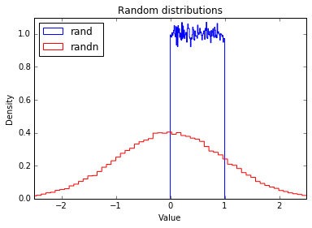

# Tools - NumPy

!!! Info ""
    NumPy is the fundamental library for scientific computing with Python. NumPy is centered around a powerful N-dimensional array object, and it also contains useful linear algebra, Fourier transform, and random number functions.

## **Creating Arrays**

!!! Info ""
    Now let's import `numpy`. Most people import it as `np`:

```py
import numpy as np
```

### **np.zeros**

!!! Info ""
    The `zeros` function creates an array containing any number of zeros:

```py
np.zeros(5)
```

??? Output "Output"
    array([0., 0., 0., 0., 0.])

!!! Info ""
    It's just as easy to create a 2D array (ie. a matrix) by providing a tuple with the desired number of rows and columns. For example, here's a 3x4 matrix:

```py
np.zeros((3,4))
```
??? Output "Output"
    array([[0., 0., 0., 0.],
           [0., 0., 0., 0.],
           [0., 0., 0., 0.]])

### **Some vocabulary**

!!! Info ""

    - In NumPy, each dimension is called an ***axis***.

    - The number of axes is called the ***rank***.

        - For example, the above 3x4 matrix is an array of rank 2 (it is 2-dimensional).

        - The first axis has length 3, the second has length 4.

    - An array's list of axis lengths is called the ***shape*** of the array.

        - For example, the above matrix's shape is `(3, 4)`.

        - The rank is equal to the shape's length.

    - The ***size*** of an array is the total number of elements, which is the product of all axis lengths (eg. 3*4=12)

```py
a = np.zeros((3,4))
a
```
??? Output "Output"

    array([[0., 0., 0., 0.],
           [0., 0., 0., 0.],
           [0., 0., 0., 0.]])

```py
a.shape
```
??? Output "Output"
    (3, 4)

```py
a.ndim  # equal to len(a.shape)
```
??? Output "Output"
    2

```py
a.size
```
??? Output "Output"
    12

### **N-dimensional arrays**

!!! Info ""
    You can also create an N-dimensional array of arbitrary rank. For example, here's a 3D array (rank=3), with shape `(2,3,4)`:

```py
np.zeros((2,3,4))
```

??? Output "Output"
    array([[[0., 0., 0., 0.],
            [0., 0., 0., 0.],
            [0., 0., 0., 0.]],

           [[0., 0., 0., 0.],
            [0., 0., 0., 0.],
            [0., 0., 0., 0.]]])

### **Array type**

!!! Info ""
    NumPy arrays have the type `ndarrays`:

```py
type(np.zeros((3,4)))
```

??? Output "Output"
    numpy.ndarray

### **np.ones**

!!! Info ""
    Many other NumPy functions create ndarrays.

    Here's a 3x4 matrix full of ones:

```py
np.ones((3,4))
```

??? Output "Output"
    array([[1., 1., 1., 1.],
           [1., 1., 1., 1.],
           [1., 1., 1., 1.]])
        
### **np.full**

!!! Info ""
    Creates an array of the given shape initialized with the given value. Here's a 3x4 matrix full of `π`.

```py
np.full((3,4), np.pi)
```

??? Output "Output"
    array([[3.14159265, 3.14159265, 3.14159265, 3.14159265],
           [3.14159265, 3.14159265, 3.14159265, 3.14159265],
           [3.14159265, 3.14159265, 3.14159265, 3.14159265]])

### **np.empty**

!!! Info ""
    An uninitialized 2x3 array (its content is not predictable, as it is whatever is in memory at that point):

```py
np.empty((2,3))
```

??? Output "Output"
    array([[0., 0., 0.],
           [0., 0., 0.]])

### **np.array**

!!! Info ""
    Of course you can initialize an `ndarray` using a regular python array. Just call the `array` function:

```py
np.array([[1,2,3,4], [10, 20, 30, 40]])
```

??? Output "Output"
    array([[ 1,  2,  3,  4],
           [10, 20, 30, 40]])

### **np.arange**

!!! Info ""
    You can create an `ndarray` using NumPy's `arange` function, which is similar to python's built-in `range` function:

```py
np.arange(1, 5)
```

??? Output "Output"
    array([1, 2, 3, 4])

!!! Info ""
    It also works with floats:

```py
np.arange(1.0, 5.0)
```

??? Output "Output"
    array([1., 2., 3., 4.])

!!! Info ""
    Of course you can provide a step parameter:

```py
np.arange(1, 5, 0.5)
```

??? Output "Output"
    array([1. , 1.5, 2. , 2.5, 3. , 3.5, 4. , 4.5])

!!! Info ""
    However, when dealing with floats, the exact number of elements in the array is not always predictible. For example, consider this:

```py
print(np.arange(0, 5/3, 1/3)) # depending on floating point errors, the max value is 4/3 or 5/3.
print(np.arange(0, 5/3, 0.333333333))
print(np.arange(0, 5/3, 0.333333334))
```

??? Output "Output"
    [0.         0.33333333 0.66666667 1.         1.33333333 1.66666667]
    [0.         0.33333333 0.66666667 1.         1.33333333 1.66666667]
    [0.         0.33333333 0.66666667 1.         1.33333334]

### **np.linspace**

!!! Info ""
    For this reason, it is generally preferable to use the `linspace` function instead of `arange` when working with floats. The `linspace` function returns an array containing a specific number of points evenly distributed between two values (note that the maximum value is included, contrary to `arange`):


```py
print(np.linspace(0, 5/3, 6))
```
??? Output "Output"
    [0.         0.33333333 0.66666667 1.         1.33333333 1.66666667]

### **np.rand and np.randn**

!!! Info ""
    A number of functions are available in NumPy's `random` module to create `ndarray`s initialized with random values. For example, here is a 3x4 matrix initialized with random floats between 0 and 1 (uniform distribution):

```py
np.random.rand(3,4)
```

??? Output "Output"
    array([[0.07951522, 0.82516403, 0.54524215, 0.46662691],
           [0.12016334, 0.74912183, 0.183234  , 0.105027  ],
           [0.22051959, 0.26931151, 0.02739192, 0.4721405 ]])

!!! Info ""
    Here's a 3x4 matrix containing random floats sampled from a univariate [normal distribution](https://en.wikipedia.org/wiki/Normal_distribution) (Gaussian distribution) of mean 0 and variance 1:


```py
np.random.randn(3,4)
```

??? Output "Output"
    array([[ 0.09545957,  0.14828368, -0.91504156, -0.36224068],
           [ 0.55434999,  0.41143633,  0.84385243, -0.3652369 ],
           [ 1.48071803, -1.45297797,  1.24551713,  0.4508626 ]])

!!! Info ""  
    To give you a feel of what these distributions look like, let's use matplotlib (see the [matplotlib tutorial](https://colab.research.google.com/drive/tools_matplotlib.ipynb) for more details):

```py
%matplotlib inline
import matplotlib.pyplot as plt
```

```py
plt.hist(np.random.rand(100000), density=True, bins=100, histtype="step", color="blue", label="rand")
plt.hist(np.random.randn(100000), density=True, bins=100, histtype="step", color="red", label="randn")
plt.axis([-2.5, 2.5, 0, 1.1])
plt.legend(loc = "upper left")
plt.title("Random distributions")
plt.xlabel("Value")
plt.ylabel("Density")
plt.show()
```

??? Output "Output"
    


### **np.fromfunction**

!!! Info "" 
    You can also initialize an `ndarray` using a function:

```py
def my_function(z, y, x):
    return x + 10 * y + 100 * z

np.fromfunction(my_function, (3, 2, 10))
```

??? Output "Output"
    array([[[  0.,   1.,   2.,   3.,   4.,   5.,   6.,   7.,   8.,   9.],
            [ 10.,  11.,  12.,  13.,  14.,  15.,  16.,  17.,  18.,  19.]],

           [[100., 101., 102., 103., 104., 105., 106., 107., 108., 109.],
            [110., 111., 112., 113., 114., 115., 116., 117., 118., 119.]],

           [[200., 201., 202., 203., 204., 205., 206., 207., 208., 209.],
            [210., 211., 212., 213., 214., 215., 216., 217., 218., 219.]]])

!!! Info "" 
    NumPy first creates three `ndarrays` (one per dimension), each of shape `(3, 2, 10)`. Each array has values equal to the coordinate along a specific axis. For example, all elements in the `z` array are equal to their z-coordinate:

```md
[[[ 0.  0.  0.  0.  0.  0.  0.  0.  0.  0.]
  [ 0.  0.  0.  0.  0.  0.  0.  0.  0.  0.]]

 [[ 1.  1.  1.  1.  1.  1.  1.  1.  1.  1.]
  [ 1.  1.  1.  1.  1.  1.  1.  1.  1.  1.]]

 [[ 2.  2.  2.  2.  2.  2.  2.  2.  2.  2.]
  [ 2.  2.  2.  2.  2.  2.  2.  2.  2.  2.]]]
```

!!! Info "" 
    So the terms `x`, `y` and `z` in the expression `x + 10 * y + 100 * z` above are in fact `ndarrays` (we will discuss arithmetic operations on arrays below). The point is that the function `my_function` is only called once, instead of once per element. This makes initialization very efficient.

## **Array data**

### **dtype**

!!! Info "" 
    NumPy's `ndarrays` are also efficient in part because all their elements must have the same type (usually numbers). You can check what the data type is by looking at the `dtype` attribute:

```py
c = np.arange(1, 5)
print(c.dtype, c)
```

??? Output "Output"
    int64 [1 2 3 4]

```py
c = np.arange(1.0, 5.0)
print(c.dtype, c)
```
??? Output "Output"
    float64 [ 1.  2.  3.  4.]

!!! Info "" 
    Instead of letting NumPy guess what data type to use, you can set it explicitly when creating an array by setting the `dtype` parameter:

??? Output "Output"
    complex64 [ 1.+0.j  2.+0.j  3.+0.j  4.+0.j]

!!! Info "" 
    Available data types include `int8`, `int16`, `int32`, `int64`, `uint8`|`16`|`32`|`64`, `float16`|`32`|`64` and `complex64`|`128`. Check out [the documentation](http://docs.scipy.org/doc/numpy-1.10.1/user/basics.types.html) for the full list.

### **itemsize**

!!! Info ""
    The `itemsize` attribute returns the size (in bytes) of each item:

```py
e = np.arange(1, 5, dtype=np.complex64)
e.itemsize
```

??? Output "Output"
    8

### **data buffer**

!!! Info ""
    An array's data is actually stored in memory as a flat (one dimensional) byte buffer. It is available via the `data` attribute (you will rarely need it, though).

```py
f = np.array([[1,2],[1000, 2000]], dtype=np.int32)
f.data
```

??? Output "Output"
    <read-write buffer for 0x10f8a18a0, size 16, offset 0 at 0x10f9dbbb0>

!!! Info ""
    In python 2, `f.data` is a buffer. In python 3, it is a memoryview.

```py
if (hasattr(f.data, "tobytes")):
    data_bytes = f.data.tobytes() # python 3
else:
    data_bytes = memoryview(f.data).tobytes() # python 2

data_bytes
```

??? Output "Output"
    '\x01\x00\x00\x00\x02\x00\x00\x00\xe8\x03\x00\x00\xd0\x07\x00\x00'

!!! Info ""
    Several `ndarrays` can share the same data buffer, meaning that modifying one will also modify the others. We will see an example in a minute.


## **Reshaping an array**

## **Arithmetic operations**

## **Broadcasting**

## **Conditional operators**

## **Mathematical and statistical functions**

## **Array indexing**

## **Iterating**

## **Stacking arrays**

## **Splitting arrays**

## **Transposing arrays**

## **Linear algebra**

## **Vectorization**

## **Saving and loading**

## **What next?**