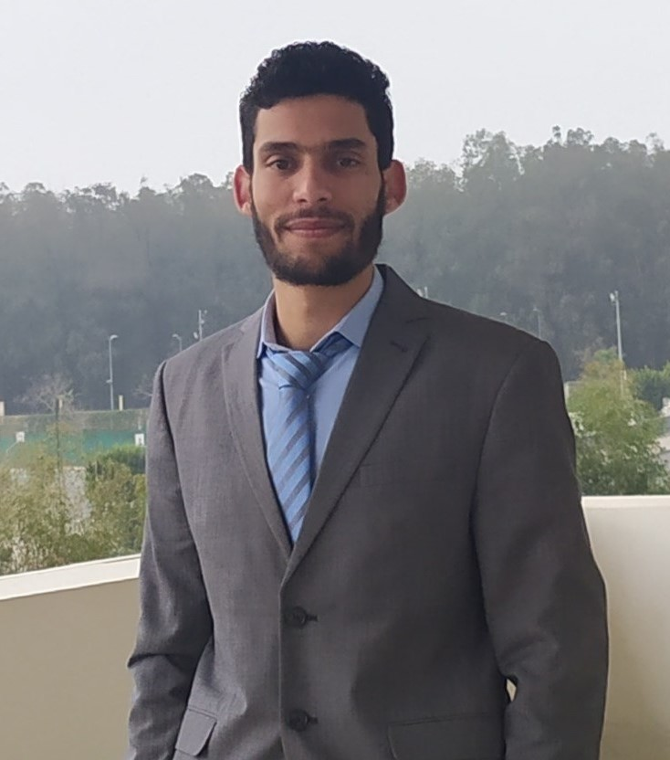
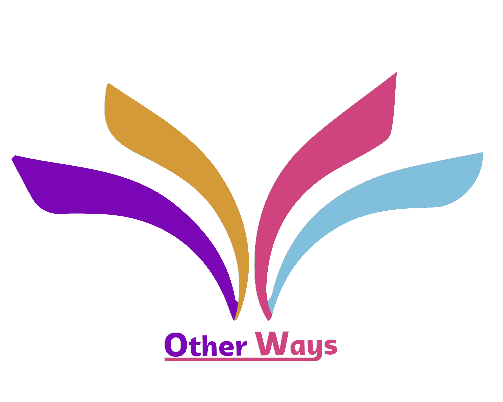

---
hide:
  - navigation
  - toc
title: About Me
---

<link rel="stylesheet" href="../../assets/css/about.css">

  

    

     

     

      <h1>Abdellatif BELMADY</h1>
      <h2>Morocco, Casablanca</h2>
      <h3>Data Scientist<h3>
      

       <a href="https://www.linkedin.com/in/abdellatif-belmady-ab999a133/" class="ln" style=" color: inherit;" title="Linked In - Abdellatif BELMADY"><i class="fab fa-linkedin"></i></a>
       <a href="https://github.com/abdellatif-belmady" class="git" style=" color: inherit;" title="Github - Abdellatif-belmady"><i class="fab fa-github"></i></a>
       <a href="https://www.instagram.com/abdellatifbelmady/?hl=fr" class="insta" style=" color: inherit;" title="Instagram - abdellatifbelmady"><i class="fa fa-instagram"></i></a>
       <a href="https://twitter.com/AbdellatifBELM" class="twitter" style=" color: inherit;" title="Twitter - @AbdellatifBELM"><i class="fa fa-twitter"></i></a>
       <a href="https://web.facebook.com/abdellatif.belmady/" class="ln" style=" color: inherit;" title="Facebook - Abdellatif BELMADY"><i class="fab fa-facebook"></i></a>
       <a href="https://www.spotify.com/ma-fr/account/overview/?utm_source=spotify&utm_medium=menu&utm_campaign=your_account" class="spotify" style=" color: inherit;" title="Spotify - Abdellatif BELMADY"><i class="fab fa-spotify"></i></a>
       <a href="mailto:<abdellatif.belmady@gmail.com>" class="email" style=" color: inherit;" title="Email - abdellatif.belmady@gmail.com"><i class="fas fa-paper-plane"></i></a>
      

      <a href="https://www.buymeacoffee.com/abdellatife" style=" color: inherit;">
        <button class="coffeelarge" title="Buy Me a Coffee :)"><i class="fas fa-coffee"></i> Buy Me a Coffee</button>
        <button class="coffeesmall" title="Buy Me a Coffee :)"><i class="fas fa-coffee"></i></button>
      </a>
     

    

  

  

    

     <a href="https://drive.google.com/file/d/1p_1YsjjlWAc7FWTrR3HKoJFbE7OdHC8S/view?usp=share_link">Export Resume <i class="far fa-file-alt"></i></a><h1>About Me</h1>
      

      
<strong>Hey! I’m Abdellatif BELMADY,</strong> I graduated from Ecole Centrale Casablanca with a degree in data science and digitalization. My professional philosophy is "Structuring and analyzing data allows me to build the story behind it in order to improve the future".

     <h2><i class="fas fa-briefcase"></i> Experience -</h2>
     
<strong>CEO and Founder - Other Ways</strong>2022-Present The third eye that you need

      
Currently, the possession and installation of cameras are indispensable in large organizations and in any sector. But despite their usefulness,these cameras still work in a traditional way in front of the evolution of the digital and intelligent world. Our solutions opt for intelligent cameras that integrate new technologies. Having smart cameras brings many advantages to your work and your business.
      

      
<strong>Machine Learning Intern</strong>2022 6 PERFORM · Internship

      <ul>
        <li>Images collection(using the Imageye extention). 
        <li>Image annotation with labelImg.exe. 
        <li>Training of Deep Learning models using the YOLO version 4 algorithm. 
        <li>Detection and recognition of surgical instruments. 
        <li>Detection of mask wearing. 
        <li>Detection of medical caps. 
        <li>Detection of gowns. 
        <li>Writing of scripts in Python. 
        </li>
      </ul>
      
<strong>Internship Operator</strong>2021 VCR-Sodalmu, Berrechid

      <ul>
        <li>Realization of an Excel application for inventory management. 
        <li>Implementation of a machine learning model to identify a waste problem in the production line. 
        <li>Development in knowing how to ask the right questions in order to get the requested data. 
        </li>
      </ul>
     <h2><i class="fas fa-graduation-cap"></i> Education -</h2>
      
<strong>Data Science and digitalization</strong>2020-Present Ecole Centrale Casablanca

 

      
<strong>Physics Chemistry Engineering Science</strong>2018-2020 Preparatory Classes Errazi, El Jadida

     <h2><i class="fas fa-award"></i> Honors & Awards -</h2>
      

        <strong><a href="https://www.linkedin.com/in/abdellatif-belmady-ab999a133/">Centrale Coding Competition, Ecole Centrale Casablanca</a></strong>, 2nd Place. (November 2021)
      

      

     <h2><i class="fas fa-map-marker-alt"></i> Where I'm Located -</h2>
      

        <iframe width="100%" height="350" style="margin-bottom: 12px; border:0 " loading="lazy" allowfullscreen src="https://www.google.com/maps/embed?pb=!1m18!1m12!1m3!1d3327.8183321003753!2d-7.622630085316603!3d33.480080255112334!2m3!1f0!2f0!3f0!3m2!1i1024!2i768!4f13.1!3m3!1m2!1s0xda62dfb0bd98e83%3A0x6c5587c807a6f58e!2s%C3%89cole%20centrale%20Casablanca!5e0!3m2!1sfr!2sma!4v1674305579490!5m2!1sfr!2sma"></iframe> 
      

     <h2><i class="fas fa-city"></i> Community Involvement -</h2>
      

        <strong>The Enactus association at Ecole Centrale Casablanca</strong>, Active member (Aug 2020 - Jan 2021)
      

      

        <strong>The Rotaract Association at Ecole Centrale Casablanca</strong> Community member, student & volunteer. (Aug 2020 - July 2021)
      

      

        <strong>The association CentraleComm' at the Ecole Centrale Casablanca</strong> Community member, student & volunteer. (Aug 2020 - July 2021)
      

      

     <h2><a href="https://www.instagram.com/abdellatifbelmady/">@abdellatifbelmady</a> On <i class="fa fa-instagram"></i> Instagram -</h2>
      

        
          

          
        
      

     <h2><i class="fas fa-headphones-alt"></i> What I'm Listening To -</h2>
      

       
    

  

