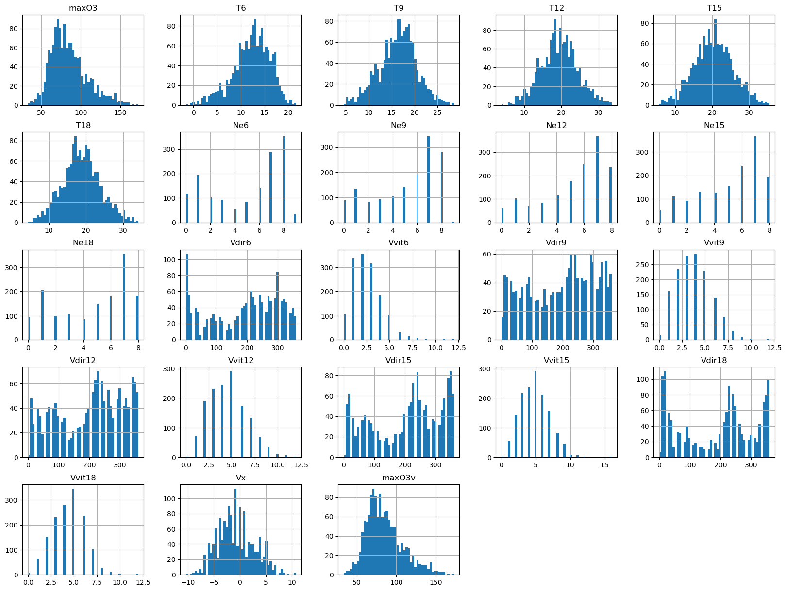
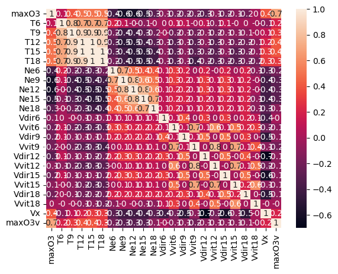

## **Introduction**

!!! Info ""
    Le jeu de données contient 1464 observations (journalières, du 01/04/1995 au 30/09/2002, à Rennes).

## **Préparation des données**
```py
# Importer les bibliothèques
import pandas as pd
import numpy as np
import matplotlib.pyplot as plt
import seaborn as sns

from tensorflow import keras
import tensorflow as tf
from tensorflow.keras.models import Sequential
from tensorflow.keras.layers import Dropout
from sklearn.metrics import accuracy_score
from tensorflow.keras.layers import Dense
from sklearn.metrics import mean_squared_error
```

!!! Info ""
    Lors de l'importation des données, j'ai remplacé la colonne index par la colonne des dates.

```py
# Importer le datasets + remplacer la colonne des indexes par celle des dates
ozone = pd.read_csv("ozone_complet.csv", sep=";", index_col='Unnamed: 0')
```
```py
# Lire les 5 première lignes
ozone.head()
```
## **Étude exploratoire des données**
```py
# Afficher quelques informations du dataset
ozone.info()
```
```py
# Afficher quelques statistiques du dataset
ozone.describe()
```
```py
# Analyse les distributions des données
ozone.hist(bins=50, figsize=(20,15))
plt.show()
```
??? success "Output"
    
```py
# Analyse des corrélations

matriceCorr = ozone.corr().round(1)
sns.heatmap(data=matriceCorr, annot = True)
```
??? success "Output"
    
```py
# Afficher le nombre des valeurs manquantes dans chaque colonne
ozone.isnull().sum()
```

!!! Info ""
    J'ai ensuite remarqué qu'il y avait des valeurs manquantes dans l'ensemble de données. Pour résoudre ce problème, j'ai remplacé ces valeurs par la moyenne en utilisant « SimpleImputer ».

```py
# Remplir les valeurs manquentes par la mayenne
from sklearn.impute import SimpleImputer
imputer = SimpleImputer(strategy="median")
```
```py
# Lancer l'entrainement de Imputer
imputer.fit(ozone)
```
```py
# Appliquer le modèle Imputer sur le dataset ozone (la sortie est de type array)
ozone_complet = imputer.transform(ozone)
```
```py
# Transformer le dataset (sortie de Imputer de type array) en data frame
ozone_complet = pd.DataFrame(ozone_complet, columns=ozone.columns)
```
```py
# Vérifier qu'il n'ya plus de valeurs manquantes
ozone_complet.isnull().sum()
```
## **Implémentation d’un modèle de réseau de neurones**
```py
# Division de données en données d'entrainement, du test et de validation

ozone_complet = ozone_complet.sample(frac=1, axis=0)

data_train_valid = ozone_complet.sample(frac=0.85, axis=0)
data_test = ozone_complet.drop(data_train_valid.index)
data_train = data_train_valid.sample(frac=0.8, axis=0)
data_valid = data_train_valid.drop(data_train.index)

x_train = data_train.drop('maxO3', axis=1)
y_train = data_train['maxO3']
print('Dimensions de X train :', x_train.shape)
print('Dimensions de Y train :', y_train.shape)

x_valid = data_valid.drop('maxO3', axis=1)
y_valid = data_valid['maxO3']
print('Dimensions de X valid :', x_valid.shape)
print('Dimensions de Y valid :', y_valid.shape)

x_test = data_test.drop('maxO3', axis=1)
y_test = data_test['maxO3']
print('Dimensions de X test :', x_test.shape)
print('Dimensions de Y test :', y_test.shape)
```
```py
# Normalisation des données

min_x_train = x_train.min()
max_x_train = x_train.max()

print("Min de x_train :", min_x_train)
print("Max de x_train :", max_x_train)

x_train_norm = (x_train-min_x_train)/(max_x_train-min_x_train)
x_test_norm = (x_test-min_x_train)/(max_x_train-min_x_train)
x_val_norm = (x_valid-min_x_train)/(max_x_train-min_x_train)
```

!!! Info ""
    La structure du perceptron se compose ***d'une couche d'entrée avec 22 neurones*** correspondant à chacune des 22 features, de ***deux couches cachées avec 5 neurones*** par chacune et ***d'une couche de sortie avec un seul neurone*** qui donnera la valeur prédite de ***« maxO3 »***.
    La ***fonction ReLu*** a été choisie comme fonction d'activation pour chacune des trois couches, ***mean square error*** comme loss function, et l'algorithme ***Adam optimizer*** pour son adaptative learning rate and momentum.


```py
## Implémentation de modèle DNN

model = Sequential()
model.add(Dense(22, input_dim=np.shape(x_train)[1], activation = 'relu'))
model.add(Dropout(.5))
model.add(Dense(5, activation = 'relu'))
model.add(Dropout(.5))
model.add(Dense(5, activation = 'relu'))
model.add(Dropout(.5))
model.add(Dense(1, activation = 'relu'))

model.compile(loss = 'mean_squared_error', optimizer = 'adam', metrics=['mean_squared_error'])

model.summary()
```
```py
callback = tf.keras.callbacks.EarlyStopping(monitor='loss', patience=100)

hist = model.fit(x_train_norm, y_train, epochs = 1000, batch_size = 9999, callbacks = callback)
```
```py
# Performance du modèle sur les données du test

pred_train= model.predict(x_train_norm)
print(np.sqrt(mean_squared_error(y_train,pred_train)))

pred= model.predict(x_test_norm)
print(np.sqrt(mean_squared_error(y_test,pred)))
```
## **Implémentation d'une Régression Linéaire**
J'ai également mis en œuvre une régression linéaire et j’ai obtenu un score de 0,625 pour les données de test et un score de 0,646 pour les données de validation.
```py
from sklearn.linear_model import LinearRegression

lin_reg = LinearRegression()
lin_reg.fit(x_train_norm, y_train)
```
```py
# Performance du modèle sur les données du test

score_test_lin_reg = lin_reg.score(x_test_norm, y_test)
print("Test Accuracy Score", score_test_lin_reg)
```
```py
# Performance du modèle sur les données de validation

score_valid_lin_reg = lin_reg.score(x_val_norm, y_valid)
print("Test Accuracy Score", score_valid_lin_reg)
```
## **Implémentation d’un SVR**

!!! Info ""
    Un SVR a également été mis en place et a donné un score de 0,489 pour les données de test et un score de 0,519 pour les données de validation.

```py
from sklearn.svm import SVR

svr = SVR()
svr.fit(x_train_norm, y_train)
```
```py
# Performance du modèle sur les données du test

score_test_svr = svr.score(x_test_norm, y_test)
print("Test Accuracy Score", score_test_svr)
```
```py
# Performance du modèle sur les données de validation

score_valid_svr = svr.score(x_val_norm, y_valid)
print("Test Accuracy Score", score_valid_svr)
```
## **Conclusion**

!!! Info ""
    Pour conclure, voici un tableau qui résume les différents scores de tous les modèles que j'ai mis en place :

    |Modèle	                    |Score (test dataset)	    |Score (validation dataset)
    |---------------------------|---------------------------|--------------------------
    |Réseau de neurones (DNN)	|mean square error : 36.827398008235775
    |Régression Linéaire	    |0.6250066102296177         |0.6463044934834267
    |SVM (SVR)	                |0.4895962389393179	        |0.5192747605192083
