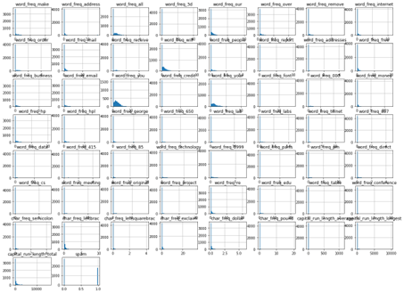
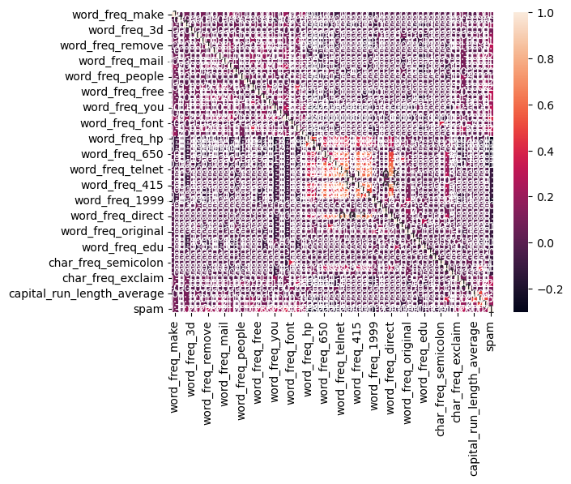
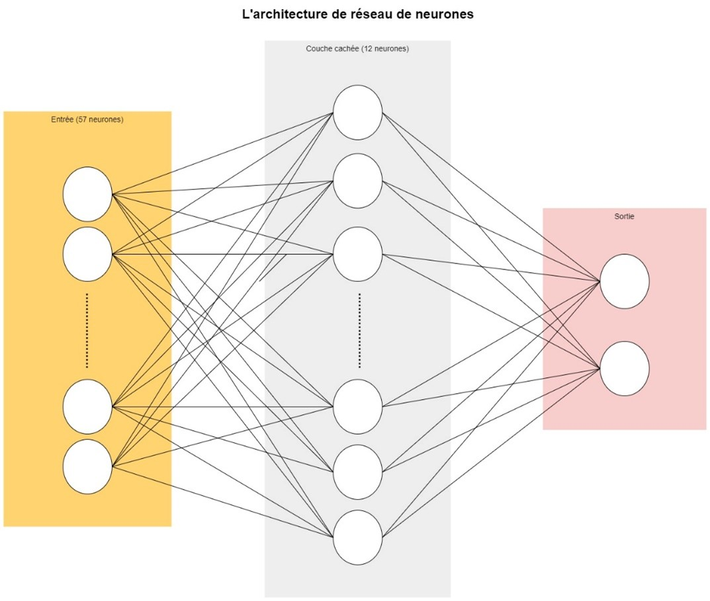

## **Introduction**

!!! Info "Membres du groupe"
    L'objectif de ce projet était d'entraîner un réseau neuronal à classer les courriels comme « spam » ou « non spam ». Ceci a été fait sur le jeu de données Spambase     fourni par le référentiel d'apprentissage automatique de l'UCI, qui contient 57 features représentant la fréquence des mots dans 4601 emails.

    Pour notre label (Spam) ; « spam » a été codé comme 1 pour la classe positive et « non spam » a été a été codé comme 0 pour la classe négative.

## **Préparation des données**

```py
# Importer les bibliothèques
import pandas as pd
import numpy as np
import matplotlib.pyplot as plt
import seaborn as sns

from tensorflow import keras
import tensorflow as tf
from tensorflow.keras.models import Sequential
from tensorflow.keras.layers import Dropout
from sklearn.metrics import accuracy_score
from tensorflow.keras.layers import Dense
```
```py
# Importer le datasets 
spam = pd.read_csv("spam.csv")
```
```py
# Lire les 5 première lignes
spam.head(5)
```
## **Étude exploratoire des données**
```py
# Afficher quelques informations du dataset
spam.info()
```

!!! Info ""
    D'après le résultat de la méthode ***« info() »***, il apparaît que tous les features sont de type float ce qui facilitera notre étude ultérieure (pas besoin de faire une feature engineering).

```py
# Afficher quelques statistiques du dataset
spam.describe()
```

!!! Info ""
    J'ai également fait une analyse des distributions des données pour avoir une idée sur les lois suivies par les différents features, ainsi veuillez trouver ci-dessous le résultat obtenu et qui montre que la plupart des features ne suivent pas une distribution gaussienne.

```py
# Afficher quelques statistiques du dataset
spam.describe()
```
??? success "Output"
    

```py
# Analyse des corrélations
matriceCorr = spam.corr().round(1)
sns.heatmap(data=matriceCorr, annot = True)
```
??? success "Output"
    

## **Implémentation d’un modèle de réseau de neurones**

```py
# Division de données en données d'entrainement, du test et de validation

spam = spam.sample(frac=1, axis=0)

data_train_valid = spam.sample(frac=0.85, axis=0)
data_test = spam.drop(data_train_valid.index)
data_train = data_train_valid.sample(frac=0.8, axis=0)
data_valid = data_train_valid.drop(data_train.index)

x_train = data_train.drop('spam', axis=1)
y_train = data_train['spam']
print('Dimensions de X train :', x_train.shape)
print('Dimensions de Y train :', y_train.shape)

x_valid = data_valid.drop('spam', axis=1)
y_valid = data_valid['spam']
print('Dimensions de X valid :', x_valid.shape)
print('Dimensions de Y valid :', y_valid.shape)

x_test = data_test.drop('spam', axis=1)
y_test = data_test['spam']
print('Dimensions de X test :', x_test.shape)
print('Dimensions de Y test :', y_test.shape)
```
```py
# Normalisation des données

min_x_train = x_train.min()
max_x_train = x_train.max()

print("Min de x_train :", min_x_train)
print("Max de x_train :", max_x_train)

x_train_norm = (x_train-min_x_train)/(max_x_train-min_x_train)
x_test_norm = (x_test-min_x_train)/(max_x_train-min_x_train)
x_val_norm = (x_valid-min_x_train)/(max_x_train-min_x_train)
```

!!! Info ""
    La structure du perceptron se compose ***d'une couche d'entrée avec 57 neurones*** correspondant à chacune des 57 features, ***d'une couche cachée avec 12 neurones*** et ***d'une couche de sortie avec 2 neurones*** : le premier peut être interprété comme la probabilité qu'un email soit « non-spam » et le second comme la probabilité de "spam". Le neurone de sortie ayant la probabilité la plus élevée détermine la classification d'un email.

    La ***fonction sigmoïde*** a été choisie comme fonction d'activation pour chacune des trois couches, l'entropie croisée binaire comme loss function, et l'algorithme ***Adam optimizer*** pour son adaptative learning rate and momentum.



```py
## Implémentation de modèle DNN

model = Sequential()
model.add(Dense(57, input_dim=np.shape(x_train)[1], activation = 'sigmoid'))
model.add(Dropout(.5))
model.add(Dense(12, activation = 'sigmoid'))
model.add(Dropout(.5))
model.add(Dense(1, activation = 'sigmoid'))

model.compile(loss = 'binary_crossentropy', optimizer = 'adam', metrics=['accuracy'])

model.summary()
```
```py
callback = tf.keras.callbacks.EarlyStopping(monitor='loss', patience=1000)

hist = model.fit(x_train_norm, y_train, epochs = 10100, batch_size = 99999, callbacks = callback)
```
```py
# Performance du modèle sur les données du test

preds = model.predict(x_test_norm)
preds = [1 if x[0] > 0.5 else 0 for x in preds]
score_test_dnn = accuracy_score(y_test, preds)
print(score_test_dnn)
```
```py
# Performance du modèle sur les données de validation

preds = model.predict(x_val_norm)
preds = [1 if x[0] > 0.5 else 0 for x in preds]
score_valid_dnn = accuracy_score(y_valid, preds)
print(score_valid_dnn)
```
```py
figure = plt.gcf()
figure.set_size_inches((20, 10))
plt.title('Analyse des erreurs')
plt.xlabel('Epoch')
plt.ylabel('Entropie croisée')
plt.plot(range(1, len(hist.history['loss']) + 1), hist.history['loss'])
plt.legend(['Entropie croisée train'])
plt.show()
```
??? success "Output"
    
```py
figure = plt.gcf()
figure.set_size_inches((20, 10))
plt.title('Analyse des erreurs')
plt.xlabel('Epoch')
plt.ylabel('Précision')
plt.plot(range(1, len(hist.history['accuracy']) + 1), hist.history['accuracy'])
plt.legend(["Précision d'apprentissage"])
plt.show()
```
??? success "Output"
    

!!! Info ""
    Ce modèle de réseau neuronal a donné un score de 0,924 pour les données de test et un score de 0,937 pour les données de validation, ce qui est très satisfaisant.

## **Implémentation d’une Régression Logistique**
```py
from sklearn.linear_model import LogisticRegression

log_reg = LogisticRegression()
log_reg.fit(x_train_norm, y_train)
```
```py
# Performance du modèle sur les données du test

score_test_log_reg = log_reg.score(x_test_norm, y_test)
print("Test Accuracy Score", score_test_log_reg)
```
```py
# Performance du modèle sur les données de validation

score_valid_log_reg = log_reg.score(x_val_norm, y_valid)
print("Test Accuracy Score", score_valid_log_reg)
```

!!! Info ""
    J'ai également mis en œuvre une régression logistique et j’ai obtenu un score de 0,876 pour les données de test et un score de 0,895 pour les données de validation.

## **Implémentation d’un SVM**
```py
from sklearn import svm

svm = svm.SVC()
svm.fit(x_train_norm, y_train)
```
```py
# Performance du modèle sur les données du test

score_test_svc = svm.score(x_test_norm, y_test)
print("Test Accuracy Score", score_test_svc)
```
```py
# Performance du modèle sur les données de validation

score_valid_svc = svm.score(x_val_norm, y_valid)
print("Test Accuracy Score", score_valid_svc)
```

!!! Info ""
    Un SVC a également été mis en place et a donné un score de 0,931 pour les données de test et un score de 0,932 pour les données de validation.

## **Implémentation d’un Random Forest**
```py
from sklearn.ensemble import RandomForestClassifier

rdf = RandomForestClassifier(max_depth=2, random_state=0)
rdf.fit(x_train_norm, y_train)
```
```py
# Performance du modèle sur les données du test

score_test_rdf = rdf.score(x_test_norm, y_test)
print("Test Accuracy Score", score_test_rdf)
```
```py
# Performance du modèle sur les données de validation

score_valid_rdf = rdf.score(x_val_norm, y_valid)
print("Test Accuracy Score", score_valid_rdf)
```

!!! Info ""
    Pour avoir une idée de tous les modèles de machine learning, j'ai mis en œuvre un Random Forest qui a donné un score de 0,884 pour les données de test et un score de 0,904 pour les données de validation.

## **Conclusion**

!!! Info "Conclusion"
    Pour conclure, voici un tableau qui résume les différents scores de tous les modèles que j'ai mis en place :

    |Modèle	                    |Score (test dataset)	    |Score (validation dataset)
    |---------------------------|---------------------------|--------------------------
    |Réseau de neurones (DNN)	|0.9246376811594202	        |0.9246376811594202
    |Régression Logistique	    |0.8768115942028986	        |0.8951406649616368
    |SVM (SVC)	                |0.9318840579710145	        |0.9322250639386189
    |Random Forest	            |0.8840579710144928	        |0.9040920716112532
