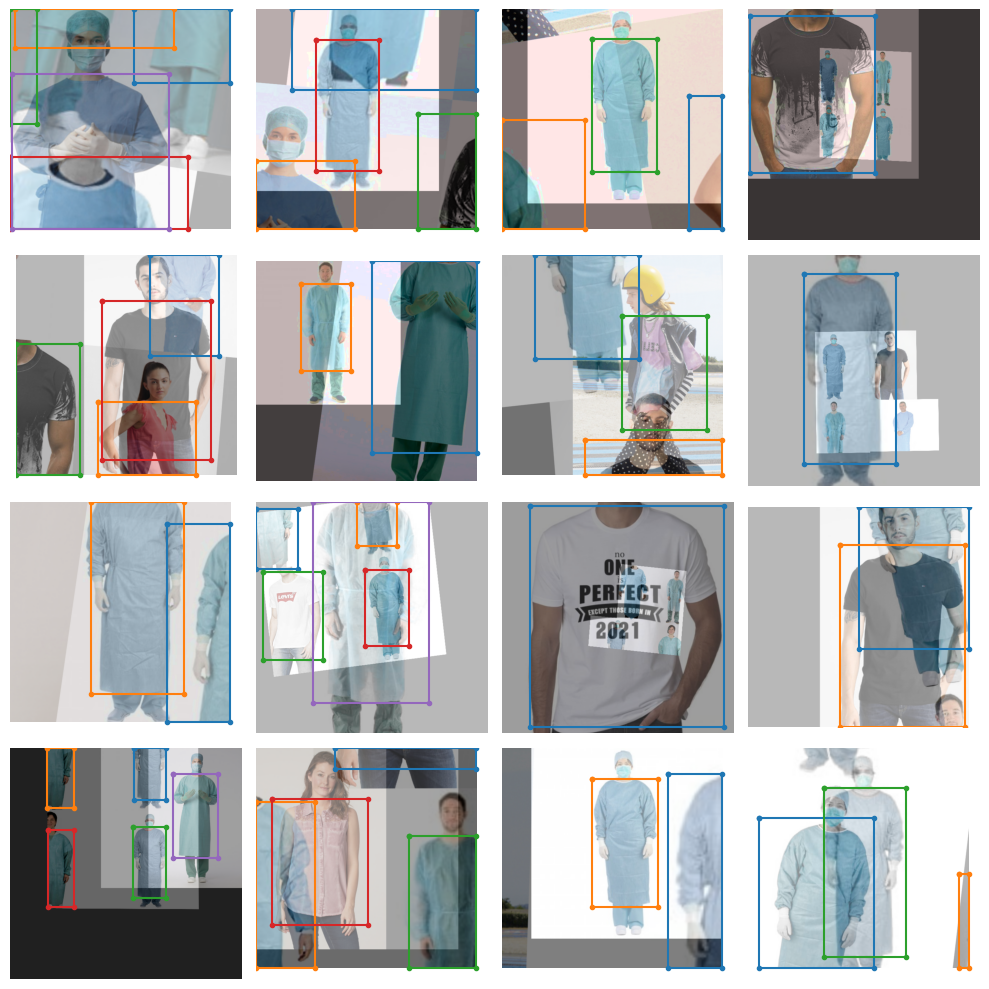

# YOLO-NAS

## **Introduction**
**A Next-Generation, Object Detection Foundational Model generated by Deci’s Neural Architecture Search Technology.**

Deci is thrilled to announce the release of a new object detection model, YOLO-NAS - a game-changer in the world of object detection, providing superior real-time object detection capabilities and production-ready performance. Deci's mission is to provide AI teams with tools to remove development barriers and attain efficient inference performance more quickly.

<center>


</center>

The new YOLO-NAS delivers state-of-the-art (SOTA) performance with the unparalleled accuracy-speed performance, outperforming other models such as YOLOv5, YOLOv6, YOLOv7 and YOLOv8.

Deci's proprietary Neural Architecture Search technology, [AutoNAC™](https://deci.ai/technology/), generated the YOLO-NAS model. The AutoNAC™ engine lets you input any task, data characteristics (access to data is not required), inference environment and performance targets, and then guides you to find the optimal architecture that delivers the best balance between accuracy and inference speed for your specific application. In addition to being data and hardware aware, the AutoNAC engine considers other components in the inference stack, including compilers and quantization.

In terms of pure numbers, YOLO-NAS is ~0.5 mAP point more accurate and 10-20% faster than equivalent variants of YOLOv8 and YOLOv7.

| Model            | mAP   | Latency (ms) |
|------------------|-------|--------------|
| YOLO-NAS S       | 47.5  | 3.21         |
| YOLO-NAS M       | 51.55 | 5.85         |
| YOLO-NAS L       | 52.22 | 7.87         |
| YOLO-NAS S INT-8 | 47.03 | 2.36         |
| YOLO-NAS M INT-8 | 51.0  | 3.78         |
| YOLO-NAS L INT-8 | 52.1  | 4.78         |

mAP numbers in table reported for Coco 2017 Val dataset and latency benchmarked for 640x640 images on Nvidia T4 GPU.

YOLO-NAS's architecture employs quantization-aware blocks and selective quantization for optimized performance. When converted to its INT8 quantized version, YOLO-NAS experiences a smaller precision drop (0.51, 0.65, and 0.45 points of mAP for S, M, and L variants) compared to other models that lose 1-2 mAP points during quantization. These techniques culminate in innovative architecture with superior object detection capabilities and top-notch performance.

## **Configuration**
!!! Note
    After installation is complete (it make take a few minutes), you'll need to restart the runtime after installation completes.

```py
%%capture
!pip install super-gradients==3.1.0
!pip install imutils
!pip install roboflow
!pip install pytube --upgrade
```

## **SuperGradients**
SuperGradients is a PyTorch based training library.

It provides a uniform interface for the most common computer vision use cases: 

- Classification

- Detection

- Segmentation

- Pose estimation

There are nearly 40 pretrained models in our model zoo. You can see the pretrained models available to you by following [this link](https://github.com/Deci-AI/super-gradients/blob/master/documentation/source/model_zoo.md).

This notebook will focus on using SuperGradients with YOLO-NAS. If you're interested in seeing how SG is used for image classification, you can check out [this templated notebook](https://colab.research.google.com/drive/1JYyEnEh2VdmKLxd7idUfBt6vLGOZxGIp?usp=sharing) that will make it easy to get started.

## **Inference with YOLONAS Pretrained Model**
Before jumping into the section on fine-tuning, I wanted to show you the power of YOLONAS out of the box. 

Start by instantiating a pretrained model. YOLONAS comes in three flavors: `yolo_nas_s`, `yolo_nas_m`, and `yolo_nas_l`.

You'll use `yolo_nas_l` throughout this notebook. Because you should always go big, or go home. 

It's a good life philosophy.

```py
from super_gradients.training import models

yolo_nas_l = models.get("yolo_nas_l", pretrained_weights="coco")
```
You can run the following cell if you're interested in the architecture:

```py
!pip install torchinfo
from torchinfo import summary

summary(model=yolo_nas_l, 
        input_size=(16, 3, 640, 640),
        col_names=["input_size", "output_size", "num_params", "trainable"],
        col_width=20,
        row_settings=["var_names"]
)
```

### **Inference on an image**
Once the model has been instantiated all you have to do is call the `predict` method. 

This method operates on:
* PIL Image
* Numpy Image
* A path to image file 
* A path to video file 
* A path to folder with images
* URL (Image only)

Allowing you to perform inference with ease.

Note predict also has an argument called `conf`, which is the threshold for a detection. You change this value as you like, for example `model.predict("path/to/asset",conf=0.25)`

Let's perform inference on the following image:


```py
url = "https://previews.123rf.com/images/freeograph/freeograph2011/freeograph201100150/158301822-group-of-friends-gathering-around-table-at-home.jpg"
yolo_nas_l.predict(url, conf=0.25).show()
```
??? Output
    

### **Inference on video**
The following code will display and download stock footage video from YouTube. [Here's a link](https://www.youtube.com/watch?v=4poqZjNTZjI&list=PLcKa-34z76PvI5KvI5S2JGj0RcBVuz3jg) to a playlist that has a lot of stock video clips which are 2mins in length or less.

**Find a video you like and use YOLONAS to perform some inference on it!**

All you have to do is get the `video_id`, and replace the line `video_id = 'aE8I7bDf62M' ` in the cell below with your chosen video's id.

The `video_id` is everything that comes after `https://www.youtube.com/watch?v=`. For the video below, the full url was `https://www.youtube.com/watch?v=aE8I7bDf62M`, and thus the video id is `aE8I7bDf62M`.

```py
# Import the YouTubeVideo class from IPython.display
from IPython.display import YouTubeVideo

# Define the YouTube video ID
video_id = 'aE8I7bDf62M'  # Replace YOUR_VIDEO_ID with the actual video ID

# Create a YouTubeVideo object with the specified video ID
video = YouTubeVideo(video_id)

# Display the video
display(video)
```

```py
%%capture
# Define the URL of the YouTube video
video_url = f'https://www.youtube.com/watch?v={video_id}'  

# Download the video in mp4 format
!pip install -U "git+https://github.com/ytdl-org/youtube-dl.git"
!python -m youtube_dl -f 'bestvideo[ext=mp4]+bestaudio[ext=m4a]/mp4' "$video_url"

# Print a success message
print('Video downloaded successfully')

input_video_path = f"/content/EXTREME SPORTS X DIVERSE-{video_id}.mp4"
output_video_path = "detections.mp4"
```
**Now, you'll peform inference on the video**

```py
import torch
device = 'cuda' if torch.cuda.is_available() else "cpu"
```

```py
yolo_nas_l.to(device).predict(input_video_path).save(output_video_path)
```

**Inference via webcam**

Check [the documentation](https://github.com/Deci-AI/super-gradients/blob/505f646728249b9b35ea9060f34936f4e88234fd/src/super_gradients/examples/predict/detection_predict_streaming.py) for inference via webcam.

## **Fine-tuning YOLONAS on custom dataset**

**The trainer**
The first thing you need to define in SuperGradients is the Trainer.

The trainer is in charge of training, evaluation, saving checkpoints, etc. If you're interested in seeing the source code for the trainer, you can do so [here](https://github.com/Deci-AI/super-gradients/blob/master/src/super_gradients/training/sg_trainer/sg_trainer.py).

**There's two important arguments to the trainer:**
1. `ckpt_root_dir` - this is the directory where results from all your experiments will be saved

2. `experiment_name` - all checkpoints, logs, and tensorboards will be saved in a directory with the name you specify here. 

In the code below, you'll instantiate the trainer with just a single GPU (since that's what Google Colab provides).

```py
from super_gradients.training import Trainer

CHECKPOINT_DIR = '/content/drive/MyDrive/YOLO-NAS/checkpoints'
trainer = Trainer(experiment_name='my_first_yolonas_run', ckpt_root_dir=CHECKPOINT_DIR)
```

## **Fine-tuning YOLONAS on custom dataset**
SuperGradients is fully compatible with PyTorch Datasets and Dataloaders, so you can use your dataloaders as is. 

There are several well-known datasets for object detection, for example: 

- COCO
- Pascal
- YOLODarkNet
- YOLOv5

SuperGradients provides ready-to-use dataloaders for these datasets. If you're interested in learning more about working with `COCOFormatDetectionDataset` and the more general `DetectionDataset` [check out the SuperGradients documentation on this topic](https://docs.deci.ai/super-gradients/docstring/training/datasets/#training.datasets.detection_datasets.coco_detection.COCODetectionDataset)

You can learn more about working with SuperGradients datasets, dataloaders, and configuration files [here.](https://github.com/Deci-AI/super-gradients/blob/master/documentation/source/Data.md)

SuperGradients supports a number of dataset formats, you can learn more about that [here.](https://github.com/Deci-AI/super-gradients/blob/master/documentation/source/ObjectDetection.md)

For this example you'll use the the [U.S. Coins Dataset](https://universe.roboflow.com/atathamuscoinsdataset/u.s.-coins-dataset-a.tatham/dataset/5) from [RoboFlow](https://app.roboflow.com/login) with the dataset in YOLOv5 format.

**Some datasets you might want to try:**
- [HuggingFace competition: Ship detection](https://huggingface.co/spaces/competitions/ship-detection)

- [Aquarium dataset on RoboFlow](https://public.roboflow.com/object-detection/aquarium)

- [Vehicles-OpenImages Dataset on RoboFlow](https://public.roboflow.com/object-detection/vehicles-openimages)

- [Winegrape detection](https://github.com/thsant/wgisd)

- [Low light object detection](https://github.com/cs-chan/Exclusively-Dark-Image-Dataset)

- [Infrafred person detection](https://camel.ece.gatech.edu/)

- [Pothole detection](https://www.kaggle.com/datasets/chitholian/annotated-potholes-dataset)

- [100k Labeled Road Images | Day, Night](https://www.kaggle.com/datasets/solesensei/solesensei_bdd100k)

- [Deep Fashion dataset](https://github.com/switchablenorms/DeepFashion2)

- [Playing card detection](https://www.kaggle.com/datasets/luantm/playing-card)

- [Anaomoly detection in videos](https://www.crcv.ucf.edu/projects/real-world/)

- [Underwater fish recognition](https://www.kaggle.com/datasets/aalborguniversity/brackish-dataset)

- [Document layout detection](https://www.primaresearch.org/datasets/Layout_Analysis)

- [Trash Annotations in Context](http://tacodataset.org/)

```py
from roboflow import Roboflow
rf = Roboflow(api_key="<your-roboflow-key-here>")
project = rf.workspace("atathamuscoinsdataset").project("u.s.-coins-dataset-a.tatham")
dataset = project.version(5).download("yolov5")
```
Start by importing the required modules, which will help you create SuperGradients dataloaders.

```py
from super_gradients.training import dataloaders
from super_gradients.training.dataloaders.dataloaders import coco_detection_yolo_format_train, coco_detection_yolo_format_val
```
You'll need to load your dataset parameters into a dictionary, specifically defining:

- path to the parent directory where your data lives
- the child directory names for training, validation, and test (if you have testing set) images and labels
- class names

```py
dataset_params = {
    'data_dir':'/content/U.S.-Coins-Dataset---A.Tatham-5',
    'train_images_dir':'train/images',
    'train_labels_dir':'train/labels',
    'val_images_dir':'valid/images',
    'val_labels_dir':'valid/labels',
    'test_images_dir':'test/images',
    'test_labels_dir':'test/labels',
    'classes': ['Dime', 'Nickel', 'Penny', 'Quarter']
}
```
You pass the values for `dataset_params` into the `dataset_params` argument as shown below.

You can also pass PyTorch DataLoaders arguments when instantiating your dataset. Here you'll set `batch_size=16` and `num_workers=2`.

Repeat this for the validation and testing datasets, note that for training and testing data we use `coco_detection_yolo_format_val` to instantiate the dataloader.

The dataloaders will print warnings when an annotation does not conform to the expected format. This particular dataset has many such annotations, thus the warnings will be muted.

```py
from IPython.display import clear_output

train_data = coco_detection_yolo_format_train(
    dataset_params={
        'data_dir': dataset_params['data_dir'],
        'images_dir': dataset_params['train_images_dir'],
        'labels_dir': dataset_params['train_labels_dir'],
        'classes': dataset_params['classes']
    },
    dataloader_params={
        'batch_size':16,
        'num_workers':2
    }
)

val_data = coco_detection_yolo_format_val(
    dataset_params={
        'data_dir': dataset_params['data_dir'],
        'images_dir': dataset_params['val_images_dir'],
        'labels_dir': dataset_params['val_labels_dir'],
        'classes': dataset_params['classes']
    },
    dataloader_params={
        'batch_size':16,
        'num_workers':2
    }
)

test_data = coco_detection_yolo_format_val(
    dataset_params={
        'data_dir': dataset_params['data_dir'],
        'images_dir': dataset_params['test_images_dir'],
        'labels_dir': dataset_params['test_labels_dir'],
        'classes': dataset_params['classes']
    },
    dataloader_params={
        'batch_size':16,
        'num_workers':2
    }
)

clear_output()
```
**Now inspect the dataset defined earlier.**
SuperGradients added `transforms` for you. You're free to experiment with these transformations as you please. You can also add in your own transformations from `torchvision.transforms`, `albumentations` or a custom tranformaton.

```py
train_data.dataset.transforms
```

The transforms are in a dictionary, so you'll need to slice it to modify.

For example...

```py
train_data.dataset.dataset_params['transforms'][1]
```

```py
train_data.dataset.dataset_params['transforms'][1]['DetectionRandomAffine']['degrees'] = 10.42
```

You can plot a batch of training data with their augmentations applied to see what they look like:

```py
train_data.dataset.plot()
```

??? Output
    

## **Fine-tuning YOLONAS on custom dataset**
You saw how to instantiate the model for inference earlier. 

Below is how to instantiate the model for finetuning. Note you need to add the `num_classes` argument here.

Note, for this tutorial you're using `yolo_nas_l`, but SuperGradients has two other flavors of YOLONAS available to you: `yolo_nas_s` and `yolo_nas_m`.

```py
from super_gradients.training import models
model = models.get('yolo_nas_l', 
                   num_classes=len(dataset_params['classes']), 
                   pretrained_weights="coco"
                   )
```
## **Define metrics and training parameters**
You need to define the training parameters for your training run. 

Full details about the training parameters can be found [here](https://github.com/Deci-AI/super-gradients/blob/master/src/super_gradients/recipes/training_hyperparams/default_train_params.yaml).

**There are a few ***mandatory*** arguments that you must define for training params**

- `max_epochs` - Max number of training epochs

- `loss` - the loss function you want to use

- `optimizer` - Optimizer you will be using

- `train_metrics_list` - Metrics to log during training

- `valid_metrics_list` - Metrics to log during training

- `metric_to_watch` - metric which the model checkpoint will be saved according to

You can choose from a variety of `optimizer`'s such as: Adam, AdamW, SGD, Lion, or RMSProps. If you choose to change the defualt parameters of these optimizrs you pass them into `optimizer_params`. 

**Integrations with experiment monitoring tools**
SuperGradients has native integrations with Tensorboard, Weights and Biases, ClearML, and DagsHub. 

If your favorite monitoring tool is not supported by SuperGradients, you can simply implement a class inheriting from BaseSGLogger that you will then pass to the training parameters.

If you're interested in monitoring experiments, you can learn more [in the docs](https://github.com/Deci-AI/super-gradients/blob/0fe46cd39572db34eb83d68e343fed97b8886fe9/documentation/source/experiment_monitoring.md).

**SuperGradients offers a number of training tricks right out of the box, such as:**

- Exponential moving average
- Zero weight decay on bias and batch normalizatiom
- Weight averaging
- Batch accumulation
- Precise BatchNorm

You can read more details about these training tricks [here](https://heartbeat.comet.ml/a-better-way-to-train-your-neural-networks-813b60a5bd6a).

If you're interested in building a using a custom metric with SuperGradients you can learn how [here](https://github.com/Deci-AI/super-gradients/blob/master/documentation/source/Metrics.md).

Note you will have to set number of classes in two places below: `PPYoloELoss` and `DetectionMetrics_050`.

You probably noticed that we make use of a post prediction callback, for details on how phase callbacks work in SuperGradients [check out our documentation](https://github.com/Deci-AI/super-gradients/blob/master/documentation/source/PhaseCallbacks.md).

!!! Note
    I've enabled `silent_mode` so the notebook doesn't get longer than it already is. You should disable it so you can see what SuperGradients outputs during training.

```py
from super_gradients.training.losses import PPYoloELoss
from super_gradients.training.metrics import DetectionMetrics_050
from super_gradients.training.models.detection_models.pp_yolo_e import PPYoloEPostPredictionCallback

train_params = {
    # ENABLING SILENT MODE
    'silent_mode': True,
    "average_best_models":True,
    "warmup_mode": "linear_epoch_step",
    "warmup_initial_lr": 1e-6,
    "lr_warmup_epochs": 3,
    "initial_lr": 5e-4,
    "lr_mode": "cosine",
    "cosine_final_lr_ratio": 0.1,
    "optimizer": "Adam",
    "optimizer_params": {"weight_decay": 0.0001},
    "zero_weight_decay_on_bias_and_bn": True,
    "ema": True,
    "ema_params": {"decay": 0.9, "decay_type": "threshold"},
    # ONLY TRAINING FOR 10 EPOCHS FOR THIS EXAMPLE NOTEBOOK
    "max_epochs": 10,
    "mixed_precision": True,
    "loss": PPYoloELoss(
        use_static_assigner=False,
        # NOTE: num_classes needs to be defined here
        num_classes=len(dataset_params['classes']),
        reg_max=16
    ),
    "valid_metrics_list": [
        DetectionMetrics_050(
            score_thres=0.1,
            top_k_predictions=300,
            # NOTE: num_classes needs to be defined here
            num_cls=len(dataset_params['classes']),
            normalize_targets=True,
            post_prediction_callback=PPYoloEPostPredictionCallback(
                score_threshold=0.01,
                nms_top_k=1000,
                max_predictions=300,
                nms_threshold=0.7
            )
        )
    ],
    "metric_to_watch": 'mAP@0.50'
}
```

## **Training the model**
You've covered a lot of ground so far:

- [x] Instantiated the trainer

- [x] Defined your dataset parameters and dataloaders

- [x] Instantiated a model

- [x] Set up your training parameters

**Now, its time to train a model**

Training a model using a SuperGradients is done using the `trainer`.

It's as easy as...

trainer.train(model=model, 
              training_params=train_params, 
              train_loader=train_data, 
              valid_loader=val_data)

## **Get the best trained model**
Now that training is complete, you need to get the best trained model.

You used checkpoint averaging so the following code will use weights averaged across training runs. 

If you want to use the best weights, or weights from the last epoch you'd use one of the following in the code below:

- best weights: `checkpoint_path = checkpoints/my_first_yolonas_run/ckpt_best.pth`

- last weights: `checkpoint_path = checkpoints/my_first_yolonas_run/ckpt_latest.pth`

```py
best_model = models.get('yolo_nas_l',
                        num_classes=len(dataset_params['classes']),
                        checkpoint_path="checkpoints/my_first_yolonas_run/average_model.pth")
```

## **Evaluating the best trained model on the test set**

```py
trainer.test(model=best_model,
            test_loader=test_data,
            test_metrics_list=DetectionMetrics_050(score_thres=0.1, 
                                                   top_k_predictions=300, 
                                                   num_cls=len(dataset_params['classes']), 
                                                   normalize_targets=True, 
                                                   post_prediction_callback=PPYoloEPostPredictionCallback(score_threshold=0.01, 
                                                                                                          nms_top_k=1000, 
                                                                                                          max_predictions=300,                                                                              
                                                                                                          nms_threshold=0.7)
                                                  ))
```

## **Predicting with the best model**

The next line will perform detection on the following image. Note, we didn't have a class for the half dollar coin. So it will likely get classified as something else.


The results aren't too bad after just a few epochs!

```py
img_url = 'https://www.mynumi.net/media/catalog/product/cache/2/image/9df78eab33525d08d6e5fb8d27136e95/s/e/serietta_usa_2_1/www.mynumi.net-USASE5AD160-31.jpg'
best_model.predict(img_url).show()
```
## **Post training quantization (PTQ) and quantization aware training (QAT)**

SuperGradients offers PTQ and QAT out of the box. That's beyond the scope of this introductory tutorial. It is, in my opinion, a truly awesome feature. 

Not many training libaries offer this out of the box.  You can learn more about PTQ and QAT [here](https://github.com/Deci-AI/super-gradients/blob/c339e2619616878172c060e6491c8c2129ed3fd4/documentation/source/ptq_qat.md).

An example specific to YOLONAS can be found [here](https://github.com/Deci-AI/super-gradients/blob/feature/SG-736_deci_yolo_rf100/documentation/source/qat_ptq_yolo_nas.md).


