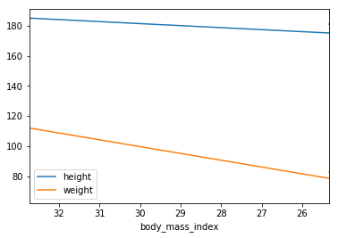
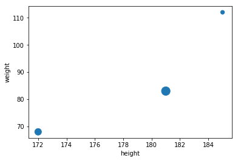

# Pandas

The `pandas` library provides high-performance, easy-to-use data structures and data analysis tools. The main data structure is the `DataFrame`, which you can think of as an in-memory 2D table (like a spreadsheet, with column names and row labels). Many features available in Excel are available programmatically, such as creating pivot tables, computing columns based on other columns, plotting graphs, etc. You can also group rows by column value, or join tables much like in SQL. Pandas is also great at handling time series.

Prerequisites:

* NumPy – if you are not familiar with NumPy, we recommend that you go through the [NumPy tutorial](https://abdellatif-belmady.github.io/abdellatif-belmady/Tutorials/Libraries/numpy/) now.

## **Setup**

First, let's import `pandas`. People usually import it as `pd`:

```py
import pandas as pd
```

## **Series objects**

The `pandas` library contains these useful data structures:

* `Series` objects, that we will discuss now. A `Series` object is 1D array, similar to a column in a spreadsheet (with a column name and row labels).

* `DataFrame` objects. This is a 2D table, similar to a spreadsheet (with column names and row labels).

* `Panel` objects. You can see a `Panel` as a dictionary of `DataFrame`s. These are less used, so we will not discuss them here.

### **Creating a Series**

Let's start by creating our first `Series` object!

```py
s = pd.Series([2,-1,3,5])
s
```

??? Output
    ```py
    0    2
    1   -1
    2    3
    3    5
    dtype: int64
    ```

### **Similar to a 1D ndarray**

`Series` objects behave much like one-dimensional NumPy `ndarray`s, and you can often pass them as parameters to NumPy functions:

```py
import numpy as np
np.exp(s)
```

??? Output
    ```py
    0      7.389056
    1      0.367879
    2     20.085537
    3    148.413159
    dtype: float64
    ```

Arithmetic operations on `Series` are also possible, and they apply *elementwise*, just like for `ndarray`s:

```py
s + [1000,2000,3000,4000]
```

??? Output
    ```py
    0    1002
    1    1999
    2    3003
    3    4005
    dtype: int64
    ```

Similar to NumPy, if you add a single number to a `Series`, that number is added to all items in the `Series`. This is called * broadcasting*:

```py
s + 1000
```

??? Output
    ```py
    0    1002
    1     999
    2    1003
    3    1005
    dtype: int64
    ```

The same is true for all binary operations such as `*` or `/`, and even conditional operations:

```py
s < 0
```

??? Output
    ```py
    0    False
    1     True
    2    False
    3    False
    dtype: bool
    ```

### **Index labels**

Each item in a `Series` object has a unique identifier called the *index label*. By default, it is simply the rank of the item in the `Series` (starting at `0`) but you can also set the index labels manually:

```py
s2 = pd.Series([68, 83, 112, 68], index=["alice", "bob", "charles", "darwin"])
s2
```

??? Output
    ```py
    alice       68
    bob         83
    charles    112
    darwin      68
    dtype: int64
    ```

You can then use the `Series` just like a `dict`:

```py
s2["bob"]
```

??? Output
    83

You can still access the items by integer location, like in a regular array:

```py
s2[1]
```

??? Output
    83

To make it clear when you are accessing by label or by integer location, it is recommended to always use the `loc` attribute when accessing by label, and the `iloc` attribute when accessing by integer location:

```py
s2.loc["bob"]
```

??? Output
    83

```py
s2.iloc[1]
```

??? Output
    83

Slicing a `Series` also slices the index labels:

```py
s2.iloc[1:3]
```

??? Output
    ```py
    bob         83
    charles    112
    dtype: int64
    ```

This can lead to unexpected results when using the default numeric labels, so be careful:

```py
surprise = pd.Series([1000, 1001, 1002, 1003])
surprise
```

??? Output
    ```py
    0    1000
    1    1001
    2    1002
    3    1003
    dtype: int64
    ```

```py
surprise_slice = surprise[2:]
surprise_slice
```

??? Output
    ```py
    2    1002
    3    1003
    dtype: int64
    ```

Oh look! The first element has index label `2`. The element with index label `0` is absent from the slice:

```py
try:
    surprise_slice[0]
except KeyError as e:
    print("Key error:", e)
```

??? Output
    Key error: 0

But remember that you can access elements by integer location using the `iloc` attribute. This illustrates another reason why it's always better to use `loc` and `iloc` to access `Series` objects:

```py
surprise_slice.iloc[0]
```

??? Output
    1002

### **Init from dict**

You can create a `Series` object from a `dict`. The keys will be used as index labels:

```py
weights = {"alice": 68, "bob": 83, "colin": 86, "darwin": 68}
s3 = pd.Series(weights)
s3
```

??? Output
    ```py
    alice     68
    bob       83
    colin     86
    darwin    68
    dtype: int64
    ```

You can control which elements you want to include in the `Series` and in what order by explicitly specifying the desired `index`:

```py
s4 = pd.Series(weights, index = ["colin", "alice"])
s4
```

??? Output
    ```py
    colin    86
    alice    68
    dtype: int64
    ```

### **Automatic alignment**

When an operation involves multiple `Series` objects, `pandas` automatically aligns items by matching index labels.

```py
print(s2.keys())
print(s3.keys())

s2 + s3
```

??? Output
    ```py
    Index(['alice', 'bob', 'charles', 'darwin'], dtype='object')
    Index(['alice', 'bob', 'colin', 'darwin'], dtype='object')
    alice      136.0
    bob        166.0
    charles      NaN
    colin        NaN
    darwin     136.0
    dtype: float64
    ```

The resulting `Series` contains the union of index labels from `s2` and `s3`. Since `"colin"` is missing from `s2` and `"charles"` is missing from `s3`, these items have a `NaN` result value. (ie. Not-a-Number means *missing*).

Automatic alignment is very handy when working with data that may come from various sources with varying structure and missing items. But if you forget to set the right index labels, you can have surprising results:

```py
s5 = pd.Series([1000,1000,1000,1000])
print("s2 =", s2.values)
print("s5 =", s5.values)

s2 + s5
```

??? Output
    ```py
    s2 = [ 68  83 112  68]
    s5 = [1000 1000 1000 1000]
    alice     NaN
    bob       NaN
    charles   NaN
    darwin    NaN
    0         NaN
    1         NaN
    2         NaN
    3         NaN
    dtype: float64
    ```

Pandas could not align the `Series`, since their labels do not match at all, hence the full `NaN` result.

### **Init with a scalar**

You can also initialize a `Series` object using a scalar and a list of index labels: all items will be set to the scalar.

```py
meaning = pd.Series(42, ["life", "universe", "everything"])
meaning
```

??? Output
    ```py
    life          42
    universe      42
    everything    42
    dtype: int64
    ```

### **Series name**

A `Series` can have a `name`:

```py
s6 = pd.Series([83, 68], index=["bob", "alice"], name="weights")
s6
```

??? Output
    ```py
    bob      83
    alice    68
    Name: weights, dtype: int64
    ```

### **Plotting a Series**

Pandas makes it easy to plot `Series` data using matplotlib (for more details on matplotlib, check out the [matplotlib tutorial](tools_matplotlib.ipynb)). Just import matplotlib and call the `plot()` method:

```py
%matplotlib inline
import matplotlib.pyplot as plt
temperatures = [4.4,5.1,6.1,6.2,6.1,6.1,5.7,5.2,4.7,4.1,3.9,3.5]
s7 = pd.Series(temperatures, name="Temperature")
s7.plot()
plt.show()
```

??? Output
    

There are *many* options for plotting your data. It is not necessary to list them all here: if you need a particular type of plot (histograms, pie charts, etc.), just look for it in the excellent [Visualization](http://pandas.pydata.org/pandas-docs/stable/visualization.html) section of pandas' documentation, and look at the example code.

## **Handling time**

Many datasets have timestamps, and pandas is awesome at manipulating such data:

* it can represent periods (such as 2016Q3) and frequencies (such as "monthly"),

* it can convert periods to actual timestamps, and *vice versa*,

* it can resample data and aggregate values any way you like,

* it can handle timezones.

### **Time range**
Let's start by creating a time series using `pd.date_range()`. This returns a `DatetimeIndex` containing one datetime per hour for 12 hours starting on October 29th 2016 at 5:30pm.

```py
dates = pd.date_range('2016/10/29 5:30pm', periods=12, freq='H')
dates
```

??? Output
    ```py
    DatetimeIndex(['2016-10-29 17:30:00', '2016-10-29 18:30:00',
                '2016-10-29 19:30:00', '2016-10-29 20:30:00',
                '2016-10-29 21:30:00', '2016-10-29 22:30:00',
                '2016-10-29 23:30:00', '2016-10-30 00:30:00',
                '2016-10-30 01:30:00', '2016-10-30 02:30:00',
                '2016-10-30 03:30:00', '2016-10-30 04:30:00'],
                dtype='datetime64[ns]', freq='H')
    ```

This `DatetimeIndex` may be used as an index in a `Series`:

```py
temp_series = pd.Series(temperatures, dates)
temp_series
```

??? Output
    ```py
    2016-10-29 17:30:00    4.4
    2016-10-29 18:30:00    5.1
    2016-10-29 19:30:00    6.1
    2016-10-29 20:30:00    6.2
    2016-10-29 21:30:00    6.1
    2016-10-29 22:30:00    6.1
    2016-10-29 23:30:00    5.7
    2016-10-30 00:30:00    5.2
    2016-10-30 01:30:00    4.7
    2016-10-30 02:30:00    4.1
    2016-10-30 03:30:00    3.9
    2016-10-30 04:30:00    3.5
    Freq: H, dtype: float64
    ```

Let's plot this series:

```py
temp_series.plot(kind="bar")

plt.grid(True)
plt.show()
```

??? Output
    

### **Resampling**

Pandas lets us resample a time series very simply. Just call the `resample()` method and specify a new frequency:

```py
temp_series_freq_2H = temp_series.resample("2H")
temp_series_freq_2H
```

??? Output
    ```py
    DatetimeIndexResampler [freq=<2 * Hours>, axis=0, closed=left, label=left, convention=start, base=0]
    ```

The resampling operation is actually a deferred operation, which is why we did not get a `Series` object, but a `DatetimeIndexResampler` object instead. To actually perform the resampling operation, we can simply call the `mean()` method: Pandas will compute the mean of every pair of consecutive hours:

```py
temp_series_freq_2H = temp_series_freq_2H.mean()
```

Let's plot the result:

```py
temp_series_freq_2H.plot(kind="bar")
plt.show()
```

??? Output
    

Note how the values have automatically been aggregated into 2-hour periods. If we look at the 6-8pm period, for example, we had a value of `5.1` at 6:30pm, and `6.1` at 7:30pm. After resampling, we just have one value of `5.6`, which is the mean of `5.1` and `6.1`. Rather than computing the mean, we could have used any other aggregation function, for example we can decide to keep the minimum value of each period:

```py
temp_series_freq_2H = temp_series.resample("2H").min()
temp_series_freq_2H
```

??? Output
    ```py
    2016-10-29 16:00:00    4.4
    2016-10-29 18:00:00    5.1
    2016-10-29 20:00:00    6.1
    2016-10-29 22:00:00    5.7
    2016-10-30 00:00:00    4.7
    2016-10-30 02:00:00    3.9
    2016-10-30 04:00:00    3.5
    Freq: 2H, dtype: float64
    ```

Or, equivalently, we could use the `apply()` method instead:

```py
temp_series_freq_2H = temp_series.resample("2H").apply(np.min)
temp_series_freq_2H
```

??? Output
    ```py
    2016-10-29 16:00:00    4.4
    2016-10-29 18:00:00    5.1
    2016-10-29 20:00:00    6.1
    2016-10-29 22:00:00    5.7
    2016-10-30 00:00:00    4.7
    2016-10-30 02:00:00    3.9
    2016-10-30 04:00:00    3.5
    Freq: 2H, dtype: float64
    ```

### **Upsampling and interpolation**

This was an example of downsampling. We can also upsample (ie. increase the frequency), but this creates holes in our data:

```py
temp_series_freq_15min = temp_series.resample("15Min").mean()
temp_series_freq_15min.head(n=10) # `head` displays the top n values
```

??? Output
    ```py
    2016-10-29 17:30:00    4.4
    2016-10-29 17:45:00    NaN
    2016-10-29 18:00:00    NaN
    2016-10-29 18:15:00    NaN
    2016-10-29 18:30:00    5.1
    2016-10-29 18:45:00    NaN
    2016-10-29 19:00:00    NaN
    2016-10-29 19:15:00    NaN
    2016-10-29 19:30:00    6.1
    2016-10-29 19:45:00    NaN
    Freq: 15T, dtype: float64
    ```

One solution is to fill the gaps by interpolating. We just call the `interpolate()` method. The default is to use linear interpolation, but we can also select another method, such as cubic interpolation:

```py
temp_series_freq_15min = temp_series.resample("15Min").interpolate(method="cubic")
temp_series_freq_15min.head(n=10)
```

??? Output
    ```py
    2016-10-29 17:30:00    4.400000
    2016-10-29 17:45:00    4.452911
    2016-10-29 18:00:00    4.605113
    2016-10-29 18:15:00    4.829758
    2016-10-29 18:30:00    5.100000
    2016-10-29 18:45:00    5.388992
    2016-10-29 19:00:00    5.669887
    2016-10-29 19:15:00    5.915839
    2016-10-29 19:30:00    6.100000
    2016-10-29 19:45:00    6.203621
    Freq: 15T, dtype: float64
    ```

```py
temp_series.plot(label="Period: 1 hour")
temp_series_freq_15min.plot(label="Period: 15 minutes")
plt.legend()
plt.show()
```

??? Output
    

### **Timezones**
By default datetimes are *naive*: they are not aware of timezones, so 2016-10-30 02:30 might mean October 30th 2016 at 2:30am in Paris or in New York. We can make datetimes timezone *aware* by calling the `tz_localize()` method:

```py
temp_series_ny = temp_series.tz_localize("America/New_York")
temp_series_ny
```

??? Output
    ```py
    2016-10-29 17:30:00-04:00    4.4
    2016-10-29 18:30:00-04:00    5.1
    2016-10-29 19:30:00-04:00    6.1
    2016-10-29 20:30:00-04:00    6.2
    2016-10-29 21:30:00-04:00    6.1
    2016-10-29 22:30:00-04:00    6.1
    2016-10-29 23:30:00-04:00    5.7
    2016-10-30 00:30:00-04:00    5.2
    2016-10-30 01:30:00-04:00    4.7
    2016-10-30 02:30:00-04:00    4.1
    2016-10-30 03:30:00-04:00    3.9
    2016-10-30 04:30:00-04:00    3.5
    Freq: H, dtype: float64
    ```

Note that `-04:00` is now appended to all the datetimes. This means that these datetimes refer to [UTC](https://en.wikipedia.org/wiki/Coordinated_Universal_Time) - 4 hours.

We can convert these datetimes to Paris time like this:

```py
temp_series_paris = temp_series_ny.tz_convert("Europe/Paris")
temp_series_paris
```

??? Output
    ```py
    2016-10-29 23:30:00+02:00    4.4
    2016-10-30 00:30:00+02:00    5.1
    2016-10-30 01:30:00+02:00    6.1
    2016-10-30 02:30:00+02:00    6.2
    2016-10-30 02:30:00+01:00    6.1
    2016-10-30 03:30:00+01:00    6.1
    2016-10-30 04:30:00+01:00    5.7
    2016-10-30 05:30:00+01:00    5.2
    2016-10-30 06:30:00+01:00    4.7
    2016-10-30 07:30:00+01:00    4.1
    2016-10-30 08:30:00+01:00    3.9
    2016-10-30 09:30:00+01:00    3.5
    Freq: H, dtype: float64
    ```

You may have noticed that the UTC offset changes from `+02:00` to `+01:00`: this is because France switches to winter time at 3am that particular night (time goes back to 2am). Notice that 2:30am occurs twice! Let's go back to a naive representation (if you log some data hourly using local time, without storing the timezone, you might get something like this):

```py
temp_series_paris_naive = temp_series_paris.tz_localize(None)
temp_series_paris_naive
```

??? Output
    ```py
    2016-10-29 23:30:00    4.4
    2016-10-30 00:30:00    5.1
    2016-10-30 01:30:00    6.1
    2016-10-30 02:30:00    6.2
    2016-10-30 02:30:00    6.1
    2016-10-30 03:30:00    6.1
    2016-10-30 04:30:00    5.7
    2016-10-30 05:30:00    5.2
    2016-10-30 06:30:00    4.7
    2016-10-30 07:30:00    4.1
    2016-10-30 08:30:00    3.9
    2016-10-30 09:30:00    3.5
    Freq: H, dtype: float64
    ```

Now `02:30` is really ambiguous. If we try to localize these naive datetimes to the Paris timezone, we get an error:

```py
try:
    temp_series_paris_naive.tz_localize("Europe/Paris")
except Exception as e:
    print(type(e))
    print(e)
```

??? Output
    ```py
    <class 'pytz.exceptions.AmbiguousTimeError'>
    Cannot infer dst time from Timestamp('2016-10-30 02:30:00'), try using the 'ambiguous' argument
    ```

Fortunately using the `ambiguous` argument we can tell pandas to infer the right DST (Daylight Saving Time) based on the order of the ambiguous timestamps:

```py
temp_series_paris_naive.tz_localize("Europe/Paris", ambiguous="infer")
```

??? Output
    ```py
    2016-10-29 23:30:00+02:00    4.4
    2016-10-30 00:30:00+02:00    5.1
    2016-10-30 01:30:00+02:00    6.1
    2016-10-30 02:30:00+02:00    6.2
    2016-10-30 02:30:00+01:00    6.1
    2016-10-30 03:30:00+01:00    6.1
    2016-10-30 04:30:00+01:00    5.7
    2016-10-30 05:30:00+01:00    5.2
    2016-10-30 06:30:00+01:00    4.7
    2016-10-30 07:30:00+01:00    4.1
    2016-10-30 08:30:00+01:00    3.9
    2016-10-30 09:30:00+01:00    3.5
    Freq: H, dtype: float64
    ```

### **Periods**
The `pd.period_range()` function returns a `PeriodIndex` instead of a `DatetimeIndex`. For example, let's get all quarters in 2016 and 2017:

```py
quarters = pd.period_range('2016Q1', periods=8, freq='Q')
quarters
```

??? Output
    ```py
    PeriodIndex(['2016Q1', '2016Q2', '2016Q3', '2016Q4', '2017Q1', '2017Q2',
                '2017Q3', '2017Q4'],
                dtype='period[Q-DEC]', freq='Q-DEC')
    ```
            
Adding a number `N` to a `PeriodIndex` shifts the periods by `N` times the `PeriodIndex`'s frequency:

```py
quarters + 3
```

??? Output
    ```py
    PeriodIndex(['2016Q4', '2017Q1', '2017Q2', '2017Q3', '2017Q4', '2018Q1',
                '2018Q2', '2018Q3'],
                dtype='period[Q-DEC]', freq='Q-DEC')
    ```

The `asfreq()` method lets us change the frequency of the `PeriodIndex`. All periods are lengthened or shortened accordingly. For example, let's convert all the quarterly periods to monthly periods (zooming in):

```py
quarters.asfreq("M")
```

??? Output
    ```py
    PeriodIndex(['2016-03', '2016-06', '2016-09', '2016-12', '2017-03', '2017-06',
                '2017-09', '2017-12'],
                dtype='period[M]', freq='M')
    ```
                
By default, the `asfreq` zooms on the end of each period. We can tell it to zoom on the start of each period instead:

```py
quarters.asfreq("M", how="start")
```

??? Output
    ```py
    PeriodIndex(['2016-01', '2016-04', '2016-07', '2016-10', '2017-01', '2017-04',
                '2017-07', '2017-10'],
                dtype='period[M]', freq='M')
    ```

And we can zoom out:

```py
quarters.asfreq("A")
```

??? Output
    ```py
    PeriodIndex(['2016', '2016', '2016', '2016', '2017', '2017', '2017', '2017'], dtype='period[A-DEC]', freq='A-DEC')
    ```

Of course we can create a `Series` with a `PeriodIndex`:

```py
quarterly_revenue = pd.Series([300, 320, 290, 390, 320, 360, 310, 410], index = quarters)
quarterly_revenue
```

??? Output
    ```py
    2016Q1    300
    2016Q2    320
    2016Q3    290
    2016Q4    390
    2017Q1    320
    2017Q2    360
    2017Q3    310
    2017Q4    410
    Freq: Q-DEC, dtype: int64
    ```

```py
quarterly_revenue.plot(kind="line")
plt.show()
```

??? Output
    

We can convert periods to timestamps by calling `to_timestamp`. By default this will give us the first day of each period, but by setting `how` and `freq`, we can get the last hour of each period:

```py
last_hours = quarterly_revenue.to_timestamp(how="end", freq="H")
last_hours
```

??? Output
    ```py
    2016-03-31 23:00:00    300
    2016-06-30 23:00:00    320
    2016-09-30 23:00:00    290
    2016-12-31 23:00:00    390
    2017-03-31 23:00:00    320
    2017-06-30 23:00:00    360
    2017-09-30 23:00:00    310
    2017-12-31 23:00:00    410
    Freq: Q-DEC, dtype: int64
    ```

And back to periods by calling `to_period`:

```py
last_hours.to_period()
```

??? Output
    ```py
    2016Q1    300
    2016Q2    320
    2016Q3    290
    2016Q4    390
    2017Q1    320
    2017Q2    360
    2017Q3    310
    2017Q4    410
    Freq: Q-DEC, dtype: int64
    ```

Pandas also provides many other time-related functions that we recommend you check out in the [documentation](http://pandas.pydata.org/pandas-docs/stable/timeseries.html). To whet your appetite, here is one way to get the last business day of each month in 2016, at 9am:

```py
months_2016 = pd.period_range("2016", periods=12, freq="M")
one_day_after_last_days = months_2016.asfreq("D") + 1
last_bdays = one_day_after_last_days.to_timestamp() - pd.tseries.offsets.BDay()
last_bdays.to_period("H") + 9
```

??? Output
    ```py
    PeriodIndex(['2016-01-29 09:00', '2016-02-29 09:00', '2016-03-31 09:00',
                '2016-04-29 09:00', '2016-05-31 09:00', '2016-06-30 09:00',
                '2016-07-29 09:00', '2016-08-31 09:00', '2016-09-30 09:00',
                '2016-10-31 09:00', '2016-11-30 09:00', '2016-12-30 09:00'],
                dtype='period[H]', freq='H')
    ```

## **DataFrame objects**

A DataFrame object represents a spreadsheet, with cell values, column names and row index labels. You can define expressions to compute columns based on other columns, create pivot-tables, group rows, draw graphs, etc. You can see `DataFrame`s as dictionaries of `Series`.

### **Creating a DataFrame**
You can create a DataFrame by passing a dictionary of `Series` objects:

```py
people_dict = {
    "weight": pd.Series([68, 83, 112], index=["alice", "bob", "charles"]),
    "birthyear": pd.Series([1984, 1985, 1992], index=["bob", "alice", "charles"], name="year"),
    "children": pd.Series([0, 3], index=["charles", "bob"]),
    "hobby": pd.Series(["Biking", "Dancing"], index=["alice", "bob"]),
}
people = pd.DataFrame(people_dict)
people
```

??? Output

    |           |birthyear  |children   |hobby      |weight |
    |-----------|-----------|-----------|-----------|-------|
    |alice	    |1985	    |NaN	    |Biking	    |68     |
    |bob	    |1984	    |3.0	    |Dancing	|83     |
    |charles	|1992	    |0.0	    |NaN	    |112    |

A few things to note:

* the `Series` were automatically aligned based on their index,

* missing values are represented as `NaN`,

* `Series` names are ignored (the name `"year"` was dropped),

* `DataFrame`s are displayed nicely in Jupyter notebooks, woohoo!

You can access columns pretty much as you would expect. They are returned as `Series` objects:

```py
people["birthyear"]
```

??? Output
    ```py
    alice      1985
    bob        1984
    charles    1992
    Name: birthyear, dtype: int64
    ```

You can also get multiple columns at once:

```py
people[["birthyear", "hobby"]]
```

??? Output

    |           |birthyear  |hobby      |
    |-----------|-----------|-----------|
    |alice	    |1985	    |Biking	    |
    |bob	    |1984	    |Dancing	|
    |charles	|1992	    |NaN	    |

If you pass a list of columns and/or index row labels to the `DataFrame` constructor, it will guarantee that these columns and/or rows will exist, in that order, and no other column/row will exist. For example:

```py
d2 = pd.DataFrame(
        people_dict,
        columns=["birthyear", "weight", "height"],
        index=["bob", "alice", "eugene"]
     )
d2
```

??? Output

    |           |birthyear  |weight     |weight     |
    |-----------|-----------|-----------|-----------|
    |bob	    |1984.0	    |83.0	    |NaN	    |
    |alice	    |1985.0	    |68.0    	|NaN     	|
    |eugene  	|NaN	    |NaN	    |NaN     	|

Another convenient way to create a `DataFrame` is to pass all the values to the constructor as an `ndarray`, or a list of lists, and specify the column names and row index labels separately:

```py
values = [
            [1985, np.nan, "Biking",   68],
            [1984, 3,      "Dancing",  83],
            [1992, 0,      np.nan,    112]
         ]
d3 = pd.DataFrame(
        values,
        columns=["birthyear", "children", "hobby", "weight"],
        index=["alice", "bob", "charles"]
     )
d3
```

??? Output

    |           |birthyear  |children   |hobby      |weight |
    |-----------|-----------|-----------|-----------|-------|
    |alice	    |1985	    |NaN	    |Biking	    |68     |
    |bob	    |1984	    |3.0	    |Dancing	|83     |
    |charles	|1992	    |0.0	    |NaN	    |112    |

To specify missing values, you can either use `np.nan` or NumPy's masked arrays:

```py
masked_array = np.ma.asarray(values, dtype=np.object)
masked_array[(0, 2), (1, 2)] = np.ma.masked
d3 = pd.DataFrame(
        masked_array,
        columns=["birthyear", "children", "hobby", "weight"],
        index=["alice", "bob", "charles"]
     )
d3
```

??? Output

    |           |birthyear  |children   |hobby      |weight |
    |-----------|-----------|-----------|-----------|-------|
    |alice	    |1985	    |NaN	    |Biking	    |68     |
    |bob	    |1984	    |3  	    |Dancing	|83     |
    |charles	|1992	    |0          |NaN	    |112    |

Instead of an `ndarray`, you can also pass a `DataFrame` object:

```py
d4 = pd.DataFrame(
         d3,
         columns=["hobby", "children"],
         index=["alice", "bob"]
     )
d4
```

??? Output

    |           |hobby      |children   |
    |-----------|-----------|-----------|
    |alice	    |Biking	    |NaN	    |
    |bob	    |Dancing    |3       	|

It is also possible to create a `DataFrame` with a dictionary (or list) of dictionaries (or list):

```py
people = pd.DataFrame({
    "birthyear": {"alice":1985, "bob": 1984, "charles": 1992},
    "hobby": {"alice":"Biking", "bob": "Dancing"},
    "weight": {"alice":68, "bob": 83, "charles": 112},
    "children": {"bob": 3, "charles": 0}
})
people
```
??? Output

    |           |birthyear  |children   |hobby      |weight |
    |-----------|-----------|-----------|-----------|-------|
    |alice	    |1985	    |NaN	    |Biking	    |68     |
    |bob	    |1984	    |3.0  	    |Dancing	|83     |
    |charles	|1992	    |0.0        |NaN	    |112    |

### **Multi-indexing**

If all columns are tuples of the same size, then they are understood as a multi-index. The same goes for row index labels. For example:

```py
d5 = pd.DataFrame(
  {
    ("public", "birthyear"):
        {("Paris","alice"):1985, ("Paris","bob"): 1984, ("London","charles"): 1992},
    ("public", "hobby"):
        {("Paris","alice"):"Biking", ("Paris","bob"): "Dancing"},
    ("private", "weight"):
        {("Paris","alice"):68, ("Paris","bob"): 83, ("London","charles"): 112},
    ("private", "children"):
        {("Paris", "alice"):np.nan, ("Paris","bob"): 3, ("London","charles"): 0}
  }
)
d5
```

You can now get a `DataFrame` containing all the `"public"` columns very simply:

```py
d5["public"]
```

```py
d5["public", "hobby"]  # Same result as d5["public"]["hobby"]
```

??? Output
    ```py
    London  charles        NaN
    Paris   alice       Biking
            bob        Dancing
    Name: (public, hobby), dtype: object
    ```

### **Dropping a level**
Let's look at `d5` again:

```py
d5
```

There are two levels of columns, and two levels of indices. We can drop a column level by calling `droplevel()` (the same goes for indices):

```py
d5.columns = d5.columns.droplevel(level = 0)
d5
```

### **Transposing**
You can swap columns and indices using the `T` attribute:

```py
d6 = d5.T
d6
```

### **Stacking and unstacking levels**

Calling the `stack()` method will push the lowest column level after the lowest index:

```py
d7 = d6.stack()
d7
```

Note that many `NaN` values appeared. This makes sense because many new combinations did not exist before (eg. there was no `bob` in `London`).

Calling `unstack()` will do the reverse, once again creating many `NaN` values.

```py
d8 = d7.unstack()
d8
```

If we call `unstack` again, we end up with a `Series` object:

```py
d9 = d8.unstack()
d9
```

??? Output
    ```py
    London  alice    children        None
                    weight           NaN
                    birthyear        NaN
                    hobby            NaN
            bob      children         NaN
                    weight           NaN
                    birthyear        NaN
                    hobby            NaN
            charles  children           0
                    weight           112
                    birthyear       1992
                    hobby           None
    Paris   alice    children        None
                    weight            68
                    birthyear       1985
                    hobby         Biking
            bob      children           3
                    weight            83
                    birthyear       1984
                    hobby        Dancing
            charles  children         NaN
                    weight           NaN
                    birthyear        NaN
                    hobby           None
    dtype: object
    ```

The `stack()` and `unstack()` methods let you select the `level` to stack/unstack. You can even stack/unstack multiple levels at once:

```py
d10 = d9.unstack(level = (0,1))
d10
```

### **Most methods return modified copies**
As you may have noticed, the `stack()` and `unstack()` methods do not modify the object they apply to. Instead, they work on a copy and return that copy. This is true of most methods in pandas.

### **Accessing rows**
Let's go back to the `people` `DataFrame`:

```py
people
```

??? Output
    
    |           |birthyear  |children   |hobby      |weight |
    |-----------|-----------|-----------|-----------|-------|
    |alice	    |1985	    |NaN	    |Biking	    |68     |
    |bob	    |1984	    |3.0  	    |Dancing	|83     |
    |charles	|1992	    |0.0        |NaN	    |112    |

The `loc` attribute lets you access rows instead of columns. The result is a `Series` object in which the `DataFrame`'s column names are mapped to row index labels:

```py
people.loc["charles"]
```

??? Output
    ```py
    birthyear    1992
    children        0
    hobby         NaN
    weight        112
    Name: charles, dtype: object
    ```

You can also access rows by integer location using the `iloc` attribute:

```py
people.iloc[2]
```

??? Output
    ```py
    birthyear    1992
    children        0
    hobby         NaN
    weight        112
    Name: charles, dtype: object
    ```

You can also get a slice of rows, and this returns a `DataFrame` object:

```py
people.iloc[1:3]
```

??? Output
    
    |           |birthyear  |children   |hobby      |weight |
    |-----------|-----------|-----------|-----------|-------|
    |bob	    |1984	    |3.0  	    |Dancing	|83     |
    |charles	|1992	    |0.0        |NaN	    |112    |

Finally, you can pass a boolean array to get the matching rows:

```py
people[np.array([True, False, True])]
```
??? Output
    
    |           |birthyear  |children   |hobby      |weight |
    |-----------|-----------|-----------|-----------|-------|
    |alice	    |1985	    |NaN	    |Biking	    |68     |
    |charles	|1992	    |0.0        |NaN	    |112    |

This is most useful when combined with boolean expressions:

```py
people[people["birthyear"] < 1990]
```
??? Output
    
    |           |birthyear  |children   |hobby      |weight |
    |-----------|-----------|-----------|-----------|-------|
    |alice	    |1985	    |NaN	    |Biking	    |68     |
    |bob	    |1984	    |3.0  	    |Dancing	|83     |

### **Adding and removing columns**
You can generally treat `DataFrame` objects like dictionaries of `Series`, so the following work fine:

```py
people
```
??? Output
    
    |           |birthyear  |children   |hobby      |weight |
    |-----------|-----------|-----------|-----------|-------|
    |alice	    |1985	    |NaN	    |Biking	    |68     |
    |bob	    |1984	    |3.0  	    |Dancing	|83     |
    |charles	|1992	    |0.0        |NaN	    |112    |

```py
people["age"] = 2018 - people["birthyear"]  # adds a new column "age"
people["over 30"] = people["age"] > 30      # adds another column "over 30"
birthyears = people.pop("birthyear")
del people["children"]

people
```
??? Output
    
    |           |hobby      |weight |age |over 30|
    |-----------|-----------|-------|----|-------|
    |alice	    |Biking	    |68     |33  |True   |
    |bob	    |Dancing	|83     |34  |True   |
    |charles	|NaN	    |112    |26  |False  |

```py
birthyears
```

??? Output
    ```py
    alice      1985
    bob        1984
    charles    1992
    Name: birthyear, dtype: int64
    ```

When you add a new colum, it must have the same number of rows. Missing rows are filled with NaN, and extra rows are ignored:

```py
people["pets"] = pd.Series({"bob": 0, "charles": 5, "eugene":1})  # alice is missing, eugene is ignored
people
```
??? Output
    
    |           |hobby      |weight |age |over 30|pets |
    |-----------|-----------|-------|----|-------|-----|
    |alice	    |Biking	    |68     |33  |True   |NaN  |
    |bob	    |Dancing	|83     |34  |True   |0.0  |
    |charles	|NaN	    |112    |26  |False  |5.0  |

When adding a new column, it is added at the end (on the right) by default. You can also insert a column anywhere else using the `insert()` method:

```py
people.insert(1, "height", [172, 181, 185])
people
```
??? Output
    
    |           |hobby      |height  |weight |age |over 30|pets |
    |-----------|-----------|--------|-------|----|-------|-----|
    |alice	    |Biking	    |172	 |68     |33  |True   |NaN  |
    |bob	    |Dancing	|181	 |83     |34  |True   |0.0  |
    |charles	|NaN	    |185	 |112    |26  |False  |5.0  |

### **Assigning new columns**
You can also create new columns by calling the `assign()` method. Note that this returns a new `DataFrame` object, the original is not modified:

```py
people.assign(
    body_mass_index = people["weight"] / (people["height"] / 100) ** 2,
    has_pets = people["pets"] > 0
)
```
Note that you cannot access columns created within the same assignment:

```py
try:
    people.assign(
        body_mass_index = people["weight"] / (people["height"] / 100) ** 2,
        overweight = people["body_mass_index"] > 25
    )
except KeyError as e:
    print("Key error:", e)
```

??? Output
    Key error: 'body_mass_index'

The solution is to split this assignment in two consecutive assignments:

```py
d6 = people.assign(body_mass_index = people["weight"] / (people["height"] / 100) ** 2)
d6.assign(overweight = d6["body_mass_index"] > 25)
```

Having to create a temporary variable `d6` is not very convenient. You may want to just chain the assigment calls, but it does not work because the `people` object is not actually modified by the first assignment:

```py
try:
    (people
         .assign(body_mass_index = people["weight"] / (people["height"] / 100) ** 2)
         .assign(overweight = people["body_mass_index"] > 25)
    )
except KeyError as e:
    print("Key error:", e)
```

??? Output
    Key error: 'body_mass_index'

But fear not, there is a simple solution. You can pass a function to the `assign()` method (typically a `lambda` function), and this function will be called with the `DataFrame` as a parameter:

```py
(people
     .assign(body_mass_index = lambda df: df["weight"] / (df["height"] / 100) ** 2)
     .assign(overweight = lambda df: df["body_mass_index"] > 25)
)
```

Problem solved!

### **Evaluating an expression**
A great feature supported by pandas is expression evaluation. This relies on the `numexpr` library which must be installed.

```py
people.eval("weight / (height/100) ** 2 > 25")
```

??? Output
    ```py
    alice      False
    bob         True
    charles     True
    dtype: bool
    ```

Assignment expressions are also supported. Let's set `inplace=True` to directly modify the `DataFrame` rather than getting a modified copy:

```py
people.eval("body_mass_index = weight / (height/100) ** 2", inplace=True)
people
```

You can use a local or global variable in an expression by prefixing it with `'@'`:

```py
overweight_threshold = 30
people.eval("overweight = body_mass_index > @overweight_threshold", inplace=True)
people
```

### **Querying a DataFrame**
The `query()` method lets you filter a `DataFrame` based on a query expression:

```py
people.query("age > 30 and pets == 0")
```

### **Sorting a DataFrame**
You can sort a `DataFrame` by calling its `sort_index` method. By default it sorts the rows by their index label, in ascending order, but let's reverse the order:

```py
people.sort_index(ascending=False)
```

Note that `sort_index` returned a sorted *copy* of the `DataFrame`. To modify `people` directly, we can set the `inplace` argument to `True`. Also, we can sort the columns instead of the rows by setting `axis=1`:

```py
people.sort_index(axis=1, inplace=True)
people
```

To sort the `DataFrame` by the values instead of the labels, we can use `sort_values` and specify the column to sort by:

```py
people.sort_values(by="age", inplace=True)
people
```

### **Plotting a DataFrame**
Just like for `Series`, pandas makes it easy to draw nice graphs based on a `DataFrame`.

For example, it is trivial to create a line plot from a `DataFrame`'s data by calling its `plot` method:

```py
people.plot(kind = "line", x = "body_mass_index", y = ["height", "weight"])
plt.show()
```

??? Output
    

You can pass extra arguments supported by matplotlib's functions. For example, we can create scatterplot and pass it a list of sizes using the `s` argument of matplotlib's `scatter()` function:

```py
people.plot(kind = "scatter", x = "height", y = "weight", s=[40, 120, 200])
plt.show()
```

??? Output
    

Again, there are way too many options to list here: the best option is to scroll through the [Visualization](http://pandas.pydata.org/pandas-docs/stable/visualization.html) page in pandas' documentation, find the plot you are interested in and look at the example code.


 


