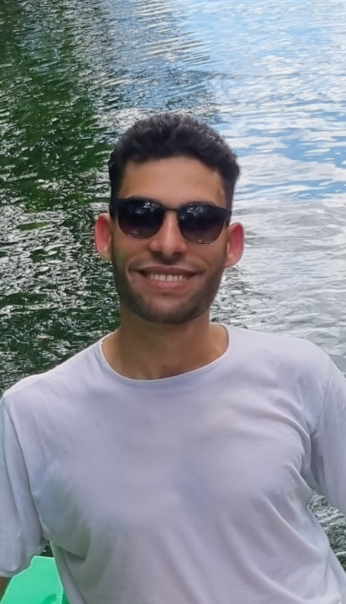

---
hide:
  - navigation
  - toc
title: About
---

<link rel="stylesheet" href="../../stylesheets/home/about.css">

  

    

     

     

      <h1>Abdellatif BELMADY</h1>
      <h2>Cergy (95000), France</h2>
      <h3>Data Engineer | Data Analyst  | Data Scientist | Full-stack developer @Angular, @C++ & @Python<h3>
      

       <a href="https://www.linkedin.com/in/abdellatif-belmady-ab999a133/" class="ln" style=" color: inherit;" title="Linked In - Abdellatif BELMADY"><i class="fab fa-linkedin"></i></a>
       <a href="https://github.com/abdellatif-belmady" class="git" style=" color: inherit;" title="Github - Abdellatif-belmady"><i class="fab fa-github"></i></a>
       <a href="https://www.instagram.com/abdellatifbelmady/?hl=fr" class="insta" style=" color: inherit;" title="Instagram - abdellatifbelmady"><i class="fa fa-instagram"></i></a>
       <a href="https://twitter.com/AbdellatifBELM" class="twitter" style=" color: inherit;" title="Twitter - @AbdellatifBELM"><i class="fa fa-twitter"></i></a>
       <a href="https://web.facebook.com/abdellatif.belmady/" class="ln" style=" color: inherit;" title="Facebook - Abdellatif BELMADY"><i class="fab fa-facebook"></i></a>
       <a href="https://www.spotify.com/ma-fr/account/overview/?utm_source=spotify&utm_medium=menu&utm_campaign=your_account" class="spotify" style=" color: inherit;" title="Spotify - Abdellatif BELMADY"><i class="fab fa-spotify"></i></a>
       <a href="mailto:<abdellatif.belmady@gmail.com>" class="email" style=" color: inherit;" title="Email - abdellatif.belmady@gmail.com"><i class="fas fa-paper-plane"></i></a>
      

      <a href="https://www.buymeacoffee.com/abdellatife" style=" color: inherit;">
        <button class="coffeelarge" title="Buy Me a Coffee :)"><i class="fas fa-coffee"></i> Buy Me a Coffee</button>
        <button class="coffeesmall" title="Buy Me a Coffee :)"><i class="fas fa-coffee"></i></button>
      </a>
     

    

  

  

    

     <a href="https://drive.google.com/file/d/1XEPZlp7eQP9NDvzpCd4-my32dwAzVxa7/view?usp=drive_link"><strong>Export Resume </strong><i class="far fa-file-alt"></i>
     </a><h1>About</h1>
      

      
<strong>Hey! I’m Abdellatif BELMADY,</strong> I'm a 23-year-old Moroccan student currently studying data science and digitalization at Ecole Centrale Casablanca.
      My passion for data science stems from my belief in the power of technology to drive positive change. I'm fascinated by how data can be used to solve complex problems and improve people's lives. I also believe that hard work and dedication are essential to success. As the famous author <i>Stephen King</i> once said, " <strong>Talent is cheaper than table salt. What separates the talented individual from the successful one is a lot of hard work.</strong>"

     <h2><i class="fas fa-briefcase"></i> Experience -</h2>
     
<strong>CEO and Founder Jan 2022 - Present <a href="https://www.linkedin.com/company/other-ways25/">Other Ways</a></strong> - full time

      
Currently, the possession and installation of cameras are indispensable in large organizations and in any sector. But despite their usefulness, these cameras still work in a traditional way in front of the evolution of the digital and intelligent world. Our solutions opt for intelligent cameras that integrate new technologies. Having smart cameras brings many advantages to your work and your business.
      

      
<strong>End-of-Studies Internship Apr 2023 - Sept 2023 <a href="https://www.solefarma.com/">SOLEFARMA</strong></a> - Internship

      <ul>
        <li>Designed and implemented innovative and high-performance algorithms to enhance product functionalities. 
        <li>Developed native applications in C++ and web applications using <strong><a href="https://angular.io/docs">Angular/TypeScript</a></strong> to improve user experience and accessibility.
        <li>Led a project to upgrade the 3D insole scanner by replacing the existing 2D cameras with 3D cameras.
        <li>Conducted a comprehensive study to determine the optimal camera placement for capturing accurate 3D scans.
        <li>Collaborated with the team to adapt the software using <strong><a href="https://github.com/IntelRealSense/librealsense/releases/tag/v2.53.1">the SDK</a></strong> of the 3D cameras, ensuring seamless integration and compatibility.
        <li>Tested and validated the upgraded system, ensuring its reliability and efficiency.
        <li>Documented the entire development process, including algorithm design, software implementation, and camera integration.
        </li>
      </ul>
      
During this end-of-studies internship at SOLEFARMA, I had the opportunity to work on challenging tasks, including algorithm design, software development, and hardware integration. I successfully contributed to improving product performance by implementing innovative algorithms and enhancing user interfaces. Additionally, leading the camera upgrade project allowed me to gain expertise in 3D imaging technology and software integration.

      
<strong>Internship in Computer Vision Apr 2022 - Jul 2022 <a href="https://www.linkedin.com/company/6-perform/">6 PERFORM</strong></a> - Internship

      <ul>
        <li>Collected images (using the <strong><a href="https://chrome.google.com/webstore/detail/image-downloader-imageye/agionbommeaifngbhincahgmoflcikhm">Imageye</a></strong> extention) to build a comprehensive dataset for computer vision tasks. 
        <li>Conducted image annotation using <strong><a href="https://sourceforge.net/projects/labelimg.mirror/">labelImg.exe</a></strong> to create accurate ground truth labels for training purposes.
        <li>Trained deep learning models utilizing <strong><a href="https://towardsdatascience.com/yolo-v4-optimal-speed-accuracy-for-object-detection-79896ed47b50">the YOLO version 4 algorithm</a></strong>.  for object detection and recognition.
        <li>Focused on the detection of surgical instruments, mask wearing, medical caps, and earrings in medical images.
        <li>Collaborated with a multidisciplinary team to refine the models and improve their performance.
        <li>Evaluated the models' accuracy, precision, and recall, and fine-tuned them for optimal results.
        <li>Documented the development process, including methodologies, challenges, and solutions.
        </li>
      </ul>
      
During this internship, I gained hands-on experience in computer vision techniques, including dataset collection, annotation, and training of deep learning models. I developed expertise in detecting and recognizing surgical instruments, as well as detecting mask wearing, medical caps, and earrings in medical images. This experience enhanced my skills in image processing, object detection, and model evaluation.

      
<strong>Data Analyst InternAug 2021 - Sept 2021 <a href="https://www.kerix.net/fr/annuaire-entreprise/vcr-sodalmu">VCR-Sodalmu</strong></a> - Internship

      <ul>
        <li>Developed an <strong><a href="https://drive.google.com/file/d/1x4r7bgLm6O38PKcY0ONY0IaTBthXEc6K/view?usp=share_link">Excel application</a></strong>.  using VBA to manage inventory efficiently.
        <li>Implemented a machine learning model to identify and address waste issues in the production line.
        <li>Collaborated with the team to collect and analyze data, ensuring accurate model training.
        <li>Presented findings and recommendations to improve production efficiency and reduce waste.
        <li>Gained hands-on experience in data preprocessing, feature engineering, and model evaluation.
        <li>Demonstrated strong problem-solving skills and attention to detail in resolving technical challenges.
        </li>
      </ul>
      
Overall, this internship provided me with valuable insights into the practical application of data science techniques in a real-world setting. I developed skills in Excel application development, machine learning implementation, data analysis, and problem-solving, which will contribute to my growth and success as a data scientist.

     <h2><i class="fas fa-graduation-cap"></i> Education -</h2>
      
<strong>Data Science and digitalizationSept 2020 - Present <a href="http://www.centrale-casablanca.ma/fr/">Ecole Centrale Casablanca</a></strong> Morocco, Casablanca

 

      
<strong>Physics Chemistry Engineering ScienceSept 2018 - Apr 2020 <a href="https://fabacademy.org/">Preparatory Classes Errazi</a></strong> Morocco, El Jadida

     <h2><i class="fas fa-award"></i> Honors & Awards -</h2>
      
<strong><a href="https://www.linkedin.com/company/techinnov-days/">TechInnov Days Poster Session</a>, 2nd Place (<a href="https://drive.google.com/file/d/1Z-UCedg1b5777CgnaPEKChC70VbUGA97/view?usp=share_link">Poster</a>)Sept 2022 - Present <a href="http://www.centrale-casablanca.ma/fr/">Ecole Centrale Casablanca</a></strong> Morocco, Casablanca

 

      
<strong>Centrale Coding Competition, 2nd Place (<a href="https://drive.google.com/file/d/1ryd9lxvUA3Qd3IUJMF8T0FRt1yWcccck/view?usp=share_link">Certification</a>)Nov 2021 - Dec 2021 <a href="http://www.centrale-casablanca.ma/fr/">Ecole Centrale Casablanca</a></strong> Morocco, Casablanca

 

     <h2><i class="fas fa-map-marker-alt"></i> Where I'm Located -</h2>
      

        <iframe width="100%" height="350" style="margin-bottom: 12px; border:0 " loading="lazy" allowfullscreen src="https://maps.google.com/maps?width=700&amp;height=440&amp;hl=en&amp;q=Cergy%2095000%2C%20France+(Titre)&amp;ie=UTF8&amp;t=&amp;z=10&amp;iwloc=B&amp;output=embed"></iframe> 
      

     <h2><i class="fas fa-city"></i> Community Involvement -</h2>
     
<strong><a href="https://www.linkedin.com/company/techinnov-days/">TechInnov Days</a>, Organizer memberSept 2022 - Present <a href="http://www.centrale-casablanca.ma/fr/">Ecole Centrale Casablanca</a></strong> Morocco, Casablanca

 

      
<strong><a href="https://www.linkedin.com/company/86309401/">Spring School Data Science</a>, Organizer member (<a href="https://drive.google.com/file/d/1dxNdsAK-3Mtm7wd0qcL3UvCtsPxz35HN/view?usp=share_link">Certification</a>)Apr 2022 - Present <a href="http://www.centrale-casablanca.ma/fr/">Ecole Centrale Casablanca</a></strong> Morocco, Casablanca

 

      
<strong><a href="https://www.linkedin.com/company/rotaract-centrale-casablanca/">Rotaract Association</a>, Active memberAug 2020 - July 2021 <a href="http://www.centrale-casablanca.ma/fr/">Ecole Centrale Casablanca</a></strong> Morocco, Casablanca

 

      
<strong><a href="https://www.linkedin.com/company/centralecomm/">CentraleComm' Association</a>, Active memberAug 2020 - July 2021 <a href="http://www.centrale-casablanca.ma/fr/">Ecole Centrale Casablanca</a></strong> Morocco, Casablanca

 
 
      
<strong><a href="https://www.linkedin.com/company/enactus-ecc/">Enactus Association</a>, Active memberAug 2020 - Jan 2021 <a href="http://www.centrale-casablanca.ma/fr/">Ecole Centrale Casablanca</a></strong> Morocco, Casablanca

 
 
      

     <h2><a href="https://www.instagram.com/abdellatifbelmady/">@abdellatifbelmady</a> On <i class="fa fa-instagram"></i> Instagram -</h2>
      

        
          

          
        
      

     <h2><i class="fas fa-headphones-alt"></i> What I'm Listening To -</h2>
      

       
    

  

