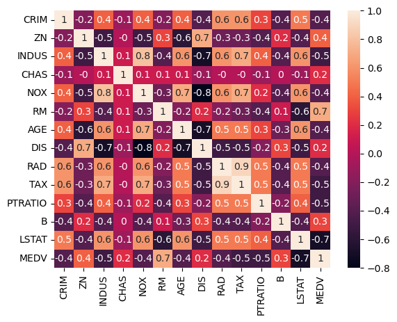
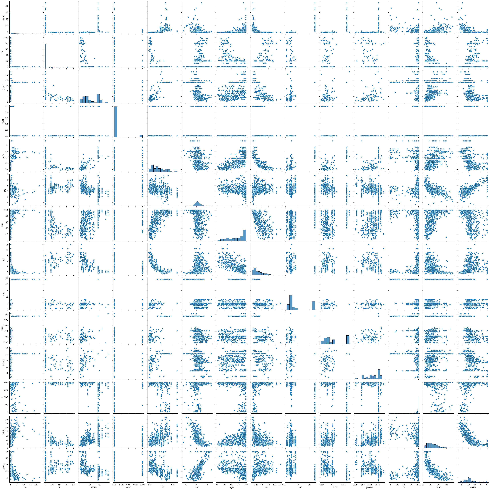
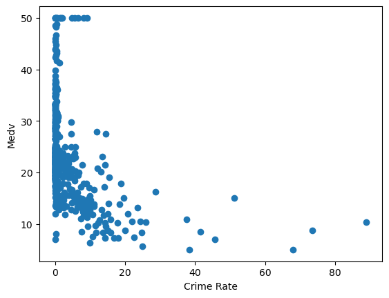
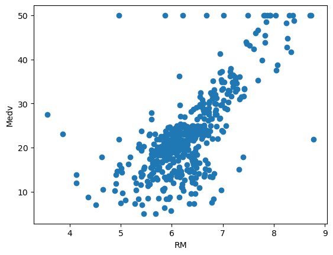
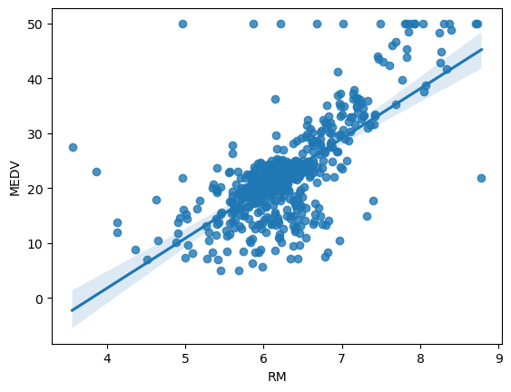
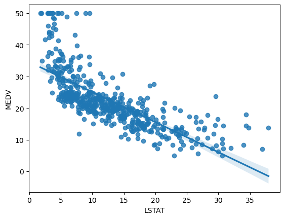
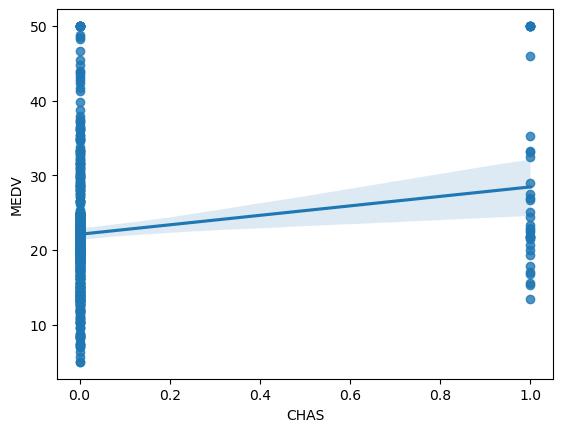

## **Bibliothèques**

Tout d'abord, exécutons la cellule ci-dessous pour importer tous les paquets dont vous aurez besoin au cours de cette étude.

- [pandas](https://pandas.pydata.org/) est une bibliothèque écrite pour le langage de programmation Python permettant la manipulation et l'analyse des données.

- [numpy](https://numpy.org/doc/1.20/) est une bibliothèque pour langage de programmation Python, destinée à manipuler des matrices ou tableaux multidimensionnels ainsi que des fonctions mathématiques opérant sur ces tableaux.

- [matplotlib](http://matplotlib.org) est une bibliothèque du langage de programmation Python destinée à tracer et visualiser des données sous forme de graphiques.

- [seaborn](https://seaborn.pydata.org/) est une bibliothèque de visualisation Python basée sur matplotlib. Elle fournit une interface de haut niveau pour dessiner des graphiques statistiques attrayants.

- [keras](https://keras.io/) est l'API de haut niveau de TensorFlow.

- [sklearn](https://scikit-learn.org/stable/) est une bibliothèque libre Python destinée à l'apprentissage automatique. 
- [pickle](https://docs.python.org/3/library/pickle.html) est principalement utilisé pour sérialiser et désérialiser une structure objet Python. En d'autres termes, c'est le processus de conversion d'un objet Python en un flux d'octets pour le stocker dans un fichier/base de données, maintenir l'état du programme entre les sessions ou transporter des données sur le réseau.

```py
import numpy as np
import pandas as pd
import matplotlib.pyplot as plt
from tensorflow import keras
from keras import layers
import seaborn as sns
import pickle
from sklearn import svm
from sklearn.svm import SVR
from sklearn.metrics import accuracy_score, precision_score, recall_score, f1_score, confusion_matrix
from sklearn.model_selection import train_test_split
from sklearn.linear_model import LinearRegression
```

## **Etude exploratoire des données**

### **Définition des colonnes**

Dans le domaine de la science des données, la première chose à faire est de bien comprendre les données, ainsi et dans ce même sens, nous avons défini les colonnes comme suit :

- `CRIM`: per capita crime rate by town.

- `ZN`: proportion of residential land zoned for lots over 25,000 sq.ft.

- `INDUS`: proportion of non-retail business acres per town.

- `CHAS`: Charles River dummy variable (= 1 if tract bounds river; 0 otherwise).

- `NOX`: nitric oxides concentration (parts per 10 million).

- `RM`: average number of rooms per dwelling.

- `AGE`: proportion of owner-occupied units built prior to 1940.

- `DIS`: weighted distances to five Boston employment centres.

- `RAD`: index of accessibility to radial highways.

- `TAX`: full-value property-tax rate per $10,000.

- `PTRATIO`: pupil-teacher ratio by town.

- `B`: 1000(Bk - 0.63)^2 where Bk is the proportion of black people by town.

- `LSTAT`: % lower status of the population.

- `MEDV`: our ***Target***, Median value of owner-occupied homes in $1000's

### **Feature engineering**

```py
# Importer le dataset
from sklearn.datasets import load_boston
boston = load_boston()
```
```py
# Afficher les ééments clés du dataset
boston.keys()
```
??? success "Output"
    dict_keys(['data', 'target', 'feature_names', 'DESCR', 'filename', 'data_module'])

```py
## Afficher la description du dataset
print(boston.DESCR)
```
??? success "Output"
    .. _boston_dataset:

    Boston house prices dataset
    

    **Data Set Characteristics:**  

        :Number of Instances: 506 

        :Number of Attributes: 13 numeric/categorical predictive. Median Value (attribute 14) is usually the target.

        :Attribute Information (in order):
            - CRIM     per capita crime rate by town
            - ZN       proportion of residential land zoned for lots over 25,000 sq.ft.
            - INDUS    proportion of non-retail business acres per town
            - CHAS     Charles River dummy variable (= 1 if tract bounds river; 0 otherwise)
            - NOX      nitric oxides concentration (parts per 10 million)
            - RM       average number of rooms per dwelling
            - AGE      proportion of owner-occupied units built prior to 1940
            - DIS      weighted distances to five Boston employment centres
            - RAD      index of accessibility to radial highways
            - TAX      full-value property-tax rate per $10,000
            - PTRATIO  pupil-teacher ratio by town
            - B        1000(Bk - 0.63)^2 where Bk is the proportion of black people by town
            - LSTAT    % lower status of the population
            - MEDV     Median value of owner-occupied homes in $1000's

        :Missing Attribute Values: None

        :Creator: Harrison, D. and Rubinfeld, D.L.

    This is a copy of UCI ML housing dataset.
    https://archive.ics.uci.edu/ml/machine-learning-databases/housing/


    This dataset was taken from the StatLib library which is maintained at Carnegie Mellon University.

    The Boston house-price data of Harrison, D. and Rubinfeld, D.L. 'Hedonic prices and the demand for clean air', J. Environ. Economics & Management, vol.5, 81-102, 1978.   Used in Belsley, Kuh & Welsch, 'Regression diagnostics ...', Wiley, 1980.   N.B. Various transformations are used in the table on pages 244-261 of the latter.

    The Boston house-price data has been used in many machine learning papers that address regression problems.   
     
    .. topic:: References

    - Belsley, Kuh & Welsch, 'Regression diagnostics: Identifying Influential Data and Sources of Collinearity', Wiley, 1980. 244-261.
    - Quinlan,R. (1993). Combining Instance-Based and Model-Based Learning. In Proceedings on the Tenth International Conference of Machine Learning, 236-243, University of Massachusetts, Amherst. Morgan Kaufmann.


```py
# Afficher le contenu des features 
print(boston.data)
```
??? success "Output"
    [[6.3200e-03 1.8000e+01 2.3100e+00 ... 1.5300e+01 3.9690e+02 4.9800e+00]

    [2.7310e-02 0.e+00 7.0700e+00 ... 1.7800e+01 3.9690e+02 9.1400e+00]

    [2.7290e-02 0.e+00 7.0700e+00 ... 1.7800e+01 3.9283e+02 4.0300e+00]

    ...

    [6.0760e-02 0.e+00 1.1930e+01 ... 2.1000e+01 3.9690e+02 5.6400e+00]

    [1.0959e-01 0.e+00 1.1930e+01 ... 2.1000e+01 3.9345e+02 6.4800e+00]

    [4.7410e-02 0.e+00 1.1930e+01 ... 2.1000e+01 3.9690e+02 7.8800e+00]]

```py
# Afficher le contenu du label
print(boston.target)
```
??? success "Output"
    [24.  21.6 34.7 33.4 36.2 28.7 22.9 27.1 16.5 18.9 15.  18.9 21.7 20.4
    18.2 19.9 23.1 17.5 20.2 18.2 13.6 19.6 15.2 14.5 15.6 13.9 16.6 14.8
    18.4 21.  12.7 14.5 13.2 13.1 13.5 18.9 20.  21.  24.7 30.8 34.9 26.6
    25.3 24.7 21.2 19.3 20.  16.6 14.4 19.4 19.7 20.5 25.  23.4 18.9 35.4
    24.7 31.6 23.3 19.6 18.7 16.  22.2 25.  33.  23.5 19.4 22.  17.4 20.9
    24.2 21.7 22.8 23.4 24.1 21.4 20.  20.8 21.2 20.3 28.  23.9 24.8 22.9
    23.9 26.6 22.5 22.2 23.6 28.7 22.6 22.  22.9 25.  20.6 28.4 21.4 38.7
    43.8 33.2 27.5 26.5 18.6 19.3 20.1 19.5 19.5 20.4 19.8 19.4 21.7 22.8
    18.8 18.7 18.5 18.3 21.2 19.2 20.4 19.3 22.  20.3 20.5 17.3 18.8 21.4
    15.7 16.2 18.  14.3 19.2 19.6 23.  18.4 15.6 18.1 17.4 17.1 13.3 17.8
    14.  14.4 13.4 15.6 11.8 13.8 15.6 14.6 17.8 15.4 21.5 19.6 15.3 19.4
    17.  15.6 13.1 41.3 24.3 23.3 27.  50.  50.  50.  22.7 25.  50.  23.8
    23.8 22.3 17.4 19.1 23.1 23.6 22.6 29.4 23.2 24.6 29.9 37.2 39.8 36.2
    37.9 32.5 26.4 29.6 50.  32.  29.8 34.9 37.  30.5 36.4 31.1 29.1 50.
    33.3 30.3 34.6 34.9 32.9 24.1 42.3 48.5 50.  22.6 24.4 22.5 24.4 20.
    21.7 19.3 22.4 28.1 23.7 25.  23.3 28.7 21.5 23.  26.7 21.7 27.5 30.1
    44.8 50.  37.6 31.6 46.7 31.5 24.3 31.7 41.7 48.3 29.  24.  25.1 31.5
    23.7 23.3 22.  20.1 22.2 23.7 17.6 18.5 24.3 20.5 24.5 26.2 24.4 24.8
    29.6 42.8 21.9 20.9 44.  50.  36.  30.1 33.8 43.1 48.8 31.  36.5 22.8
    30.7 50.  43.5 20.7 21.1 25.2 24.4 35.2 32.4 32.  33.2 33.1 29.1 35.1
    45.4 35.4 46.  50.  32.2 22.  20.1 23.2 22.3 24.8 28.5 37.3 27.9 23.9
    21.7 28.6 27.1 20.3 22.5 29.  24.8 22.  26.4 33.1 36.1 28.4 33.4 28.2
    22.8 20.3 16.1 22.1 19.4 21.6 23.8 16.2 17.8 19.8 23.1 21.  23.8 23.1
    20.4 18.5 25.  24.6 23.  22.2 19.3 22.6 19.8 17.1 19.4 22.2 20.7 21.1
    19.5 18.5 20.6 19.  18.7 32.7 16.5 23.9 31.2 17.5 17.2 23.1 24.5 26.6
    22.9 24.1 18.6 30.1 18.2 20.6 17.8 21.7 22.7 22.6 25.  19.9 20.8 16.8
    21.9 27.5 21.9 23.1 50.  50.  50.  50.  50.  13.8 13.8 15.  13.9 13.3
    13.1 10.2 10.4 10.9 11.3 12.3  8.8  7.2 10.5  7.4 10.2 11.5 15.1 23.2
    9.7 13.8 12.7 13.1 12.5  8.5  5.   6.3  5.6  7.2 12.1  8.3  8.5  5.
    11.9 27.9 17.2 27.5 15.  17.2 17.9 16.3  7.   7.2  7.5 10.4  8.8  8.4
    16.7 14.2 20.8 13.4 11.7  8.3 10.2 10.9 11.   9.5 14.5 14.1 16.1 14.3
    11.7 13.4  9.6  8.7  8.4 12.8 10.5 17.1 18.4 15.4 10.8 11.8 14.9 12.6
    14.1 13.  13.4 15.2 16.1 17.8 14.9 14.1 12.7 13.5 14.9 20.  16.4 17.7
    19.5 20.2 21.4 19.9 19.  19.1 19.1 20.1 19.9 19.6 23.2 29.8 13.8 13.3
    16.7 12.  14.6 21.4 23.  23.7 25.  21.8 20.6 21.2 19.1 20.6 15.2  7.
    8.1 13.6 20.1 21.8 24.5 23.1 19.7 18.3 21.2 17.5 16.8 22.4 20.6 23.9
    22.  11.9]

```py
# Afficher les noms des features
print(boston.feature_names)
```
??? success "Output"
    ['CRIM' 'ZN' 'INDUS' 'CHAS' 'NOX' 'RM' 'AGE' 'DIS' 'RAD' 'TAX' 'PTRATIO' 'B' 'LSTAT']

```py
# Transformer le boston dataset en Data Frame
dataset = pd.DataFrame(boston.data,columns=boston.feature_names)
```
```py
# Afficher les 5 premières lignes du dataset
dataset.head(5)
```
??? success "Output"
    |   |CRIM	    |ZN	    |INDUS	|CHAS	|NOX	|RM	    |AGE	|DIS	|RAD	|TAX	    |PTRATIO	|B	    |LSTAT|
    |---|-----------|-------|-------|-------|-------|-------|-------|-------|-------|-----------|-----------|-------|-----|
    |0	|0.00632	|18.0	|2.31	|0.0	|0.538	|6.575	|65.2	|4.0900	|1.0	|296.0	    |15.3	    |396.90	|4.98 |
    |1	|0.02731	|0.0	|7.07	|0.0	|0.469	|6.421	|78.9	|4.9671	|2.0	|242.0	    |17.8	    |396.90	|9.14 |
    |2	|0.02729	|0.0	|7.07	|0.0	|0.469	|7.185	|61.1	|4.9671	|2.0	|242.0	    |17.8	    |392.83	|4.03 |
    |3	|0.03237	|0.0	|2.18	|0.0	|0.458	|6.998	|45.8	|6.0622	|3.0	|222.0	    |18.7	    |394.63	|2.94 |
    |4	|0.06905	|0.0	|2.18	|0.0	|0.458	|7.147	|54.2	|6.0622	|3.0	|222.0	    |18.7	    |396.90	|5.33 |

```py
# Ajouter le label au dataset et lui nommer "Price"
dataset['MEDV'] = boston.target
```
```py
# Afficher quelques informations de la data
dataset.info()
```
??? success "Output"
    `<class 'pandas.core.frame.DataFrame'>`

    RangeIndex: 506 entries, 0 to 505

    Data columns (total 14 columns):

    |#   |Column   |Non-Null |Count       |Dtype   |
    |----|---------|---------|------------|--------| 
    |0   |CRIM     |506      |non-null    |float64 |
    |1   |ZN       |506      |non-null    |float64 |
    |2   |INDUS    |506      |non-null    |float64 |
    |3   |CHAS     |506      |non-null    |float64 |
    |4   |NOX      |506      |non-null    |float64 |
    |5   |RM       |506      |non-null    |float64 |
    |6   |AGE      |506      |non-null    |float64 |
    |7   |DIS      |506      |non-null    |float64 |
    |8   |RAD      |506      |non-null    |float64 |
    |9   |TAX      |506      |non-null    |float64 |
    |10  |PTRATIO  |506      |non-null    |float64 |
    |11  |B        |506      |non-null    |float64 |
    |12  |LSTAT    |506      |non-null    |float64 |
    |13  |MEDV     |506      |non-null    |float64 |

    dtypes: float64(14)

    memory usage: 55.5 KB

- Le Dataset contient **506 lignes** et **14 colonnes**.
- toutes les colonnes sont de type **float64**.

```py
# Afficher une description statistique de la dataset
dataset.describe()
```
??? success "Output"
    |       |CRIM	|ZN	     |INDUS	 |CHAS	 |NOX	 |RM	 |AGE	 |DIS	 |RAD	  |TAX	    |PTRATIO	|B	    |LSTAT	  |MEDV     |
    |-------|-------|--------|-------|-------|-------|-------|-------|-------|--------|---------|-----------|-------|---------|---------|
    |count	|506.00 |506.00	 |506.00 |506.00 |506.00 |506.00 |506.00 |506.00 |506.00  |506.00	|506.00	    |506.00	|506.00	  |506.00   |
    |mean	|3.61	|11.36	 |11.13  |0.06	 |0.55	 |6.28	 |68.57	 |3.79	 |9.54	  |408.23	|18.45	    |356.67	|12.65	  |22.53    |
    |std	|8.60	|23.32	 |6.86	 |0.25	 |0.11	 |0.70	 |28.14	 |2.10	 |8.70	  |168.53	|2.16	    |91.29	|7.14     |9.19     |
    |min	|0.006	|0.00	 |0.46	 |0.00	 |0.38	 |3.56	 |2.90	 |1.12	 |1.00	  |187.00	|12.60	    |0.32	|1.73	  |5.00     |
    |25%	|0.08	|0.00	 |5.19	 |0.00	 |0.44	 |5.88	 |45.02	 |2.10	 |4.00	  |279.00	|17.40	    |375.37	|6.95	  |17.02    |
    |50%	|0.25	|0.00	 |9.69	 |0.00	 |0.53	 |6.20	 |77.50	 |3.20	 |5.00	  |330.00	|19.05	    |391.44	|11.36	  |21.20    |
    |75%	|3.67	|12.50	 |18.10	 |0.00	 |0.62	 |6.62	 |94.07	 |5.18	 |24.00	  |666.00	|20.20	    |396.22	|16.95	  |25.00    |
    |max	|88.97	|100.00	 |27.74	 |1.00	 |0.87	 |8.78	 |100.00 |12.12	 |24.00	  |711.00	|22.00	    |396.90	|37.97	  |50.00    |
```py
# Afficher les valeurs NaN
dataset.isnull().sum()
```
??? success "Output"
    |Column     |Number of NaN |
    |-----------|--------------|
    |CRIM       |0             |
    |ZN         |0             |
    |INDUS      |0             |
    |CHAS       |0             |
    |NOX        |0             |
    |RM         |0             |
    |AGE        |0             |
    |DIS        |0             |
    |RAD        |0             |
    |TAX        |0             |
    |PTRATIO    |0             |
    |B          |0             |
    |LSTAT      |0             |
    |MEDV       |0             |

    dtype: int64
!!! Note
    Nous notons que le dataset ne contient pas de valeurs **``NaN``**.

## **Vizualisation des données**

### **Matrice de corrélation**

La matrice de corrélation indique les valeurs de corrélation, qui mesurent le degré de relation linéaire entre chaque paire de variables. Les valeurs de corrélation peuvent être comprises entre -1 et +1. Si les deux variables ont tendance à augmenter et à diminuer en même temps, la valeur de corrélation est positive. Lorsqu'une variable augmente alors que l'autre diminue, la valeur de corrélation est négative.

```py
# Afficher la matrice de corrélation
matriceCorr = data.corr().round(1)
sns.heatmap(data=matriceCorr, annot = True)
```
??? success "Output"
    

!!! Note
    Nous notons qu'il y a plusieurs correlations entre les colonnes, mais nous n'allons pas prendre en considération ces corrélations pour l'instant parce que les réseaux de neuronnes peuvent détecter les corrélations ainsi les traiter. 

### **Représentations des colonnes deux à deux**

```py
# Afficher les représentations des colonnes deux à deux
sns.pairplot(dataset)
```
??? success "Output"
    
```py
# Afficher "MEDV" en fonction de "CRIM"
plt.scatter(dataset['CRIM'],dataset['MEDV'])
plt.xlabel("Crime Rate")
plt.ylabel("Medv")
```
??? success "Output"
    
```py
# Afficher "RM" en fonction de "MEDV"
plt.scatter(dataset['RM'],dataset['MEDV'])
plt.xlabel("RM")
plt.ylabel("Medv")
```
??? success "Output"
    
```py
# Tracer les données et l'ajustement d'un modèle de régression linéaire MEDV=f(RM)
sns.regplot(x="RM",y="MEDV",data=dataset)
```
??? success "Output"
    
```py
# Tracer les données et l'ajustement d'un modèle de régression linéaire MEDV=f(LSTAT)
sns.regplot(x="LSTAT",y="MEDV",data=dataset)
```
??? success "Output"
    
```py
# Tracer les données et l'ajustement d'un modèle de régression linéaire MEDV=f(CHAS)
sns.regplot(x="CHAS",y="MEDV",data=dataset)
```
??? success "Output"
    
```py
# Tracer les données et l'ajustement d'un modèle de régression linéaire MEDV=f(PTRATIO)
sns.regplot(x="PTRATIO",y="MEDV",data=dataset)
```
??? success "Output"
    

## **Implémentation des modèles**

### **Préparation des des vecteurs d'entrainement**

Maintenant nous allons implémenter et entrainer plusieurs modèles de machine learning afin de choisir le meilleur, mais avant nous devons définir les ***features***, le ***target*** et décomposer le dataset en data d'entrainement et data du test.  

```py
# Définir les features
X = dataset.drop('MEDV', axis=1)

# Définir le target
y = dataset['MEDV']
```
```py
# Décomposer la data en 80% pour l'entrainement et 20% pour le test
X_train, X_test, y_train, y_test = train_test_split(X,y,test_size=0.2,random_state=42)
```
```py
# Afficher la taille de X_train, X_test, y_train, y_test
print("la taille de X_train est :", X_train.shape)
print("la taille de X_test est :", X_test.shape)
print("la taille de y_train est :", y_train.shape)
print("la taille de y_test est :", y_test.shape)
```
??? success "Output"
    la taille de X_train est : (404, 13)

    la taille de X_test est : (102, 13)

    la taille de y_train est : (404,)

    la taille de y_test est : (102,)
```py
# Norrmalisation des données en utilisant le StandardScaler (x-mean)/(std)
from sklearn.preprocessing import StandardScaler
scaler = StandardScaler()
X_train = scaler.fit_transform(X_train)
X_test = scaler.transform(X_test)
```

### **Réseaux de neurones denses DNN**

```py
num_layer1 = 50
num_layer2 = 50

model = keras.models.Sequential(name='DNN')
model.add(layers.Input((13,), name="Couche_in"))
model.add(layers.Dense(num_layer1, activation='relu', name='Couche_cachee1'))
model.add(layers.Dense(num_layer2, activation='relu', name='Couche_cachee2'))
model.add(layers.Dense(1, name='Couche_out'))
```
```py
model.compile(optimizer='adam',
              loss='mse',
              metrics=['mae'])
```
```py
model.summary()
```
??? success "Output"
    Model: "DNN"

    |Layer (type)                |Output Shape              |Param #  | 
    |----------------------------|--------------------------|---------|
    |Couche_cachee1 (Dense)      |(None, 50)                |700      |
    |Couche_cachee2 (Dense)      |(None, 50)                |2550     | 
    |Couche_out (Dense)          |(None, 1)                 |51       | 

    Total params: 3,301

    Trainable params: 3,301

    Non-trainable params: 0
```py
# Lancer l'entrainement du modèle
hist = model.fit(X_train,
                 y_train,
                 epochs=400,
                 batch_size=50)
```
??? success "Output"

    Epoch 1/400
    9/9 [==============================] - 1s 4ms/step - loss: 557.3136 - mae: 21.6968

    Epoch 2/400
    9/9 [==============================] - 0s 3ms/step - loss: 520.2143 - mae: 20.8262

    Epoch 3/400
    9/9 [==============================] - 0s 3ms/step - loss: 475.9985 - mae: 19.7651

    Epoch 4/400
    9/9 [==============================] - 0s 3ms/step - loss: 423.2747 - mae: 18.4109

    Epoch 5/400
    9/9 [==============================] - 0s 3ms/step - loss: 361.1457 - mae: 16.7136

    Epoch 6/400
    9/9 [==============================] - 0s 3ms/step - loss: 289.6600 - mae: 14.6173

    Epoch 7/400
    9/9 [==============================] - 0s 3ms/step - loss: 219.4651 - mae: 12.2325

    Epoch 8/400
    9/9 [==============================] - 0s 3ms/step - loss: 158.8683 - mae: 10.0692

    Epoch 9/400
    9/9 [==============================] - 0s 3ms/step - loss: 116.7818 - mae: 8.3857

    Epoch 10/400
    9/9 [==============================] - 0s 3ms/step - loss: 91.9504 - mae: 7.3596

    Epoch 11/400
    9/9 [==============================] - 0s 3ms/step - loss: 76.5844 - mae: 6.6405

    Epoch 12/400
    9/9 [==============================] - 0s 8ms/step - loss: 62.4096 - mae: 5.9445

    Epoch 13/400
    9/9 [==============================] - 0s 3ms/step - loss: 49.9997 - mae: 5.3151

    Epoch 14/400
    9/9 [==============================] - 0s 3ms/step - loss: 40.8705 - mae: 4.8252

    Epoch 15/400
    9/9 [==============================] - 0s 3ms/step - loss: 34.1865 - mae: 4.4059

    Epoch 16/400
    9/9 [==============================] - 0s 3ms/step - loss: 29.6209 - mae: 4.0728

    Epoch 17/400
    9/9 [==============================] - 0s 3ms/step - loss: 26.3418 - mae: 3.8037

    Epoch 18/400
    9/9 [==============================] - 0s 3ms/step - loss: 24.0514 - mae: 3.6174

    Epoch 19/400
    9/9 [==============================] - 0s 3ms/step - loss: 22.3640 - mae: 3.4849

    Epoch 20/400
    9/9 [==============================] - 0s 3ms/step - loss: 21.0404 - mae: 3.3751

    Epoch 21/400
    9/9 [==============================] - 0s 3ms/step - loss: 20.0787 - mae: 3.2945

    Epoch 22/400
    9/9 [==============================] - 0s 4ms/step - loss: 19.1893 - mae: 3.2271

    Epoch 23/400
    9/9 [==============================] - 0s 3ms/step - loss: 18.4744 - mae: 3.1858

    Epoch 24/400
    9/9 [==============================] - 0s 3ms/step - loss: 17.9731 - mae: 3.1562

    Epoch 25/400
    9/9 [==============================] - 0s 3ms/step - loss: 17.4404 - mae: 3.0923

    Epoch 26/400
    9/9 [==============================] - 0s 3ms/step - loss: 16.9731 - mae: 3.0298

    Epoch 27/400
    9/9 [==============================] - 0s 3ms/step - loss: 16.6027 - mae: 2.9926

    Epoch 28/400
    9/9 [==============================] - 0s 3ms/step - loss: 16.2943 - mae: 2.9884

    Epoch 29/400
    9/9 [==============================] - 0s 3ms/step - loss: 16.1183 - mae: 2.9904

    Epoch 30/400
    9/9 [==============================] - 0s 3ms/step - loss: 15.8298 - mae: 2.9535

    Epoch 31/400
    9/9 [==============================] - 0s 3ms/step - loss: 15.4369 - mae: 2.8914

    Epoch 32/400
    9/9 [==============================] - 0s 3ms/step - loss: 15.2457 - mae: 2.8531

    Epoch 33/400
    9/9 [==============================] - 0s 3ms/step - loss: 15.0859 - mae: 2.8292

    Epoch 34/400
    9/9 [==============================] - 0s 3ms/step - loss: 14.8123 - mae: 2.8021

    Epoch 35/400
    9/9 [==============================] - 0s 2ms/step - loss: 14.7016 - mae: 2.8349

    Epoch 36/400
    9/9 [==============================] - 0s 3ms/step - loss: 14.7392 - mae: 2.8583

    Epoch 37/400
    9/9 [==============================] - 0s 3ms/step - loss: 14.4040 - mae: 2.7936

    Epoch 38/400
    9/9 [==============================] - 0s 3ms/step - loss: 14.1673 - mae: 2.7549

    Epoch 39/400
    9/9 [==============================] - 0s 3ms/step - loss: 14.0135 - mae: 2.7394

    Epoch 40/400
    9/9 [==============================] - 0s 3ms/step - loss: 13.7766 - mae: 2.7193

    Epoch 41/400
    9/9 [==============================] - 0s 3ms/step - loss: 13.6497 - mae: 2.7049

    Epoch 42/400
    9/9 [==============================] - 0s 3ms/step - loss: 13.8148 - mae: 2.7279

    Epoch 43/400
    9/9 [==============================] - 0s 3ms/step - loss: 13.5806 - mae: 2.7368

    Epoch 44/400
    9/9 [==============================] - 0s 4ms/step - loss: 13.3692 - mae: 2.6903

    Epoch 45/400
    9/9 [==============================] - 0s 3ms/step - loss: 13.1967 - mae: 2.6587

    Epoch 46/400
    9/9 [==============================] - 0s 3ms/step - loss: 13.0199 - mae: 2.6454

    Epoch 47/400
    9/9 [==============================] - 0s 3ms/step - loss: 13.0109 - mae: 2.6521

    Epoch 48/400
    9/9 [==============================] - 0s 3ms/step - loss: 12.9398 - mae: 2.6408

    Epoch 49/400
    9/9 [==============================] - 0s 3ms/step - loss: 12.8580 - mae: 2.6236

    Epoch 50/400
    9/9 [==============================] - 0s 3ms/step - loss: 12.8581 - mae: 2.6218

    Epoch 51/400
    9/9 [==============================] - 0s 3ms/step - loss: 12.7277 - mae: 2.6095

    Epoch 52/400
    9/9 [==============================] - 0s 3ms/step - loss: 12.5262 - mae: 2.5825

    Epoch 53/400
    9/9 [==============================] - 0s 3ms/step - loss: 12.5404 - mae: 2.5921

    Epoch 54/400
    9/9 [==============================] - 0s 3ms/step - loss: 12.3580 - mae: 2.5644

    Epoch 55/400
    9/9 [==============================] - 0s 3ms/step - loss: 12.2630 - mae: 2.5534

    Epoch 56/400
    9/9 [==============================] - 0s 3ms/step - loss: 12.1893 - mae: 2.5394

    Epoch 57/400
    9/9 [==============================] - 0s 4ms/step - loss: 12.0945 - mae: 2.5230

    Epoch 58/400
    9/9 [==============================] - 0s 3ms/step - loss: 12.1561 - mae: 2.5299

    Epoch 59/400
    9/9 [==============================] - 0s 3ms/step - loss: 12.0405 - mae: 2.5175

    Epoch 60/400
    9/9 [==============================] - 0s 3ms/step - loss: 12.0079 - mae: 2.4976

    Epoch 61/400
    9/9 [==============================] - 0s 3ms/step - loss: 11.8621 - mae: 2.4903

    Epoch 62/400
    9/9 [==============================] - 0s 3ms/step - loss: 11.7536 - mae: 2.4790

    Epoch 63/400
    9/9 [==============================] - 0s 3ms/step - loss: 11.8308 - mae: 2.4806

    Epoch 64/400
    9/9 [==============================] - 0s 3ms/step - loss: 11.8091 - mae: 2.4820

    Epoch 65/400
    9/9 [==============================] - 0s 3ms/step - loss: 11.6384 - mae: 2.4957

    Epoch 66/400
    9/9 [==============================] - 0s 3ms/step - loss: 11.8385 - mae: 2.5424

    Epoch 67/400
    9/9 [==============================] - 0s 4ms/step - loss: 11.7600 - mae: 2.5212

    Epoch 68/400
    9/9 [==============================] - 0s 3ms/step - loss: 11.4665 - mae: 2.4539

    Epoch 69/400
    9/9 [==============================] - 0s 3ms/step - loss: 11.4085 - mae: 2.4327

    Epoch 70/400
    9/9 [==============================] - 0s 3ms/step - loss: 11.3790 - mae: 2.4286

    Epoch 71/400
    9/9 [==============================] - 0s 4ms/step - loss: 11.2816 - mae: 2.4209

    Epoch 72/400
    9/9 [==============================] - 0s 4ms/step - loss: 11.2071 - mae: 2.4173

    Epoch 73/400
    9/9 [==============================] - 0s 3ms/step - loss: 11.1422 - mae: 2.4088

    Epoch 74/400
    9/9 [==============================] - 0s 3ms/step - loss: 11.0773 - mae: 2.4023

    Epoch 75/400
    9/9 [==============================] - 0s 3ms/step - loss: 11.0161 - mae: 2.3964

    Epoch 76/400
    9/9 [==============================] - 0s 4ms/step - loss: 11.0054 - mae: 2.3888

    Epoch 77/400
    9/9 [==============================] - 0s 3ms/step - loss: 10.8978 - mae: 2.3807

    Epoch 78/400
    9/9 [==============================] - 0s 3ms/step - loss: 10.8926 - mae: 2.3930

    Epoch 79/400
    9/9 [==============================] - 0s 3ms/step - loss: 10.9182 - mae: 2.3996

    Epoch 80/400
    9/9 [==============================] - 0s 3ms/step - loss: 10.9850 - mae: 2.4115

    Epoch 81/400
    9/9 [==============================] - 0s 3ms/step - loss: 11.0064 - mae: 2.3867

    Epoch 82/400
    9/9 [==============================] - 0s 3ms/step - loss: 11.1898 - mae: 2.3889

    Epoch 83/400
    9/9 [==============================] - 0s 3ms/step - loss: 10.7470 - mae: 2.3746

    Epoch 84/400
    9/9 [==============================] - 0s 3ms/step - loss: 10.8092 - mae: 2.4083

    Epoch 85/400
    9/9 [==============================] - 0s 3ms/step - loss: 10.5877 - mae: 2.3942

    Epoch 86/400
    9/9 [==============================] - 0s 4ms/step - loss: 10.5039 - mae: 2.3632

    Epoch 87/400
    9/9 [==============================] - 0s 3ms/step - loss: 10.5263 - mae: 2.3636

    Epoch 88/400
    9/9 [==============================] - 0s 3ms/step - loss: 10.4007 - mae: 2.3452

    Epoch 89/400
    9/9 [==============================] - 0s 3ms/step - loss: 10.3052 - mae: 2.3390

    Epoch 90/400
    9/9 [==============================] - 0s 3ms/step - loss: 10.2830 - mae: 2.3430

    Epoch 91/400
    9/9 [==============================] - 0s 3ms/step - loss: 10.2626 - mae: 2.3305

    Epoch 92/400
    9/9 [==============================] - 0s 3ms/step - loss: 10.2998 - mae: 2.3301

    Epoch 93/400
    9/9 [==============================] - 0s 3ms/step - loss: 10.3857 - mae: 2.3660

    Epoch 94/400
    9/9 [==============================] - 0s 3ms/step - loss: 10.2242 - mae: 2.3430

    Epoch 95/400
    9/9 [==============================] - 0s 3ms/step - loss: 10.0685 - mae: 2.3185

    Epoch 96/400
    9/9 [==============================] - 0s 3ms/step - loss: 10.0650 - mae: 2.3192

    Epoch 97/400
    9/9 [==============================] - 0s 3ms/step - loss: 10.0117 - mae: 2.3269

    Epoch 98/400
    9/9 [==============================] - 0s 3ms/step - loss: 10.0123 - mae: 2.3178

    Epoch 99/400
    9/9 [==============================] - 0s 3ms/step - loss: 9.9383 - mae: 2.3025

    Epoch 100/400
    9/9 [==============================] - 0s 4ms/step - loss: 9.8653 - mae: 2.2933

    Epoch 101/400
    9/9 [==============================] - 0s 3ms/step - loss: 9.9191 - mae: 2.3033

    Epoch 102/400
    9/9 [==============================] - 0s 3ms/step - loss: 9.8622 - mae: 2.2823

    Epoch 103/400
    9/9 [==============================] - 0s 3ms/step - loss: 9.7497 - mae: 2.2569

    Epoch 104/400
    9/9 [==============================] - 0s 3ms/step - loss: 9.6942 - mae: 2.2639

    Epoch 105/400
    9/9 [==============================] - 0s 4ms/step - loss: 9.6776 - mae: 2.2588

    Epoch 106/400
    9/9 [==============================] - 0s 3ms/step - loss: 9.7455 - mae: 2.2674

    Epoch 107/400
    9/9 [==============================] - 0s 3ms/step - loss: 9.5815 - mae: 2.2458

    Epoch 108/400
    9/9 [==============================] - 0s 3ms/step - loss: 9.5837 - mae: 2.2518

    Epoch 109/400
    9/9 [==============================] - 0s 3ms/step - loss: 9.4691 - mae: 2.2334

    Epoch 110/400
    9/9 [==============================] - 0s 3ms/step - loss: 9.4230 - mae: 2.2271

    Epoch 111/400
    9/9 [==============================] - 0s 3ms/step - loss: 9.4083 - mae: 2.2276

    Epoch 112/400
    9/9 [==============================] - 0s 3ms/step - loss: 9.3655 - mae: 2.2257

    Epoch 113/400
    9/9 [==============================] - 0s 3ms/step - loss: 9.3588 - mae: 2.2105

    Epoch 114/400
    9/9 [==============================] - 0s 3ms/step - loss: 9.6419 - mae: 2.2598

    Epoch 115/400
    9/9 [==============================] - 0s 3ms/step - loss: 9.5963 - mae: 2.2624

    Epoch 116/400
    9/9 [==============================] - 0s 3ms/step - loss: 9.4118 - mae: 2.2251

    Epoch 117/400
    9/9 [==============================] - 0s 3ms/step - loss: 9.2462 - mae: 2.2159

    Epoch 118/400
    9/9 [==============================] - 0s 3ms/step - loss: 9.2559 - mae: 2.2230

    Epoch 119/400
    9/9 [==============================] - 0s 3ms/step - loss: 9.1834 - mae: 2.2073

    Epoch 120/400
    9/9 [==============================] - 0s 3ms/step - loss: 9.1216 - mae: 2.1961

    Epoch 121/400
    9/9 [==============================] - 0s 4ms/step - loss: 9.1227 - mae: 2.1902

    Epoch 122/400
    9/9 [==============================] - 0s 3ms/step - loss: 9.1087 - mae: 2.1876

    Epoch 123/400
    9/9 [==============================] - 0s 4ms/step - loss: 9.1089 - mae: 2.1849

    Epoch 124/400
    9/9 [==============================] - 0s 3ms/step - loss: 9.0926 - mae: 2.1861

    Epoch 125/400
    9/9 [==============================] - 0s 3ms/step - loss: 9.2096 - mae: 2.2124

    Epoch 126/400
    9/9 [==============================] - 0s 4ms/step - loss: 9.0495 - mae: 2.1710

    Epoch 127/400
    9/9 [==============================] - 0s 3ms/step - loss: 8.9340 - mae: 2.1624

    Epoch 128/400
    9/9 [==============================] - 0s 4ms/step - loss: 8.8782 - mae: 2.1619

    Epoch 129/400
    9/9 [==============================] - 0s 3ms/step - loss: 8.8453 - mae: 2.1571

    Epoch 130/400
    9/9 [==============================] - 0s 4ms/step - loss: 8.9253 - mae: 2.1674

    Epoch 131/400
    9/9 [==============================] - 0s 5ms/step - loss: 8.8694 - mae: 2.1647

    Epoch 132/400
    9/9 [==============================] - 0s 4ms/step - loss: 8.7110 - mae: 2.1455

    Epoch 133/400
    9/9 [==============================] - 0s 4ms/step - loss: 8.7117 - mae: 2.1463

    Epoch 134/400
    9/9 [==============================] - 0s 3ms/step - loss: 8.7079 - mae: 2.1490

    Epoch 135/400
    9/9 [==============================] - 0s 4ms/step - loss: 8.6802 - mae: 2.1438

    Epoch 136/400
    9/9 [==============================] - 0s 3ms/step - loss: 8.6549 - mae: 2.1312

    Epoch 137/400
    9/9 [==============================] - 0s 3ms/step - loss: 8.5795 - mae: 2.1202

    Epoch 138/400
    9/9 [==============================] - 0s 3ms/step - loss: 8.5459 - mae: 2.1143

    Epoch 139/400
    9/9 [==============================] - 0s 3ms/step - loss: 8.5602 - mae: 2.1233

    Epoch 140/400
    9/9 [==============================] - 0s 3ms/step - loss: 8.4806 - mae: 2.1126

    Epoch 141/400
    9/9 [==============================] - 0s 3ms/step - loss: 8.4711 - mae: 2.1127

    Epoch 142/400
    9/9 [==============================] - 0s 3ms/step - loss: 8.4310 - mae: 2.1130

    Epoch 143/400
    9/9 [==============================] - 0s 3ms/step - loss: 8.3803 - mae: 2.1100

    Epoch 144/400
    9/9 [==============================] - 0s 3ms/step - loss: 8.4019 - mae: 2.1182

    Epoch 145/400
    9/9 [==============================] - 0s 3ms/step - loss: 8.5072 - mae: 2.1415

    Epoch 146/400
    9/9 [==============================] - 0s 3ms/step - loss: 8.4077 - mae: 2.1234

    Epoch 147/400
    9/9 [==============================] - 0s 3ms/step - loss: 8.3219 - mae: 2.1120

    Epoch 148/400
    9/9 [==============================] - 0s 3ms/step - loss: 8.2850 - mae: 2.1045

    Epoch 149/400
    9/9 [==============================] - 0s 3ms/step - loss: 8.2003 - mae: 2.0864

    Epoch 150/400
    9/9 [==============================] - 0s 3ms/step - loss: 8.3044 - mae: 2.1012

    Epoch 151/400
    9/9 [==============================] - 0s 3ms/step - loss: 8.1278 - mae: 2.0764

    Epoch 152/400
    9/9 [==============================] - 0s 3ms/step - loss: 8.1840 - mae: 2.0984

    Epoch 153/400
    9/9 [==============================] - 0s 3ms/step - loss: 8.0466 - mae: 2.0698

    Epoch 154/400
    9/9 [==============================] - 0s 3ms/step - loss: 8.0476 - mae: 2.0702

    Epoch 155/400
    9/9 [==============================] - 0s 3ms/step - loss: 8.0402 - mae: 2.0748

    Epoch 156/400
    9/9 [==============================] - 0s 3ms/step - loss: 7.9566 - mae: 2.0641

    Epoch 157/400
    9/9 [==============================] - 0s 3ms/step - loss: 7.9516 - mae: 2.0667

    Epoch 158/400
    9/9 [==============================] - 0s 3ms/step - loss: 7.9795 - mae: 2.0733

    Epoch 159/400
    9/9 [==============================] - 0s 4ms/step - loss: 7.8663 - mae: 2.0591

    Epoch 160/400
    9/9 [==============================] - 0s 3ms/step - loss: 7.8300 - mae: 2.0529

    Epoch 161/400
    9/9 [==============================] - 0s 3ms/step - loss: 7.8782 - mae: 2.0532

    Epoch 162/400
    9/9 [==============================] - 0s 3ms/step - loss: 7.7560 - mae: 2.0371

    Epoch 163/400
    9/9 [==============================] - 0s 3ms/step - loss: 7.9327 - mae: 2.0501

    Epoch 164/400
    9/9 [==============================] - 0s 3ms/step - loss: 8.0039 - mae: 2.0472

    Epoch 165/400
    9/9 [==============================] - 0s 4ms/step - loss: 7.8326 - mae: 2.0383

    Epoch 166/400
    9/9 [==============================] - 0s 3ms/step - loss: 7.7433 - mae: 2.0366

    Epoch 167/400
    9/9 [==============================] - 0s 3ms/step - loss: 7.7063 - mae: 2.0403

    Epoch 168/400
    9/9 [==============================] - 0s 4ms/step - loss: 7.6165 - mae: 2.0247

    Epoch 169/400
    9/9 [==============================] - 0s 3ms/step - loss: 7.6203 - mae: 2.0237

    Epoch 170/400
    9/9 [==============================] - 0s 4ms/step - loss: 7.7583 - mae: 2.0332

    Epoch 171/400
    9/9 [==============================] - 0s 4ms/step - loss: 7.7060 - mae: 2.0474

    Epoch 172/400
    9/9 [==============================] - 0s 4ms/step - loss: 7.7214 - mae: 2.0453

    Epoch 173/400
    9/9 [==============================] - 0s 4ms/step - loss: 7.5782 - mae: 2.0151

    Epoch 174/400
    9/9 [==============================] - 0s 3ms/step - loss: 7.4870 - mae: 1.9941

    Epoch 175/400
    9/9 [==============================] - 0s 3ms/step - loss: 7.4292 - mae: 1.9942

    Epoch 176/400
    9/9 [==============================] - 0s 3ms/step - loss: 7.4034 - mae: 1.9908

    Epoch 177/400
    9/9 [==============================] - 0s 3ms/step - loss: 7.3374 - mae: 1.9794

    Epoch 178/400
    9/9 [==============================] - 0s 3ms/step - loss: 7.3651 - mae: 1.9837

    Epoch 179/400
    9/9 [==============================] - 0s 3ms/step - loss: 7.3334 - mae: 1.9801

    Epoch 180/400
    9/9 [==============================] - 0s 3ms/step - loss: 7.2986 - mae: 1.9715

    Epoch 181/400
    9/9 [==============================] - 0s 3ms/step - loss: 7.3080 - mae: 1.9842

    Epoch 182/400
    9/9 [==============================] - 0s 3ms/step - loss: 7.2384 - mae: 1.9710

    Epoch 183/400
    9/9 [==============================] - 0s 3ms/step - loss: 7.2382 - mae: 1.9695

    Epoch 184/400
    9/9 [==============================] - 0s 4ms/step - loss: 7.1499 - mae: 1.9672

    Epoch 185/400
    9/9 [==============================] - 0s 4ms/step - loss: 7.2522 - mae: 1.9746

    Epoch 186/400
    9/9 [==============================] - 0s 3ms/step - loss: 7.1246 - mae: 1.9721

    Epoch 187/400
    9/9 [==============================] - 0s 3ms/step - loss: 7.0991 - mae: 1.9624

    Epoch 188/400
    9/9 [==============================] - 0s 4ms/step - loss: 7.0756 - mae: 1.9483

    Epoch 189/400
    9/9 [==============================] - 0s 3ms/step - loss: 7.1697 - mae: 1.9584

    Epoch 190/400
    9/9 [==============================] - 0s 4ms/step - loss: 6.9426 - mae: 1.9408

    Epoch 191/400
    9/9 [==============================] - 0s 3ms/step - loss: 7.0492 - mae: 1.9498

    Epoch 192/400
    9/9 [==============================] - 0s 3ms/step - loss: 6.9617 - mae: 1.9392

    Epoch 193/400
    9/9 [==============================] - 0s 3ms/step - loss: 6.9713 - mae: 1.9391

    Epoch 194/400
    9/9 [==============================] - 0s 3ms/step - loss: 6.9681 - mae: 1.9466

    Epoch 195/400
    9/9 [==============================] - 0s 3ms/step - loss: 7.0815 - mae: 1.9378

    Epoch 196/400
    9/9 [==============================] - 0s 3ms/step - loss: 6.9769 - mae: 1.9339

    Epoch 197/400
    9/9 [==============================] - 0s 4ms/step - loss: 6.8727 - mae: 1.9210

    Epoch 198/400
    9/9 [==============================] - 0s 3ms/step - loss: 6.8014 - mae: 1.9227

    Epoch 199/400
    9/9 [==============================] - 0s 3ms/step - loss: 6.7703 - mae: 1.9244

    Epoch 200/400
    9/9 [==============================] - 0s 3ms/step - loss: 6.8127 - mae: 1.9195

    Epoch 201/400
    9/9 [==============================] - 0s 3ms/step - loss: 6.7469 - mae: 1.9105

    Epoch 202/400
    9/9 [==============================] - 0s 3ms/step - loss: 6.7515 - mae: 1.9144

    Epoch 203/400
    9/9 [==============================] - 0s 3ms/step - loss: 6.6946 - mae: 1.9044

    Epoch 204/400
    9/9 [==============================] - 0s 4ms/step - loss: 6.6362 - mae: 1.8985

    Epoch 205/400
    9/9 [==============================] - 0s 4ms/step - loss: 6.6175 - mae: 1.8955

    Epoch 206/400
    9/9 [==============================] - 0s 3ms/step - loss: 6.5702 - mae: 1.8874

    Epoch 207/400
    9/9 [==============================] - 0s 3ms/step - loss: 6.5716 - mae: 1.8900

    Epoch 208/400
    9/9 [==============================] - 0s 4ms/step - loss: 6.5384 - mae: 1.8846

    Epoch 209/400
    9/9 [==============================] - 0s 3ms/step - loss: 6.5449 - mae: 1.8830

    Epoch 210/400
    9/9 [==============================] - 0s 3ms/step - loss: 6.5513 - mae: 1.8749

    Epoch 211/400
    9/9 [==============================] - 0s 4ms/step - loss: 6.4929 - mae: 1.8735

    Epoch 212/400
    9/9 [==============================] - 0s 3ms/step - loss: 6.5068 - mae: 1.8747

    Epoch 213/400
    9/9 [==============================] - 0s 3ms/step - loss: 6.5305 - mae: 1.8740

    Epoch 214/400
    9/9 [==============================] - 0s 6ms/step - loss: 6.5346 - mae: 1.8997

    Epoch 215/400
    9/9 [==============================] - 0s 5ms/step - loss: 6.4906 - mae: 1.8849

    Epoch 216/400
    9/9 [==============================] - 0s 4ms/step - loss: 6.4162 - mae: 1.8608

    Epoch 217/400
    9/9 [==============================] - 0s 3ms/step - loss: 6.3261 - mae: 1.8522

    Epoch 218/400
    9/9 [==============================] - 0s 3ms/step - loss: 6.2750 - mae: 1.8420

    Epoch 219/400
    9/9 [==============================] - 0s 3ms/step - loss: 6.2780 - mae: 1.8364

    Epoch 220/400
    9/9 [==============================] - 0s 2ms/step - loss: 6.2991 - mae: 1.8530

    Epoch 221/400
    9/9 [==============================] - 0s 2ms/step - loss: 6.2668 - mae: 1.8361

    Epoch 222/400
    9/9 [==============================] - 0s 2ms/step - loss: 6.2077 - mae: 1.8355

    Epoch 223/400
    9/9 [==============================] - 0s 3ms/step - loss: 6.1889 - mae: 1.8245

    Epoch 224/400
    9/9 [==============================] - 0s 2ms/step - loss: 6.2081 - mae: 1.8289

    Epoch 225/400
    9/9 [==============================] - 0s 2ms/step - loss: 6.1629 - mae: 1.8108

    Epoch 226/400
    9/9 [==============================] - 0s 2ms/step - loss: 6.1450 - mae: 1.8226

    Epoch 227/400
    9/9 [==============================] - 0s 2ms/step - loss: 6.1505 - mae: 1.8359

    Epoch 228/400
    9/9 [==============================] - 0s 2ms/step - loss: 6.1221 - mae: 1.8270

    Epoch 229/400
    9/9 [==============================] - 0s 3ms/step - loss: 6.1809 - mae: 1.8272

    Epoch 230/400
    9/9 [==============================] - 0s 3ms/step - loss: 6.0162 - mae: 1.8011

    Epoch 231/400
    9/9 [==============================] - 0s 3ms/step - loss: 6.1452 - mae: 1.8393

    Epoch 232/400
    9/9 [==============================] - 0s 3ms/step - loss: 6.0985 - mae: 1.8124

    Epoch 233/400
    9/9 [==============================] - 0s 2ms/step - loss: 6.4570 - mae: 1.8844

    Epoch 234/400
    9/9 [==============================] - 0s 1ms/step - loss: 6.2272 - mae: 1.8489

    Epoch 235/400
    9/9 [==============================] - 0s 2ms/step - loss: 6.0741 - mae: 1.8166

    Epoch 236/400
    9/9 [==============================] - 0s 4ms/step - loss: 6.0031 - mae: 1.8197

    Epoch 237/400
    9/9 [==============================] - 0s 2ms/step - loss: 5.9739 - mae: 1.8037

    Epoch 238/400
    9/9 [==============================] - 0s 2ms/step - loss: 6.0253 - mae: 1.8145

    Epoch 239/400
    9/9 [==============================] - 0s 2ms/step - loss: 5.9134 - mae: 1.7873

    Epoch 240/400
    9/9 [==============================] - 0s 4ms/step - loss: 5.8683 - mae: 1.7957

    Epoch 241/400
    9/9 [==============================] - 0s 2ms/step - loss: 5.8370 - mae: 1.7853

    Epoch 242/400
    9/9 [==============================] - 0s 2ms/step - loss: 5.6954 - mae: 1.7598

    Epoch 243/400
    9/9 [==============================] - 0s 3ms/step - loss: 5.7053 - mae: 1.7696

    Epoch 244/400
    9/9 [==============================] - 0s 2ms/step - loss: 5.6565 - mae: 1.7627

    Epoch 245/400
    9/9 [==============================] - 0s 2ms/step - loss: 5.7158 - mae: 1.7734

    Epoch 246/400
    9/9 [==============================] - 0s 3ms/step - loss: 5.6415 - mae: 1.7482

    Epoch 247/400
    9/9 [==============================] - 0s 2ms/step - loss: 5.6077 - mae: 1.7508

    Epoch 248/400
    9/9 [==============================] - 0s 2ms/step - loss: 5.7397 - mae: 1.7653

    Epoch 249/400
    9/9 [==============================] - 0s 3ms/step - loss: 5.6152 - mae: 1.7499

    Epoch 250/400
    9/9 [==============================] - 0s 2ms/step - loss: 5.6300 - mae: 1.7422

    Epoch 251/400
    9/9 [==============================] - 0s 3ms/step - loss: 5.5146 - mae: 1.7228

    Epoch 252/400
    9/9 [==============================] - 0s 2ms/step - loss: 5.5786 - mae: 1.7403

    Epoch 253/400
    9/9 [==============================] - 0s 4ms/step - loss: 5.5123 - mae: 1.7385

    Epoch 254/400
    9/9 [==============================] - 0s 3ms/step - loss: 5.4784 - mae: 1.7380

    Epoch 255/400
    9/9 [==============================] - 0s 2ms/step - loss: 5.5062 - mae: 1.7488

    Epoch 256/400
    9/9 [==============================] - 0s 2ms/step - loss: 5.5507 - mae: 1.7410

    Epoch 257/400
    9/9 [==============================] - 0s 3ms/step - loss: 5.4626 - mae: 1.7239

    Epoch 258/400
    9/9 [==============================] - 0s 2ms/step - loss: 5.4174 - mae: 1.7266

    Epoch 259/400
    9/9 [==============================] - 0s 2ms/step - loss: 5.4086 - mae: 1.7221

    Epoch 260/400
    9/9 [==============================] - 0s 2ms/step - loss: 5.4384 - mae: 1.7349

    Epoch 261/400
    9/9 [==============================] - 0s 2ms/step - loss: 5.3345 - mae: 1.7105

    Epoch 262/400
    9/9 [==============================] - 0s 2ms/step - loss: 5.4374 - mae: 1.7372

    Epoch 263/400
    9/9 [==============================] - 0s 2ms/step - loss: 5.3719 - mae: 1.7141

    Epoch 264/400
    9/9 [==============================] - 0s 3ms/step - loss: 5.3888 - mae: 1.7084

    Epoch 265/400
    9/9 [==============================] - 0s 2ms/step - loss: 5.3843 - mae: 1.7203

    Epoch 266/400
    9/9 [==============================] - 0s 3ms/step - loss: 5.2937 - mae: 1.6940

    Epoch 267/400
    9/9 [==============================] - 0s 3ms/step - loss: 5.4328 - mae: 1.7181

    Epoch 268/400
    9/9 [==============================] - 0s 3ms/step - loss: 5.4531 - mae: 1.7435

    Epoch 269/400
    9/9 [==============================] - 0s 3ms/step - loss: 5.3654 - mae: 1.7205

    Epoch 270/400
    9/9 [==============================] - 0s 3ms/step - loss: 5.2651 - mae: 1.6883

    Epoch 271/400
    9/9 [==============================] - 0s 3ms/step - loss: 5.2156 - mae: 1.6878

    Epoch 272/400
    9/9 [==============================] - 0s 3ms/step - loss: 5.1566 - mae: 1.6785

    Epoch 273/400
    9/9 [==============================] - 0s 2ms/step - loss: 5.1215 - mae: 1.6799

    Epoch 274/400
    9/9 [==============================] - 0s 2ms/step - loss: 5.2469 - mae: 1.7029

    Epoch 275/400
    9/9 [==============================] - 0s 2ms/step - loss: 5.2710 - mae: 1.7097

    Epoch 276/400
    9/9 [==============================] - 0s 3ms/step - loss: 5.2278 - mae: 1.7117

    Epoch 277/400
    9/9 [==============================] - 0s 3ms/step - loss: 5.2271 - mae: 1.6952

    Epoch 278/400
    9/9 [==============================] - 0s 4ms/step - loss: 5.2615 - mae: 1.6881

    Epoch 279/400
    9/9 [==============================] - 0s 3ms/step - loss: 5.0883 - mae: 1.6659

    Epoch 280/400
    9/9 [==============================] - 0s 3ms/step - loss: 5.0631 - mae: 1.6695

    Epoch 281/400
    9/9 [==============================] - 0s 2ms/step - loss: 5.0413 - mae: 1.6467

    Epoch 282/400
    9/9 [==============================] - 0s 2ms/step - loss: 5.0614 - mae: 1.6541

    Epoch 283/400
    9/9 [==============================] - 0s 3ms/step - loss: 5.2651 - mae: 1.6999

    Epoch 284/400
    9/9 [==============================] - 0s 3ms/step - loss: 5.0937 - mae: 1.6658

    Epoch 285/400
    9/9 [==============================] - 0s 3ms/step - loss: 4.9900 - mae: 1.6483

    Epoch 286/400
    9/9 [==============================] - 0s 3ms/step - loss: 4.9686 - mae: 1.6482

    Epoch 287/400
    9/9 [==============================] - 0s 2ms/step - loss: 4.9377 - mae: 1.6493

    Epoch 288/400
    9/9 [==============================] - 0s 3ms/step - loss: 4.9239 - mae: 1.6397

    Epoch 289/400
    9/9 [==============================] - 0s 4ms/step - loss: 5.0049 - mae: 1.6458

    Epoch 290/400
    9/9 [==============================] - 0s 3ms/step - loss: 5.0257 - mae: 1.6677

    Epoch 291/400
    9/9 [==============================] - 0s 3ms/step - loss: 4.9595 - mae: 1.6502

    Epoch 292/400
    9/9 [==============================] - 0s 3ms/step - loss: 4.8937 - mae: 1.6199

    Epoch 293/400
    9/9 [==============================] - 0s 3ms/step - loss: 4.8048 - mae: 1.6054

    Epoch 294/400
    9/9 [==============================] - 0s 3ms/step - loss: 4.8538 - mae: 1.6189

    Epoch 295/400
    9/9 [==============================] - 0s 3ms/step - loss: 4.8086 - mae: 1.6214

    Epoch 296/400
    9/9 [==============================] - 0s 3ms/step - loss: 4.9100 - mae: 1.6228

    Epoch 297/400
    9/9 [==============================] - 0s 4ms/step - loss: 4.7689 - mae: 1.6057

    Epoch 298/400
    9/9 [==============================] - 0s 3ms/step - loss: 4.7895 - mae: 1.6120

    Epoch 299/400
    9/9 [==============================] - 0s 3ms/step - loss: 4.7679 - mae: 1.6074

    Epoch 300/400
    9/9 [==============================] - 0s 3ms/step - loss: 4.9302 - mae: 1.6508

    Epoch 301/400
    9/9 [==============================] - 0s 4ms/step - loss: 4.8806 - mae: 1.6316

    Epoch 302/400
    9/9 [==============================] - 0s 4ms/step - loss: 4.7871 - mae: 1.6054

    Epoch 303/400
    9/9 [==============================] - 0s 4ms/step - loss: 4.7296 - mae: 1.6088

    Epoch 304/400
    9/9 [==============================] - 0s 3ms/step - loss: 4.8593 - mae: 1.6316

    Epoch 305/400
    9/9 [==============================] - 0s 3ms/step - loss: 4.8702 - mae: 1.6265

    Epoch 306/400
    9/9 [==============================] - 0s 4ms/step - loss: 4.9289 - mae: 1.6436

    Epoch 307/400
    9/9 [==============================] - 0s 3ms/step - loss: 4.8258 - mae: 1.6364

    Epoch 308/400
    9/9 [==============================] - 0s 3ms/step - loss: 4.7715 - mae: 1.6131

    Epoch 309/400
    9/9 [==============================] - 0s 3ms/step - loss: 4.7257 - mae: 1.5808

    Epoch 310/400
    9/9 [==============================] - 0s 3ms/step - loss: 4.9713 - mae: 1.6622

    Epoch 311/400
    9/9 [==============================] - 0s 3ms/step - loss: 4.7670 - mae: 1.6311

    Epoch 312/400
    9/9 [==============================] - 0s 3ms/step - loss: 4.7790 - mae: 1.6104

    Epoch 313/400
    9/9 [==============================] - 0s 3ms/step - loss: 4.6748 - mae: 1.6186

    Epoch 314/400
    9/9 [==============================] - 0s 3ms/step - loss: 4.7386 - mae: 1.6191

    Epoch 315/400
    9/9 [==============================] - 0s 3ms/step - loss: 4.5862 - mae: 1.5769

    Epoch 316/400
    9/9 [==============================] - 0s 3ms/step - loss: 4.6310 - mae: 1.5809

    Epoch 317/400
    9/9 [==============================] - 0s 3ms/step - loss: 4.8212 - mae: 1.6367

    Epoch 318/400
    9/9 [==============================] - 0s 3ms/step - loss: 4.4685 - mae: 1.5482

    Epoch 319/400
    9/9 [==============================] - 0s 3ms/step - loss: 4.6965 - mae: 1.5876

    Epoch 320/400
    9/9 [==============================] - 0s 3ms/step - loss: 4.7098 - mae: 1.5959

    Epoch 321/400
    9/9 [==============================] - 0s 3ms/step - loss: 4.8441 - mae: 1.6635

    Epoch 322/400
    9/9 [==============================] - 0s 3ms/step - loss: 4.5366 - mae: 1.5945

    Epoch 323/400
    9/9 [==============================] - 0s 3ms/step - loss: 4.7188 - mae: 1.5974

    Epoch 324/400
    9/9 [==============================] - 0s 3ms/step - loss: 4.5682 - mae: 1.5611

    Epoch 325/400
    9/9 [==============================] - 0s 3ms/step - loss: 4.5609 - mae: 1.5801

    Epoch 326/400
    9/9 [==============================] - 0s 3ms/step - loss: 4.5395 - mae: 1.5852

    Epoch 327/400
    9/9 [==============================] - 0s 3ms/step - loss: 4.4885 - mae: 1.5625

    Epoch 328/400
    9/9 [==============================] - 0s 3ms/step - loss: 4.3885 - mae: 1.5423

    Epoch 329/400
    9/9 [==============================] - 0s 4ms/step - loss: 4.5206 - mae: 1.5739

    Epoch 330/400
    9/9 [==============================] - 0s 7ms/step - loss: 4.4114 - mae: 1.5382

    Epoch 331/400
    9/9 [==============================] - 0s 3ms/step - loss: 4.3323 - mae: 1.5197

    Epoch 332/400
    9/9 [==============================] - 0s 3ms/step - loss: 4.3240 - mae: 1.5208

    Epoch 333/400
    9/9 [==============================] - 0s 3ms/step - loss: 4.4238 - mae: 1.5322

    Epoch 334/400
    9/9 [==============================] - 0s 3ms/step - loss: 4.3662 - mae: 1.5501

    Epoch 335/400
    9/9 [==============================] - 0s 3ms/step - loss: 4.3211 - mae: 1.5324

    Epoch 336/400
    9/9 [==============================] - 0s 3ms/step - loss: 4.2283 - mae: 1.5031

    Epoch 337/400
    9/9 [==============================] - 0s 4ms/step - loss: 4.2960 - mae: 1.5352

    Epoch 338/400
    9/9 [==============================] - 0s 3ms/step - loss: 4.2662 - mae: 1.5223

    Epoch 339/400
    9/9 [==============================] - 0s 3ms/step - loss: 4.3856 - mae: 1.5406

    Epoch 340/400
    9/9 [==============================] - 0s 3ms/step - loss: 4.3143 - mae: 1.5513

    Epoch 341/400
    9/9 [==============================] - 0s 3ms/step - loss: 4.3948 - mae: 1.5666

    Epoch 342/400
    9/9 [==============================] - 0s 3ms/step - loss: 4.3177 - mae: 1.5356

    Epoch 343/400
    9/9 [==============================] - 0s 3ms/step - loss: 4.2848 - mae: 1.5331

    Epoch 344/400
    9/9 [==============================] - 0s 3ms/step - loss: 4.2723 - mae: 1.5274

    Epoch 345/400
    9/9 [==============================] - 0s 3ms/step - loss: 4.2018 - mae: 1.5079

    Epoch 346/400
    9/9 [==============================] - 0s 3ms/step - loss: 4.2182 - mae: 1.5171

    Epoch 347/400
    9/9 [==============================] - 0s 3ms/step - loss: 4.2083 - mae: 1.5251

    Epoch 348/400
    9/9 [==============================] - 0s 3ms/step - loss: 4.2829 - mae: 1.5318

    Epoch 349/400
    9/9 [==============================] - 0s 3ms/step - loss: 4.1793 - mae: 1.4975

    Epoch 350/400
    9/9 [==============================] - 0s 3ms/step - loss: 4.1535 - mae: 1.5021

    Epoch 351/400
    9/9 [==============================] - 0s 3ms/step - loss: 4.1689 - mae: 1.4901

    Epoch 352/400
    9/9 [==============================] - 0s 3ms/step - loss: 4.1737 - mae: 1.5091

    Epoch 353/400
    9/9 [==============================] - 0s 3ms/step - loss: 4.2916 - mae: 1.5423

    Epoch 354/400
    9/9 [==============================] - 0s 3ms/step - loss: 4.2486 - mae: 1.5089

    Epoch 355/400
    9/9 [==============================] - 0s 3ms/step - loss: 4.5061 - mae: 1.5545

    Epoch 356/400
    9/9 [==============================] - 0s 4ms/step - loss: 4.1563 - mae: 1.5199

    Epoch 357/400
    9/9 [==============================] - 0s 3ms/step - loss: 4.1927 - mae: 1.5353

    Epoch 358/400
    9/9 [==============================] - 0s 3ms/step - loss: 4.0238 - mae: 1.4803

    Epoch 359/400
    9/9 [==============================] - 0s 3ms/step - loss: 4.2785 - mae: 1.5282

    Epoch 360/400
    9/9 [==============================] - 0s 3ms/step - loss: 4.1957 - mae: 1.5044

    Epoch 361/400
    9/9 [==============================] - 0s 3ms/step - loss: 4.0877 - mae: 1.5101

    Epoch 362/400
    9/9 [==============================] - 0s 3ms/step - loss: 3.9776 - mae: 1.4631

    Epoch 363/400
    9/9 [==============================] - 0s 3ms/step - loss: 3.9758 - mae: 1.4540

    Epoch 364/400
    9/9 [==============================] - 0s 3ms/step - loss: 3.9303 - mae: 1.4430

    Epoch 365/400
    9/9 [==============================] - 0s 3ms/step - loss: 3.9630 - mae: 1.4558

    Epoch 366/400
    9/9 [==============================] - 0s 3ms/step - loss: 3.8929 - mae: 1.4350

    Epoch 367/400
    9/9 [==============================] - 0s 3ms/step - loss: 3.9009 - mae: 1.4355

    Epoch 368/400
    9/9 [==============================] - 0s 3ms/step - loss: 3.9361 - mae: 1.4656

    Epoch 369/400
    9/9 [==============================] - 0s 3ms/step - loss: 3.9120 - mae: 1.4496

    Epoch 370/400
    9/9 [==============================] - 0s 3ms/step - loss: 3.8926 - mae: 1.4374

    Epoch 371/400
    9/9 [==============================] - 0s 3ms/step - loss: 3.8675 - mae: 1.4317

    Epoch 372/400
    9/9 [==============================] - 0s 4ms/step - loss: 3.8442 - mae: 1.4272

    Epoch 373/400
    9/9 [==============================] - 0s 3ms/step - loss: 3.8265 - mae: 1.4365

    Epoch 374/400
    9/9 [==============================] - 0s 3ms/step - loss: 3.7951 - mae: 1.4227

    Epoch 375/400
    9/9 [==============================] - 0s 3ms/step - loss: 3.8109 - mae: 1.4185

    Epoch 376/400
    9/9 [==============================] - 0s 4ms/step - loss: 3.8171 - mae: 1.4315

    Epoch 377/400
    9/9 [==============================] - 0s 3ms/step - loss: 3.8079 - mae: 1.4224

    Epoch 378/400
    9/9 [==============================] - 0s 3ms/step - loss: 3.9359 - mae: 1.4343

    Epoch 379/400
    9/9 [==============================] - 0s 3ms/step - loss: 3.9052 - mae: 1.4712

    Epoch 380/400
    9/9 [==============================] - 0s 3ms/step - loss: 3.9682 - mae: 1.4686

    Epoch 381/400
    9/9 [==============================] - 0s 4ms/step - loss: 3.8712 - mae: 1.4372

    Epoch 382/400
    9/9 [==============================] - 0s 10ms/step - loss: 3.7983 - mae: 1.4193

    Epoch 383/400
    9/9 [==============================] - 0s 16ms/step - loss: 3.7823 - mae: 1.4226

    Epoch 384/400
    9/9 [==============================] - 0s 5ms/step - loss: 3.7303 - mae: 1.4140

    Epoch 385/400
    9/9 [==============================] - 0s 4ms/step - loss: 3.7204 - mae: 1.4044

    Epoch 386/400
    9/9 [==============================] - 0s 3ms/step - loss: 3.7432 - mae: 1.4152

    Epoch 387/400
    9/9 [==============================] - 0s 3ms/step - loss: 3.7204 - mae: 1.4045

    Epoch 388/400
    9/9 [==============================] - 0s 3ms/step - loss: 3.7163 - mae: 1.3980

    Epoch 389/400
    9/9 [==============================] - 0s 3ms/step - loss: 3.6538 - mae: 1.3896

    Epoch 390/400
    9/9 [==============================] - 0s 3ms/step - loss: 3.6510 - mae: 1.3874

    Epoch 391/400
    9/9 [==============================] - 0s 3ms/step - loss: 3.9399 - mae: 1.4741

    Epoch 392/400
    9/9 [==============================] - 0s 3ms/step - loss: 3.8155 - mae: 1.4265

    Epoch 393/400
    9/9 [==============================] - 0s 3ms/step - loss: 3.6893 - mae: 1.3884

    Epoch 394/400
    9/9 [==============================] - 0s 3ms/step - loss: 3.6876 - mae: 1.4176

    Epoch 395/400
    9/9 [==============================] - 0s 3ms/step - loss: 3.6896 - mae: 1.3905

    Epoch 396/400
    9/9 [==============================] - 0s 3ms/step - loss: 3.6180 - mae: 1.3828

    Epoch 397/400
    9/9 [==============================] - 0s 3ms/step - loss: 3.5933 - mae: 1.3773

    Epoch 398/400
    9/9 [==============================] - 0s 3ms/step - loss: 3.5719 - mae: 1.3750

    Epoch 399/400
    9/9 [==============================] - 0s 3ms/step - loss: 3.5381 - mae: 1.3641

    Epoch 400/400
    9/9 [==============================] - 0s 3ms/step - loss: 3.6085 - mae: 1.3688
```py
# Applique le modèle sur la data du test
pred_test = model.predict(X_test)
pred_test.shape
```
```py
# Evaluation du modèle
result_test = model.evaluate(X_test, y_test, verbose=0)
print('MSE test', round(result_test[0],2))
print('MAE test', round(result_test[1],2))
```
??? success "Output"
    MSE test 10.72

    MAE test 2.11

### **Support Vector Regression SVR**

```py
# Définir le modèle
model_SVR = svm.SVR()

# Lancer l’apprentissage
model_SVR.fit(X_train,y_train)
```

### **Régression Linéaire LR**

```py
# Définir le modèle
regression=LinearRegression()

# Lancer l’apprentissage
regression.fit(X_train,y_train)
```
```py
# Afficher les coefficients 
print(regression.coef_)
```
??? success "Output"
    [-1.00213533  0.69626862  0.27806485  0.7187384  -2.0223194   3.14523956 -0.17604788 -3.0819076   2.25140666 -1.76701378 -2.03775151  1.12956831 -3.61165842]
```py
# Afficher the intercept
print(regression.intercept_)
```
??? success "Output"
    23.023938223938224
```py
# Sur quels paramètres le modèle a entrainné
regression.get_params()
```
??? success "Output"
    {'copy_X': True,

    'fit_intercept': True,

    'n_jobs': None,

    'normalize': 'deprecated',
    
    'positive': False}
