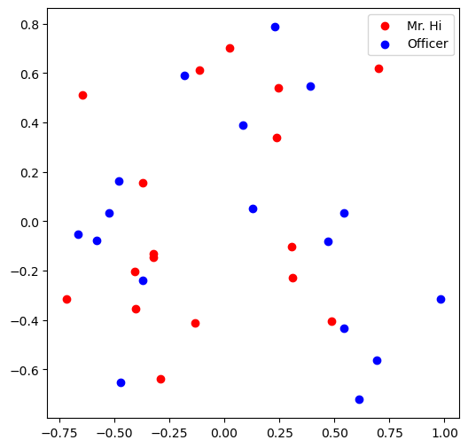
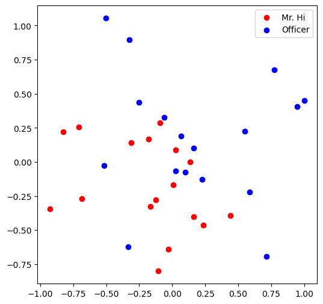
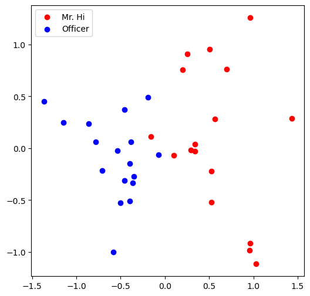
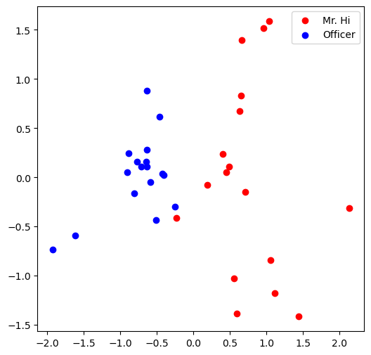

# TP: Réseaux de neurones graphiques

Dans ce TP, on va appliquer les concepts d'extraction de caractéristiques et de node embedding sur un dataset classique [Karate Club Network](https://en.wikipedia.org/wiki/Zachary%27s_karate_club).

## **Représentation graphique avec networkx**

```py
import networkx as nx
```

### **Zachary's karate club network**

Zachary's karate club est un graphe décrivant un réseau social de 34 membres d'un club de karaté. Les liens représentent les interactions entre les membres en dehors du club.

```py
G = nx.karate_club_graph()

nx.draw(G, with_labels = True)
```

??? success "Output"
    

### **Question 1 : quel est le degré moyen du karaté club ?**

```py
def average_degree(num_edges, num_nodes):
  # Cette fonction retourne le degré moyen du graphe.

    avg_degree = 0

    avg_degree = round(2 * num_edges/num_nodes)

    return avg_degree

num_edges = G.number_of_edges()
num_nodes = G.number_of_nodes()
print("Nombre d'arêtes :", num_edges, "Nombre de noeuds :", num_nodes)
avg_degree = average_degree(num_edges, num_nodes)
print("Le degré moyen du karaté club est : {}".format(avg_degree))
```

??? success "Output"
    Nombre d'arêtes : 78 Nombre de noeuds : 34
    Le degré moyen du karaté club est : 5

### **Question 2 : quel est le coefficient de clustering moyen du karaté club ?**

```py
def average_clust_coef(G):
  # Cette fonction retourne le coefficient de clustring moyen du caracté club 

  ####### Code ########
    avg_cluster_coef = nx.algorithms.cluster.average_clustering(G)
  #####################
  
    return avg_cluster_coef

avg_cluster_coef = average_clust_coef(G)
print("Le coefficient de clustering moyen du karaté club est : {}".format(avg_cluster_coef))
```

??? success "Output"
    Le coefficient de clustering moyen du karaté club est : 0.5706384782076823

### **Question 3 : quelle est la centralité de proximité du noeud numéro 5 ?**

??? success "Output"
    La centralité de proximité est définie par :  $c(v) = \frac{1}{\sum_{u \neq v}\text{le chemin le plus court entre } u \text{ and } v}$

```py
def closeness_centrality(G, node = 5):
  # Cette fonction retourne la centralité de proximité d'un noeud donné

  ###### Code #######
    degree_centrality = nx.algorithms.centrality.closeness_centrality(G)
    closeness = degree_centrality[node]
  ###################

    return closeness

node = 5
closeness = closeness_centrality(G, node=node)
print("La centralité de proximité du noeud numéro 5 est : {}".format(closeness))
```

??? success "Output"
    La centralité de proximité du noeud numéro 5 est : 0.38372093023255816

### **Question 4 : quelle est la centralité intermédiaire associée à un noeud donné du karacté club ?**

```py
def betweeness_centrality(G, node = 5):
  # Cette fonction retourne la centralité intermédiaire d'un noeud donné

  ####### Code ########
    btw_centrality = nx.algorithms.centrality.betweenness_centrality(G)
    betweeness = btw_centrality[node]
  #####################
  
    return betweeness
node = 5
betweeness = betweeness_centrality(G, node=node)
print("La centralité intermédiaire du noeud numéro 5 est : {}".format(closeness))
```
??? success "Output"
    La centralité intermédiaire du noeud numéro 5 est : 0.38372093023255816

## **Graphe en Tenseur**

Nous allons transformer le graphe  G  en tenseur Pytorch.

```py
import torch
```

### **Question 5 : Liste des arêtes du Karaté club en format torch.LongTensor. Quel le nombe d'arêtes positives ?**

```py
def graph_to_edge_list(G):

  # Cette fonction retourne la liste des arêtes d'un graphe sous forme
  # de couplet composé de deux noeuds.

    edge_list = []
    lst1 = []
    lst2 = []

  ############# Code ############
    edge_list = list(G.edges())
  #########################################

    return edge_list

def edge_list_to_tensor(edge_list):
 
  # Cette fonction transforme un liste d'arêtes en Tenseur Pytorch
  # de dimension [2 x len(edge_list)]

    edge_index = torch.tensor([])

  ############# Code ############
    edge_index = torch.tensor(edge_list, dtype = torch.long).permute((1,0))
  #########################################

    return edge_index

pos_edge_list = graph_to_edge_list(G)
# print(pos_edge_list)
pos_edge_index = edge_list_to_tensor(pos_edge_list)
print("La dimension de pos_edge_index est : {}".format(pos_edge_index.shape))
print("La somme des valeurs de pos_edge_index : {}".format(torch.sum(pos_edge_index)))
```

??? success "Output"
    La dimension de pos_edge_index est : torch.Size([2, 78])
    La somme des valeurs de pos_edge_index : 2535

### **Question 6 : Ecrire une fonction qui retourne les arêtes négatives.**

```py
import random

def sample_negative_edges(G, num_neg_samples):

  # Cette fonction retourne la liste des arêtes négatives. 

    neg_edge_list = []
    pos_set = set(G.edges())
    visited_set = set()
    

  ############# Code ############
    for n_i in G.nodes():
        for n_j in G.nodes():
            if n_i == n_j or (n_i,n_j) in pos_set or (n_j,n_i) in pos_set or (n_i,n_j) in visited_set or (n_j, n_i) is visited_set:
                continue
            neg_edge_list.append((n_i,n_j))
            visited_set.add((n_i,n_j))
            visited_set.add((n_j,n_i))
            if len(neg_edge_list) == num_neg_samples:
                break

  ###############################

    return neg_edge_list

# Echantillon de 78 arêtes négatives
neg_edge_list = sample_negative_edges(G, len(pos_edge_list))

# Convertir la liste des arêtes négatives en tenseur
neg_edge_index = edge_list_to_tensor(neg_edge_list)
print("Le tenseur neg_edge_index est de dimension {}".format(neg_edge_index.shape))

# Quelles sont les arêtes négatives parmi les arêtes suivantes ?
edge_1 = (7, 1)
edge_2 = (1, 33)
edge_3 = (33, 22)
edge_4 = (0, 4)
edge_5 = (4, 2)
```

??? success "Output"
    Le tenseur neg_edge_index est de dimension torch.Size([2, 483])

```py
a = nx.negative_edge_cycle(G)
print(a)
```

??? success "Output"
    False

## **Node Embeddings**

```py
import torch
import torch.nn as nn
import matplotlib.pyplot as plt
from sklearn.decomposition import PCA
```

On va utiliser ici le module [nn.Embedding](https://pytorch.org/docs/stable/generated/torch.nn.Embedding.html) de PyTorch.

```py
# Initialisation de la couche d'embeddings
# avec, par exemple, 4 objets de dimension 8 chacun

emb_sample = nn.Embedding(num_embeddings=4, embedding_dim=8)
print('Embedding layer: {}'.format(emb_sample))
```

??? success "Output"
    Embedding layer: Embedding(4, 8)

!!! Info
    On peut sélectionner l'embedding d'un objet en utilisant l'indice correspondant.

```py
# Sélectionner un seul embedding
id = torch.LongTensor([1])
print(emb_sample(id))

# Sélectionner plusieurs embeddings
ids = torch.LongTensor([1, 3])
print(emb_sample(ids))

# Obtenir la dimension de la mtrice de poids de l'embedding
shape = emb_sample.weight.data.shape
print(shape)

# Affecter de nouvelles valeurs à la matrice de poids (ici des 1)
emb_sample.weight.data = torch.ones(shape)

# Vérifier la nouvelle affectation
ids = torch.LongTensor([0, 3])
print(emb_sample(ids))
```

??? success "Output"
    tensor([[-0.6316,  0.5919,  0.3717, -0.0679, -1.0768,  0.7879, -0.3337,  1.6544]],
           grad_fn=<EmbeddingBackward0>)
    tensor([[-0.6316,  0.5919,  0.3717, -0.0679, -1.0768,  0.7879, -0.3337,  1.6544],
            [ 1.4465,  0.5489, -0.5271, -1.6461,  0.5401, -0.8992,  0.6385,  0.8055]],
           grad_fn=<EmbeddingBackward0>)
    torch.Size([4, 8])
    tensor([[1., 1., 1., 1., 1., 1., 1., 1.],
            [1., 1., 1., 1., 1., 1., 1., 1.]], grad_fn=<EmbeddingBackward0>)

On va appliquer à cela au jeu de données Zachary's karaté club.
On va associer un vecteur de dimension 16 à chaque noeud du graphe.
on va initialiser la matrice avec une distribution uniforme dans  [0,1]  en utilisant [torch.rand](https://pytorch.org/docs/stable/generated/torch.rand.html).

```py
torch.manual_seed(1)

def create_node_emb(num_node=34, embedding_dim=16):
 
  # Ecrire une fonction qui implémente la matrice d'embeddings pour les noeuds.
  # La fonction doit retourner un embedding de format torch.nn initalisé selon
  # une loi uniforme dans [0,1].

    emb = None

  ############# Code ############
    emb = nn.Embedding(num_embeddings=num_nodes, embedding_dim=embedding_dim)
    shape = emb.weight.data.shape
    emb.weight.data = torch.rand(shape)
  ###############################

    return emb

emb = create_node_emb()
ids = torch.LongTensor([0, 3])

print("Embedding: {}".format(emb))

print(emb(ids))
```

??? success "Output"
    Embedding: Embedding(34, 16)
    tensor([[0.2114, 0.7335, 0.1433, 0.9647, 0.2933, 0.7951, 0.5170, 0.2801, 0.8339,
             0.1185, 0.2355, 0.5599, 0.8966, 0.2858, 0.1955, 0.1808],
            [0.7486, 0.6546, 0.3843, 0.9820, 0.6012, 0.3710, 0.4929, 0.9915, 0.8358,
             0.4629, 0.9902, 0.7196, 0.2338, 0.0450, 0.7906, 0.9689]],
        grad_fn=<EmbeddingBackward0>)
    

### **Visualisation des embeddings**

Nous allons projet les embeddings inialisés ci-dessous en deux dimensions afin de les visualiser.

```py
def visualize_emb(emb):
    X = emb.weight.data.numpy()
    pca = PCA(n_components=2)
    components = pca.fit_transform(X)
    plt.figure(figsize=(6, 6))
    club1_x = []
    club1_y = []
    club2_x = []
    club2_y = []
    for node in G.nodes(data=True):
        if node[1]['club'] == 'Mr. Hi':
            club1_x.append(components[node[0]][0])
            club1_y.append(components[node[0]][1])
        else:
            club2_x.append(components[node[0]][0])
            club2_y.append(components[node[0]][1])
    plt.scatter(club1_x, club1_y, color="red", label="Mr. Hi")
    plt.scatter(club2_x, club2_y, color="blue", label="Officer")
    plt.legend()
    plt.show()

# Visualize the initial random embeddding
visualize_emb(emb)
```

??? success "Output"
    

### **Question 7 : calcul des embeddings par descente du gradient.**

```py
from torch.optim import SGD

def accuracy(pred, label):
  # Cette fonction prend les prédictions réalisées, 
  # les arrondit et calcul la précision du modèle.

    accu = 0.0
    accu = torch.sum(torch.round(pred) == label) / pred.shape[0]

    return accu

def train(emb, loss_fn, sigmoid, train_label, train_edge):
  # Cette fonction entraîne les embeddings par SGD.
  # A faire :
  # 1 : récupérer les embeddings respectifs des noeuds à partir de train_edge
  # 2 : Calculer le produit scalaire des embeddings de chaque paire de noeuds
  # 3 : Appliquer une fonction sigmoïde au produit scalaire calculé
  # 4 : Appliquer la loss_fn au résultat de la fonction sigmoïde
  # 5 : Imprimer la fonction loss et la précision à chaque epoch. 
  # (as a sanity check, the loss should decrease during training)


    epochs = 500
    learning_rate = 0.1

    optimizer = SGD(emb.parameters(), lr=learning_rate, momentum=0.9)

    for i in range(epochs):
        

    ############# Code ###########
        optimizer.zero_grad()  # Clear gradients.

        product = torch.sum(torch.mul(emb(train_edge[0]),emb(train_edge[1])), axis = 1)
        pred = torch.sigmoid(product)
        loss = loss_fn(pred, train_label)
        loss.backward()  # Derive gradients.
        optimizer.step()  # Update parameters based on gradients.

    
        with torch.no_grad():
            accu = accuracy(pred, train_label)
            if i % 100 == 0:
                visualize_emb(emb)
            print("loss: {}, accuracy: {}".format(loss.item(), accu))

    ##############################

loss_fn = nn.BCELoss()
sigmoid = nn.Sigmoid()

# Générer les labels positifs et négatifs
pos_label = torch.ones(pos_edge_index.shape[1], )
neg_label = torch.zeros(neg_edge_index.shape[1], )

# Concaténer les labels positifs and négatifs dans le même tenseur
train_label = torch.cat([pos_label, neg_label], dim=0)


train_edge = torch.cat([pos_edge_index, neg_edge_index], dim=1)

train(emb, loss_fn, sigmoid, train_label, train_edge)
```

??? success "Output"
    

    loss: 3.468411684036255, accuracy: 0.13903743028640747
    loss: 3.43456768989563, accuracy: 0.13903743028640747
    loss: 3.371028184890747, accuracy: 0.13903743028640747
    loss: 3.282146453857422, accuracy: 0.13903743028640747
    loss: 3.1723263263702393, accuracy: 0.13903743028640747
    loss: 3.045901298522949, accuracy: 0.13903743028640747
    loss: 2.907038450241089, accuracy: 0.13903743028640747
    loss: 2.7596638202667236, accuracy: 0.13903743028640747
    loss: 2.6074018478393555, accuracy: 0.13903743028640747
    loss: 2.4535279273986816, accuracy: 0.13903743028640747
    loss: 2.3009305000305176, accuracy: 0.13903743028640747
    loss: 2.152082920074463, accuracy: 0.13903743028640747
    loss: 2.009026050567627, accuracy: 0.13903743028640747
    loss: 1.8733632564544678, accuracy: 0.13903743028640747
    loss: 1.7462693452835083, accuracy: 0.13903743028640747
    loss: 1.6285123825073242, accuracy: 0.13903743028640747
    loss: 1.5204927921295166, accuracy: 0.14260248839855194
    loss: 1.4222900867462158, accuracy: 0.14438502490520477
    loss: 1.3337185382843018, accuracy: 0.14973261952400208
    loss: 1.254386305809021, accuracy: 0.15508021414279938
    loss: 1.183752417564392, accuracy: 0.16399286687374115
    loss: 1.1211791038513184, accuracy: 0.17290551960468292
    loss: 1.0659770965576172, accuracy: 0.18538324534893036
    loss: 1.0174411535263062, accuracy: 0.20677362382411957
    loss: 0.9748789668083191, accuracy: 0.22281639277935028
    loss: 0.937629222869873, accuracy: 0.2442067712545395
    loss: 0.9050756096839905, accuracy: 0.2549019753932953
    loss: 0.8766528964042664, accuracy: 0.27807486057281494
    loss: 0.8518502116203308, accuracy: 0.3030303120613098
    loss: 0.8302105069160461, accuracy: 0.3333333432674408
    loss: 0.8113287091255188, accuracy: 0.35650622844696045
    loss: 0.7948473691940308, accuracy: 0.38324421644210815
    loss: 0.7804537415504456, accuracy: 0.40463459491729736
    loss: 0.7678741216659546, accuracy: 0.4153297543525696
    loss: 0.7568702101707458, accuracy: 0.4367201328277588
    loss: 0.7472350597381592, accuracy: 0.4474153220653534
    loss: 0.7387885451316833, accuracy: 0.45989304780960083
    loss: 0.731374979019165, accuracy: 0.4777183532714844
    loss: 0.7248587012290955, accuracy: 0.48663100600242615
    loss: 0.7191224098205566, accuracy: 0.5080214142799377
    loss: 0.714064359664917, accuracy: 0.5222816467285156
    loss: 0.7095963358879089, accuracy: 0.5204991102218628
    loss: 0.7056415677070618, accuracy: 0.531194269657135
    loss: 0.7021337151527405, accuracy: 0.5347593426704407
    loss: 0.6990148425102234, accuracy: 0.5436720252037048
    loss: 0.6962348818778992, accuracy: 0.5472370982170105
    loss: 0.6937502026557922, accuracy: 0.5490196347236633
    loss: 0.6915227174758911, accuracy: 0.554367184638977
    loss: 0.689519464969635, accuracy: 0.5561497211456299
    loss: 0.6877117156982422, accuracy: 0.5561497211456299
    loss: 0.686074435710907, accuracy: 0.565062403678894
    loss: 0.6845855712890625, accuracy: 0.5704099535942078
    loss: 0.683226466178894, accuracy: 0.5739750266075134
    loss: 0.6819803714752197, accuracy: 0.5757575631141663
    loss: 0.68083256483078, accuracy: 0.5739750266075134
    loss: 0.6797709465026855, accuracy: 0.5739750266075134
    loss: 0.6787840723991394, accuracy: 0.5757575631141663
    loss: 0.6778624653816223, accuracy: 0.5793226361274719
    loss: 0.6769978404045105, accuracy: 0.5793226361274719
    loss: 0.6761825680732727, accuracy: 0.5828877091407776
    loss: 0.6754106283187866, accuracy: 0.5846702456474304
    loss: 0.6746761202812195, accuracy: 0.5846702456474304
    loss: 0.6739742159843445, accuracy: 0.5882353186607361
    loss: 0.6733008027076721, accuracy: 0.5900177955627441
    loss: 0.672652006149292, accuracy: 0.591800332069397
    loss: 0.6720245480537415, accuracy: 0.5900177955627441
    loss: 0.6714155673980713, accuracy: 0.5900177955627441
    loss: 0.6708226799964905, accuracy: 0.5900177955627441
    loss: 0.670243501663208, accuracy: 0.5900177955627441
    loss: 0.6696761846542358, accuracy: 0.5935828685760498
    loss: 0.6691192388534546, accuracy: 0.591800332069397
    loss: 0.6685709357261658, accuracy: 0.5900177955627441
    loss: 0.6680300831794739, accuracy: 0.5900177955627441
    loss: 0.6674955487251282, accuracy: 0.5900177955627441
    loss: 0.6669663190841675, accuracy: 0.591800332069397
    loss: 0.6664415597915649, accuracy: 0.591800332069397
    loss: 0.6659204363822937, accuracy: 0.5935828685760498
    loss: 0.6654024720191956, accuracy: 0.5935828685760498
    loss: 0.6648867726325989, accuracy: 0.5935828685760498
    loss: 0.664372980594635, accuracy: 0.5971479415893555
    loss: 0.6638606786727905, accuracy: 0.5989304780960083
    loss: 0.6633493900299072, accuracy: 0.602495551109314
    loss: 0.6628386974334717, accuracy: 0.6042780876159668
    loss: 0.6623283624649048, accuracy: 0.6078431606292725
    loss: 0.6618180274963379, accuracy: 0.6114081740379333
    loss: 0.6613075137138367, accuracy: 0.6131907105445862
    loss: 0.6607966423034668, accuracy: 0.614973247051239
    loss: 0.6602851748466492, accuracy: 0.6167557835578918
    loss: 0.6597728729248047, accuracy: 0.6167557835578918
    loss: 0.6592594981193542, accuracy: 0.614973247051239
    loss: 0.6587451696395874, accuracy: 0.6167557835578918
    loss: 0.6582295298576355, accuracy: 0.6167557835578918
    loss: 0.6577125191688538, accuracy: 0.6185383200645447
    loss: 0.6571941375732422, accuracy: 0.6185383200645447
    loss: 0.6566741466522217, accuracy: 0.6185383200645447
    loss: 0.6561526656150818, accuracy: 0.6221033930778503
    loss: 0.6556293368339539, accuracy: 0.6238859295845032
    loss: 0.6551043391227722, accuracy: 0.625668466091156
    loss: 0.6545774936676025, accuracy: 0.625668466091156
    loss: 0.6540487408638, accuracy: 0.6274510025978088

    

    loss: 0.65351802110672, accuracy: 0.6274510025978088
    loss: 0.6529853940010071, accuracy: 0.6274510025978088
    loss: 0.6524505615234375, accuracy: 0.6292335391044617
    loss: 0.6519137620925903, accuracy: 0.6292335391044617
    loss: 0.6513748168945312, accuracy: 0.6310160160064697
    loss: 0.650833785533905, accuracy: 0.6345810890197754
    loss: 0.6502905488014221, accuracy: 0.6327985525131226
    loss: 0.6497451663017273, accuracy: 0.6345810890197754
    loss: 0.6491974592208862, accuracy: 0.638146162033081
    loss: 0.6486475467681885, accuracy: 0.638146162033081
    loss: 0.6480953693389893, accuracy: 0.6434937715530396
    loss: 0.6475409865379333, accuracy: 0.6434937715530396
    loss: 0.6469841599464417, accuracy: 0.6417112350463867
    loss: 0.6464250683784485, accuracy: 0.6434937715530396
    loss: 0.6458637714385986, accuracy: 0.6452763080596924
    loss: 0.645300030708313, accuracy: 0.6452763080596924
    loss: 0.6447339057922363, accuracy: 0.6452763080596924
    loss: 0.6441654562950134, accuracy: 0.6452763080596924
    loss: 0.6435947418212891, accuracy: 0.6452763080596924
    loss: 0.6430215835571289, accuracy: 0.6452763080596924
    loss: 0.6424461603164673, accuracy: 0.648841381072998
    loss: 0.6418682932853699, accuracy: 0.6524063944816589
    loss: 0.6412880420684814, accuracy: 0.6541889309883118
    loss: 0.6407055258750916, accuracy: 0.6541889309883118
    loss: 0.6401206254959106, accuracy: 0.6524063944816589
    loss: 0.6395334601402283, accuracy: 0.6524063944816589
    loss: 0.6389438509941101, accuracy: 0.6524063944816589
    loss: 0.6383520364761353, accuracy: 0.6559714674949646
    loss: 0.6377577781677246, accuracy: 0.6559714674949646
    loss: 0.6371612548828125, accuracy: 0.6559714674949646
    loss: 0.6365625858306885, accuracy: 0.6559714674949646
    loss: 0.6359614133834839, accuracy: 0.6595365405082703
    loss: 0.6353582143783569, accuracy: 0.6595365405082703
    loss: 0.6347528100013733, accuracy: 0.6595365405082703
    loss: 0.6341450214385986, accuracy: 0.6595365405082703
    loss: 0.6335352063179016, accuracy: 0.6613190770149231
    loss: 0.6329231262207031, accuracy: 0.6631016135215759
    loss: 0.6323089599609375, accuracy: 0.6613190770149231
    loss: 0.6316927075386047, accuracy: 0.6631016135215759
    loss: 0.6310743093490601, accuracy: 0.6631016135215759
    loss: 0.6304540038108826, accuracy: 0.6648841500282288
    loss: 0.6298316717147827, accuracy: 0.6666666865348816
    loss: 0.6292073130607605, accuracy: 0.6648841500282288
    loss: 0.6285809278488159, accuracy: 0.6648841500282288
    loss: 0.6279527544975281, accuracy: 0.6648841500282288
    loss: 0.6273227334022522, accuracy: 0.6648841500282288
    loss: 0.6266907453536987, accuracy: 0.6666666865348816
    loss: 0.6260570287704468, accuracy: 0.6666666865348816
    loss: 0.6254215836524963, accuracy: 0.6702316999435425
    loss: 0.624784529209137, accuracy: 0.6720142364501953
    loss: 0.6241457462310791, accuracy: 0.6702316999435425
    loss: 0.6235052347183228, accuracy: 0.6737967729568481
    loss: 0.6228633522987366, accuracy: 0.675579309463501
    loss: 0.6222198009490967, accuracy: 0.6773618459701538
    loss: 0.6215748190879822, accuracy: 0.6809269189834595
    loss: 0.6209284067153931, accuracy: 0.6809269189834595
    loss: 0.6202806830406189, accuracy: 0.6809269189834595
    loss: 0.6196316480636597, accuracy: 0.6827094554901123
    loss: 0.6189813613891602, accuracy: 0.6827094554901123
    loss: 0.6183297634124756, accuracy: 0.6827094554901123
    loss: 0.6176772117614746, accuracy: 0.6844919919967651
    loss: 0.6170234680175781, accuracy: 0.686274528503418
    loss: 0.6163687109947205, accuracy: 0.6880570650100708
    loss: 0.6157130002975464, accuracy: 0.6898396015167236
    loss: 0.6150563955307007, accuracy: 0.6916220784187317
    loss: 0.6143988966941833, accuracy: 0.6916220784187317
    loss: 0.6137406826019287, accuracy: 0.6934046149253845
    loss: 0.6130816340446472, accuracy: 0.6951871514320374
    loss: 0.6124221086502075, accuracy: 0.6951871514320374
    loss: 0.6117619276046753, accuracy: 0.6951871514320374
    loss: 0.6111010909080505, accuracy: 0.6969696879386902
    loss: 0.6104399561882019, accuracy: 0.6969696879386902
    loss: 0.6097782850265503, accuracy: 0.7005347609519958
    loss: 0.6091163754463196, accuracy: 0.698752224445343
    loss: 0.6084542870521545, accuracy: 0.7005347609519958
    loss: 0.6077919602394104, accuracy: 0.698752224445343
    loss: 0.6071293950080872, accuracy: 0.7005347609519958
    loss: 0.6064668297767639, accuracy: 0.7005347609519958
    loss: 0.6058043241500854, accuracy: 0.7040998339653015
    loss: 0.6051419377326965, accuracy: 0.7040998339653015
    loss: 0.6044796109199524, accuracy: 0.7040998339653015
    loss: 0.6038175225257874, accuracy: 0.7040998339653015
    loss: 0.6031557321548462, accuracy: 0.7058823704719543
    loss: 0.6024941802024841, accuracy: 0.7076649069786072
    loss: 0.601833164691925, accuracy: 0.70944744348526
    loss: 0.601172685623169, accuracy: 0.70944744348526
    loss: 0.6005127429962158, accuracy: 0.7112299203872681
    loss: 0.5998533368110657, accuracy: 0.70944744348526
    loss: 0.5991947054862976, accuracy: 0.70944744348526
    loss: 0.5985367298126221, accuracy: 0.70944744348526
    loss: 0.5978797078132629, accuracy: 0.7112299203872681
    loss: 0.5972235202789307, accuracy: 0.7112299203872681
    loss: 0.5965683460235596, accuracy: 0.7112299203872681
    loss: 0.5959141254425049, accuracy: 0.70944744348526
    loss: 0.5952609777450562, accuracy: 0.7147949934005737
    loss: 0.5946089625358582, accuracy: 0.7147949934005737
    loss: 0.5939582586288452, accuracy: 0.7112299203872681
    loss: 0.593308687210083, accuracy: 0.7147949934005737
    loss: 0.5926604866981506, accuracy: 0.7130124568939209
    loss: 0.5920137763023376, accuracy: 0.7130124568939209

    

    loss: 0.5913684368133545, accuracy: 0.7130124568939209
    loss: 0.5907245874404907, accuracy: 0.7130124568939209
    loss: 0.5900822281837463, accuracy: 0.7147949934005737
    loss: 0.58944171667099, accuracy: 0.7183600664138794
    loss: 0.5888026356697083, accuracy: 0.7147949934005737
    loss: 0.5881654024124146, accuracy: 0.7147949934005737
    loss: 0.5875298976898193, accuracy: 0.7147949934005737
    loss: 0.5868962407112122, accuracy: 0.7147949934005737
    loss: 0.5862644910812378, accuracy: 0.7147949934005737
    loss: 0.5856345891952515, accuracy: 0.7147949934005737
    loss: 0.5850067138671875, accuracy: 0.7147949934005737
    loss: 0.5843808054924011, accuracy: 0.7147949934005737
    loss: 0.5837571024894714, accuracy: 0.7147949934005737
    loss: 0.5831353068351746, accuracy: 0.7147949934005737
    loss: 0.5825158357620239, accuracy: 0.7165775299072266
    loss: 0.5818983912467957, accuracy: 0.7147949934005737
    loss: 0.5812832713127136, accuracy: 0.7147949934005737
    loss: 0.5806704163551331, accuracy: 0.7147949934005737
    loss: 0.5800597667694092, accuracy: 0.7165775299072266
    loss: 0.5794515609741211, accuracy: 0.7165775299072266
    loss: 0.5788455605506897, accuracy: 0.7165775299072266
    loss: 0.5782421231269836, accuracy: 0.7165775299072266
    loss: 0.577640950679779, accuracy: 0.7147949934005737
    loss: 0.577042281627655, accuracy: 0.7147949934005737
    loss: 0.5764461755752563, accuracy: 0.7130124568939209
    loss: 0.5758525133132935, accuracy: 0.7147949934005737
    loss: 0.5752614140510559, accuracy: 0.7147949934005737
    loss: 0.5746727585792542, accuracy: 0.7147949934005737
    loss: 0.5740866661071777, accuracy: 0.7165775299072266
    loss: 0.5735033750534058, accuracy: 0.7165775299072266
    loss: 0.5729224681854248, accuracy: 0.7165775299072266
    loss: 0.5723443031311035, accuracy: 0.7183600664138794
    loss: 0.5717687606811523, accuracy: 0.7183600664138794
    loss: 0.5711959004402161, accuracy: 0.7165775299072266
    loss: 0.5706256031990051, accuracy: 0.7147949934005737
    loss: 0.5700580477714539, accuracy: 0.7147949934005737
    loss: 0.5694931745529175, accuracy: 0.7147949934005737
    loss: 0.568930983543396, accuracy: 0.7147949934005737
    loss: 0.5683714747428894, accuracy: 0.7147949934005737
    loss: 0.5678147077560425, accuracy: 0.7130124568939209
    loss: 0.5672606229782104, accuracy: 0.7130124568939209
    loss: 0.5667092204093933, accuracy: 0.7130124568939209
    loss: 0.5661605596542358, accuracy: 0.7183600664138794
    loss: 0.5656147003173828, accuracy: 0.7183600664138794
    loss: 0.5650715231895447, accuracy: 0.7183600664138794
    loss: 0.5645310282707214, accuracy: 0.7183600664138794
    loss: 0.5639932155609131, accuracy: 0.7165775299072266
    loss: 0.5634582042694092, accuracy: 0.7165775299072266
    loss: 0.5629258155822754, accuracy: 0.7165775299072266
    loss: 0.562396228313446, accuracy: 0.7165775299072266
    loss: 0.5618692636489868, accuracy: 0.7147949934005737
    loss: 0.5613449811935425, accuracy: 0.7147949934005737
    loss: 0.5608234405517578, accuracy: 0.7147949934005737
    loss: 0.5603045225143433, accuracy: 0.7147949934005737
    loss: 0.5597882866859436, accuracy: 0.7165775299072266
    loss: 0.5592747330665588, accuracy: 0.7165775299072266
    loss: 0.5587638020515442, accuracy: 0.7147949934005737
    loss: 0.5582554936408997, accuracy: 0.7165775299072266
    loss: 0.5577497482299805, accuracy: 0.7165775299072266
    loss: 0.5572466850280762, accuracy: 0.7165775299072266
    loss: 0.5567461848258972, accuracy: 0.7147949934005737
    loss: 0.5562481880187988, accuracy: 0.7147949934005737
    loss: 0.5557528138160706, accuracy: 0.7147949934005737
    loss: 0.5552600026130676, accuracy: 0.7147949934005737
    loss: 0.55476975440979, accuracy: 0.7147949934005737
    loss: 0.5542818903923035, accuracy: 0.7183600664138794
    loss: 0.5537965893745422, accuracy: 0.7165775299072266
    loss: 0.5533138513565063, accuracy: 0.7201426029205322
    loss: 0.5528334975242615, accuracy: 0.7201426029205322
    loss: 0.5523555874824524, accuracy: 0.7254902124404907
    loss: 0.5518800020217896, accuracy: 0.7254902124404907
    loss: 0.551406979560852, accuracy: 0.7254902124404907
    loss: 0.5509361624717712, accuracy: 0.7272727489471436
    loss: 0.5504679083824158, accuracy: 0.7254902124404907
    loss: 0.550001859664917, accuracy: 0.7254902124404907
    loss: 0.5495381951332092, accuracy: 0.7254902124404907
    loss: 0.5490767955780029, accuracy: 0.7254902124404907
    loss: 0.5486176609992981, accuracy: 0.7254902124404907
    loss: 0.5481607913970947, accuracy: 0.7272727489471436
    loss: 0.5477061867713928, accuracy: 0.7272727489471436
    loss: 0.5472538471221924, accuracy: 0.7272727489471436
    loss: 0.5468035936355591, accuracy: 0.7272727489471436
    loss: 0.5463555455207825, accuracy: 0.7272727489471436
    loss: 0.5459097027778625, accuracy: 0.7272727489471436
    loss: 0.545465886592865, accuracy: 0.7272727489471436
    loss: 0.5450242757797241, accuracy: 0.7272727489471436
    loss: 0.5445848107337952, accuracy: 0.7272727489471436
    loss: 0.544147253036499, accuracy: 0.7272727489471436
    loss: 0.54371178150177, accuracy: 0.7272727489471436
    loss: 0.5432783365249634, accuracy: 0.7272727489471436
    loss: 0.5428469777107239, accuracy: 0.7290552854537964
    loss: 0.5424174666404724, accuracy: 0.7290552854537964
    loss: 0.5419899821281433, accuracy: 0.7290552854537964
    loss: 0.541564404964447, accuracy: 0.7308377623558044
    loss: 0.5411407351493835, accuracy: 0.7326202988624573
    loss: 0.5407189726829529, accuracy: 0.7326202988624573
    loss: 0.5402990579605103, accuracy: 0.7326202988624573
    loss: 0.5398810505867004, accuracy: 0.7326202988624573
    loss: 0.5394647121429443, accuracy: 0.7326202988624573
    loss: 0.5390503406524658, accuracy: 0.7326202988624573

    

    loss: 0.5386376976966858, accuracy: 0.7344028353691101
    loss: 0.538226842880249, accuracy: 0.7344028353691101
    loss: 0.5378177165985107, accuracy: 0.7344028353691101
    loss: 0.537410318851471, accuracy: 0.7344028353691101
    loss: 0.5370044708251953, accuracy: 0.7344028353691101
    loss: 0.5366004705429077, accuracy: 0.7344028353691101
    loss: 0.536198079586029, accuracy: 0.7344028353691101
    loss: 0.5357974171638489, accuracy: 0.7344028353691101
    loss: 0.5353982448577881, accuracy: 0.7361853718757629
    loss: 0.535000741481781, accuracy: 0.7361853718757629
    loss: 0.5346047878265381, accuracy: 0.7361853718757629
    loss: 0.5342103838920593, accuracy: 0.7361853718757629
    loss: 0.5338175296783447, accuracy: 0.7361853718757629
    loss: 0.5334262251853943, accuracy: 0.7361853718757629
    loss: 0.5330364108085632, accuracy: 0.7361853718757629
    loss: 0.532647967338562, accuracy: 0.7379679083824158
    loss: 0.5322611331939697, accuracy: 0.7379679083824158
    loss: 0.5318756699562073, accuracy: 0.7344028353691101
    loss: 0.5314916968345642, accuracy: 0.7361853718757629
    loss: 0.531109094619751, accuracy: 0.7361853718757629
    loss: 0.5307279229164124, accuracy: 0.7361853718757629
    loss: 0.5303480625152588, accuracy: 0.7361853718757629
    loss: 0.5299695730209351, accuracy: 0.7361853718757629
    loss: 0.5295924544334412, accuracy: 0.7361853718757629
    loss: 0.5292166471481323, accuracy: 0.7361853718757629
    loss: 0.5288420915603638, accuracy: 0.7361853718757629
    loss: 0.528468906879425, accuracy: 0.7361853718757629
    loss: 0.5280970335006714, accuracy: 0.7361853718757629
    loss: 0.5277262926101685, accuracy: 0.7361853718757629
    loss: 0.5273568630218506, accuracy: 0.7344028353691101
    loss: 0.5269885659217834, accuracy: 0.7344028353691101
    loss: 0.5266215801239014, accuracy: 0.7361853718757629
    loss: 0.5262557864189148, accuracy: 0.7361853718757629
    loss: 0.5258911848068237, accuracy: 0.7361853718757629
    loss: 0.5255276560783386, accuracy: 0.7379679083824158
    loss: 0.5251653790473938, accuracy: 0.7397504448890686
    loss: 0.5248041749000549, accuracy: 0.7379679083824158
    loss: 0.524444043636322, accuracy: 0.7379679083824158
    loss: 0.5240850448608398, accuracy: 0.7379679083824158
    loss: 0.5237272381782532, accuracy: 0.7379679083824158
    loss: 0.5233704447746277, accuracy: 0.7379679083824158
    loss: 0.5230147242546082, accuracy: 0.7379679083824158
    loss: 0.5226598978042603, accuracy: 0.7397504448890686
    loss: 0.5223063230514526, accuracy: 0.7397504448890686
    loss: 0.5219537019729614, accuracy: 0.7397504448890686
    loss: 0.5216020941734314, accuracy: 0.7397504448890686
    loss: 0.5212514996528625, accuracy: 0.7397504448890686
    loss: 0.5209018588066101, accuracy: 0.7397504448890686
    loss: 0.5205531716346741, accuracy: 0.7397504448890686
    loss: 0.5202054381370544, accuracy: 0.7397504448890686
    loss: 0.519858717918396, accuracy: 0.7397504448890686
    loss: 0.5195128917694092, accuracy: 0.7397504448890686
    loss: 0.5191680192947388, accuracy: 0.7415329813957214
    loss: 0.51882404088974, accuracy: 0.7450980544090271
    loss: 0.5184809565544128, accuracy: 0.7433155179023743
    loss: 0.5181388258934021, accuracy: 0.7433155179023743
    loss: 0.5177974700927734, accuracy: 0.7433155179023743
    loss: 0.5174570083618164, accuracy: 0.7433155179023743
    loss: 0.5171175003051758, accuracy: 0.7433155179023743
    loss: 0.5167787671089172, accuracy: 0.7433155179023743
    loss: 0.5164408683776855, accuracy: 0.7433155179023743
    loss: 0.5161037445068359, accuracy: 0.7433155179023743
    loss: 0.515767514705658, accuracy: 0.7433155179023743
    loss: 0.5154321193695068, accuracy: 0.7450980544090271
    loss: 0.515097439289093, accuracy: 0.7468805909156799
    loss: 0.5147635340690613, accuracy: 0.7486631274223328
    loss: 0.514430582523346, accuracy: 0.7504456043243408
    loss: 0.5140981674194336, accuracy: 0.7504456043243408
    loss: 0.5137667059898376, accuracy: 0.7504456043243408
    loss: 0.5134359002113342, accuracy: 0.7504456043243408
    loss: 0.5131058096885681, accuracy: 0.7504456043243408
    loss: 0.5127764940261841, accuracy: 0.7504456043243408
    loss: 0.5124478936195374, accuracy: 0.7486631274223328
    loss: 0.5121200680732727, accuracy: 0.7486631274223328
    loss: 0.5117928385734558, accuracy: 0.7486631274223328
    loss: 0.5114663243293762, accuracy: 0.7486631274223328
    loss: 0.5111406445503235, accuracy: 0.7504456043243408
    loss: 0.5108155012130737, accuracy: 0.7486631274223328
    loss: 0.5104910731315613, accuracy: 0.7468805909156799
    loss: 0.5101673603057861, accuracy: 0.7468805909156799
    loss: 0.5098442435264587, accuracy: 0.7468805909156799
    loss: 0.5095217823982239, accuracy: 0.7486631274223328
    loss: 0.5092000365257263, accuracy: 0.7486631274223328
    loss: 0.5088788866996765, accuracy: 0.7486631274223328
    loss: 0.5085583329200745, accuracy: 0.7504456043243408
    loss: 0.5082384943962097, accuracy: 0.7504456043243408
    loss: 0.5079192519187927, accuracy: 0.7504456043243408
    loss: 0.5076005458831787, accuracy: 0.7504456043243408
    loss: 0.5072824954986572, accuracy: 0.7504456043243408
    loss: 0.5069650411605835, accuracy: 0.7504456043243408
    loss: 0.5066481828689575, accuracy: 0.7504456043243408
    loss: 0.5063318610191345, accuracy: 0.7504456043243408
    loss: 0.506016194820404, accuracy: 0.7504456043243408
    loss: 0.5057010650634766, accuracy: 0.7504456043243408
    loss: 0.505386471748352, accuracy: 0.7504456043243408
    loss: 0.5050725340843201, accuracy: 0.7522281408309937
    loss: 0.5047590732574463, accuracy: 0.7540106773376465
    loss: 0.5044461488723755, accuracy: 0.7557932138442993
    loss: 0.5041337609291077, accuracy: 0.7557932138442993
    loss: 0.5038220286369324, accuracy: 0.7557932138442993

    

    loss: 0.5035106539726257, accuracy: 0.7557932138442993
    loss: 0.5031999349594116, accuracy: 0.7557932138442993
    loss: 0.5028897523880005, accuracy: 0.7557932138442993
    loss: 0.5025800466537476, accuracy: 0.7557932138442993
    loss: 0.5022708773612976, accuracy: 0.7540106773376465
    loss: 0.5019621849060059, accuracy: 0.7540106773376465
    loss: 0.5016539096832275, accuracy: 0.7540106773376465
    loss: 0.501346230506897, accuracy: 0.7522281408309937
    loss: 0.5010391473770142, accuracy: 0.7522281408309937
    loss: 0.5007324814796448, accuracy: 0.7522281408309937
    loss: 0.5004262328147888, accuracy: 0.7522281408309937
    loss: 0.5001205205917358, accuracy: 0.7522281408309937
    loss: 0.4998152554035187, accuracy: 0.7540106773376465
    loss: 0.4995104670524597, accuracy: 0.7540106773376465
    loss: 0.49920615553855896, accuracy: 0.7540106773376465
    loss: 0.498902291059494, accuracy: 0.7540106773376465
    loss: 0.4985989034175873, accuracy: 0.7540106773376465
    loss: 0.49829596281051636, accuracy: 0.7540106773376465
    loss: 0.49799349904060364, accuracy: 0.7522281408309937
    loss: 0.49769142270088196, accuracy: 0.7522281408309937
    loss: 0.49738985300064087, accuracy: 0.7522281408309937
    loss: 0.4970887005329132, accuracy: 0.7522281408309937
    loss: 0.49678799510002136, accuracy: 0.7540106773376465
    loss: 0.49648764729499817, accuracy: 0.7540106773376465
    loss: 0.49618786573410034, accuracy: 0.7540106773376465
    loss: 0.49588844180107117, accuracy: 0.7540106773376465
    loss: 0.4955894351005554, accuracy: 0.7540106773376465
    loss: 0.4952908158302307, accuracy: 0.7540106773376465
    loss: 0.494992733001709, accuracy: 0.7540106773376465
    loss: 0.49469494819641113, accuracy: 0.7540106773376465
    loss: 0.4943976104259491, accuracy: 0.7540106773376465
    loss: 0.4941006302833557, accuracy: 0.7540106773376465
    loss: 0.4938041567802429, accuracy: 0.7540106773376465
    loss: 0.493507981300354, accuracy: 0.7557932138442993
    loss: 0.4932122528553009, accuracy: 0.7557932138442993
    loss: 0.49291694164276123, accuracy: 0.7575757503509521
    loss: 0.49262192845344543, accuracy: 0.7575757503509521
    loss: 0.49232742190361023, accuracy: 0.7575757503509521
    loss: 0.4920332133769989, accuracy: 0.7575757503509521
    loss: 0.491739422082901, accuracy: 0.7575757503509521
    loss: 0.49144604802131653, accuracy: 0.759358286857605
    loss: 0.4911530017852783, accuracy: 0.759358286857605
    loss: 0.49086034297943115, accuracy: 0.759358286857605
    loss: 0.4905681610107422, accuracy: 0.759358286857605
    loss: 0.49027615785598755, accuracy: 0.759358286857605
    loss: 0.4899846315383911, accuracy: 0.7611408233642578
    loss: 0.4896934926509857, accuracy: 0.7611408233642578
    loss: 0.4894026219844818, accuracy: 0.7611408233642578
    loss: 0.4891121983528137, accuracy: 0.7611408233642578
    loss: 0.4888221323490143, accuracy: 0.7611408233642578
    loss: 0.4885323941707611, accuracy: 0.7611408233642578
    loss: 0.48824307322502136, accuracy: 0.7611408233642578
    loss: 0.4879539906978607, accuracy: 0.759358286857605
    loss: 0.4876653552055359, accuracy: 0.759358286857605
    loss: 0.4873770475387573, accuracy: 0.759358286857605
    loss: 0.48708903789520264, accuracy: 0.7629233598709106
    loss: 0.48680150508880615, accuracy: 0.7629233598709106
    loss: 0.4865141212940216, accuracy: 0.7647058963775635
    loss: 0.4862271547317505, accuracy: 0.7647058963775635
    loss: 0.4859405755996704, accuracy: 0.7647058963775635
    loss: 0.485654354095459, accuracy: 0.7647058963775635
    loss: 0.48536837100982666, accuracy: 0.7647058963775635
    loss: 0.4850827753543854, accuracy: 0.7647058963775635
    loss: 0.48479750752449036, accuracy: 0.7647058963775635
    loss: 0.4845125079154968, accuracy: 0.7664884328842163
    loss: 0.4842279553413391, accuracy: 0.7647058963775635
    loss: 0.4839436113834381, accuracy: 0.7647058963775635
    loss: 0.48365965485572815, accuracy: 0.7664884328842163
    loss: 0.48337602615356445, accuracy: 0.7664884328842163
    loss: 0.483092725276947, accuracy: 0.7664884328842163
    loss: 0.48280972242355347, accuracy: 0.7664884328842163
    loss: 0.4825270175933838, accuracy: 0.7664884328842163
    loss: 0.48224470019340515, accuracy: 0.7682709693908691
    loss: 0.481962651014328, accuracy: 0.7682709693908691
    loss: 0.48168089985847473, accuracy: 0.7682709693908691
    loss: 0.4813995063304901, accuracy: 0.7700534462928772
    loss: 0.481118381023407, accuracy: 0.7700534462928772
    loss: 0.4808375835418701, accuracy: 0.7682709693908691
    loss: 0.48055708408355713, accuracy: 0.7682709693908691
    loss: 0.48027682304382324, accuracy: 0.7700534462928772
    loss: 0.4799969494342804, accuracy: 0.7700534462928772
    loss: 0.47971734404563904, accuracy: 0.77183598279953
    loss: 0.4794381260871887, accuracy: 0.7736185193061829
    loss: 0.4791591167449951, accuracy: 0.7736185193061829
    loss: 0.4788804352283478, accuracy: 0.7736185193061829
    loss: 0.4786020517349243, accuracy: 0.7736185193061829
    loss: 0.47832396626472473, accuracy: 0.7754010558128357
    loss: 0.478046178817749, accuracy: 0.7754010558128357
    loss: 0.4777686893939972, accuracy: 0.7754010558128357
    loss: 0.4774914085865021, accuracy: 0.7754010558128357
    loss: 0.4772144556045532, accuracy: 0.7754010558128357
    loss: 0.4769378900527954, accuracy: 0.7736185193061829
    loss: 0.4766616225242615, accuracy: 0.7754010558128357
    loss: 0.4763854742050171, accuracy: 0.7754010558128357
    loss: 0.4761098027229309, accuracy: 0.7754010558128357
    loss: 0.47583428025245667, accuracy: 0.7754010558128357
    loss: 0.4755590558052063, accuracy: 0.7754010558128357
    loss: 0.4752841889858246, accuracy: 0.7754010558128357
    loss: 0.47500959038734436, accuracy: 0.7754010558128357
    loss: 0.4747351408004761, accuracy: 0.7754010558128357


### **Visualisation des embeddings calculés**

```py
visualize_emb(emb)
```

??? success "Output"
    


