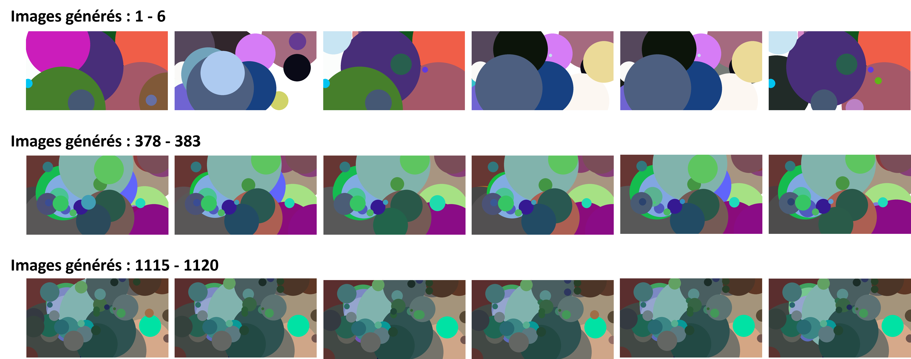

# Algorithmes Génétiques 2: Peindre Vermeer

## **Introduction**

!!! Note "Packages"
    **Les Algorithmes Génétiques 2: Peindre Vermeer** est un problème dans lequel un algorithme génétique peut être appliqué. L'objectif est de créer une peinture générée par ordinateur qui ressemble à une peinture du célèbre peintre hollandais Johannes Vermeer.

    Pour appliquer un algorithme génétique à ce problème, nous devons définir un ensemble de gènes, qui représentent dans ce cas la couleur et la position de chaque coup de pinceau. Chaque individu de la population serait une peinture créée en combinant les gènes d'une manière particulière. La fonction d'adaptation serait utilisée pour évaluer dans quelle mesure chaque peinture ressemble à une véritable peinture de Vermeer.

    L'algorithme génétique serait ensuite appliqué de la manière suivante :

    1. Initialisation : Générer une population initiale d'individus aléatoires.

    2. Évaluation : Évaluer la qualité de chaque individu en utilisant la fonction d'adaptation.

    3. Sélection : Sélectionner un sous-ensemble d'individus de la population pour servir de parents à la prochaine génération.

    4. Croisement : Combiner les gènes des parents sélectionnés pour créer de nouveaux individus.

    5. Mutation : Introduire des changements aléatoires dans les gènes des nouveaux individus.

    6. Remplacement : Remplacer certains individus de la population actuelle par les nouveaux individus.

    7. Condition d'arrêt : Vérifier si la condition d'arrêt a été atteinte. Si ce n'est pas le cas, revenir à l'étape 2.

    Dans le cas de la peinture de Vermeer, la condition d'arrêt pourrait être un nombre maximal de générations ou un niveau d'adaptation seuil.

    En appliquant ces étapes de manière itérative, l'algorithme génétique améliorera progressivement la qualité des peintures dans la population. Au fil du temps, l'algorithme peut converger vers une peinture qui ressemble étroitement à une peinture de Vermeer.

## **Importer les Packages**

!!! Note "Packages"

    - [os](https://docs.python.org/fr/3/library/os.html) : est une bibliothèque standard de Python qui permet d'interagir avec le système d'exploitation sous-jacent. Il fournit des fonctionnalités pour effectuer des opérations liées aux fichiers et aux répertoires, à l'environnement système, aux processus, etc.

    - [NumPy](https://numpy.org/) : NumPy est une bibliothèque Python populaire pour le calcul scientifique qui fournit des structures de données pour la représentation de tableaux multidimensionnels et des fonctions pour manipuler ces tableaux.

    - [random](https://www.geeksforgeeks.org/python-random-module/) : The random module in Python provides a suite of functions for generating random numbers.

    - [colour](https://pypi.org/project/colour/) : est une bibliothèque de gestion des couleurs qui offre des fonctionnalités pour la manipulation, la conversion et la représentation des couleurs dans différents espaces colorimétriques.

    - [json](https://www.w3schools.com/python/python_json.asp) : cette bibliothèque permet de travailler avec des données au format JSON (JavaScript Object Notation). Le module json offre des fonctions pour la sérialisation (encodage) et la désérialisation (décodage) des objets Python en JSON et vice versa.

    - [Pygame](https://www.pygame.org/news) : est une bibliothèque Python populaire utilisée pour développer des jeux vidéo et des applications multimédias interactives. Elle fournit des fonctionnalités pour la création de graphismes, la gestion des événements, le traitement du son, la gestion des entrées utilisateur et bien plus encore.

```py linenums="1"
import os
import numpy as np
from numpy.random import choice, random, normal
from colour import Color
import json
import pygame
```


## **Initialiser un organisme**

!!! Note "Organism"

    Ce code définit la classe ``Organism`` (Organisme) qui représente un organisme avec un ensemble de gènes. Elle a les attributs suivants :

    **chromosome:** un tableau numpy représentant les gènes de l'organisme. Les valeurs des gènes sont limitées entre 0 et 1 à l'aide de ***np.clip(genes, 0, 1)***.

    **visual:** une variable utilisée pour stocker une représentation visuelle de l'organisme (probablement une image).

    **fitness:** une variable utilisée pour stocker la valeur de fitness de l'organisme.

    La classe ``Organism`` a également une méthode ``mutate`` qui effectue une mutation sur l'organisme. Les paramètres **rate**, **scale** et **add** sont les taux de mutation et d'ajout, ainsi que l'échelle de mutation utilisés dans le processus de mutation. Voici ce que fait la méthode ``mutate`` :

    - Elle effectue une copie du chromosome de l'organisme en utilisant ***np.copy(self.chromosome)***.

    - Elle détermine le nombre de mutations à effectuer en fonction du taux de mutation : ***num_mutations = 1 + int(rate * n_gene).***

    - Elle itère sur le nombre de mutations et effectue les mutations suivantes :

        - Si le résultat de ***random() > add*** est ***True***, une mutation sur un gène existant est effectuée.

            - Un indice **i** est choisi aléatoirement à partir des indices de caractéristiques (***n_feat***).

            - Une valeur aléatoire est ajoutée à la caractéristique sélectionnée dans un gène sélectionné aléatoirement dans le chromosome.

            - Si l'indice est 3, la valeur de cette caractéristique est modulo 1.

        - Sinon, une opération d'ajout ou de suppression d'un gène est effectuée.

            - Si ***random() < 0.3***, un gène est supprimé aléatoirement du chromosome.
            Sinon, deux gènes existants sont sélectionnés aléatoirement pour créer un nouveau gène. Le nouveau gène est obtenu en faisant la moyenne des deux gènes sélectionnés et en ajoutant une perturbation. La troisième caractéristique du nouveau gène est multipliée par 0.2.

    - Enfin, la méthode renvoie un nouvel objet ``Organism`` avec le chromosome muté.

```py linenums="7"
class Organism:
    def __init__(self, genes):
        """
        Initialise un organisme avec un ensemble de gènes.
        
        - genes : Matrice représentant les gènes de l'organisme.
        """
        self.chromosome = np.clip(genes, 0, 1)
        self.visual = None
        self.fitness = None
        
    def mutate(self, rate=0.01, scale=0.3, add=0.3):
        """
        Effectue une mutation sur l'organisme avec des taux de mutation et une échelle donnés.
        
        - rate : Taux de mutation, probabilité qu'un gène soit muté.
        - scale : Échelle de la mutation, détermine l'amplitude des mutations.
        - add : Probabilité d'ajouter un nouveau gène lors de la mutation.
        
        Retourne un nouvel organisme muté.
        """
        chromosome = np.copy(self.chromosome)
        n_gene, n_feat = chromosome.shape

        # Ici, nous pouvons ajouter/supprimer un gène ou muter un gène existant
        if random() > add:
            # Mutation des caractéristiques de nos gènes
            num_mutations = 1 + int(rate * n_gene)
            # À mesure que nous effectuons plus de mutations, la taille des mutations diminue
            scale2 = scale / num_mutations
            for i in range(num_mutations):
                if random() > 0.5:
                    i = 3
                else:
                    i = choice(n_feat)
                chromosome[choice(n_gene), i] += normal() * scale2
                if i == 3:
                    chromosome[:, i] = np.mod(chromosome[:, i], 1)
        else:
            # Ajout ou suppression d'un gène
            if random() < 0.3:
                chromosome = np.delete(chromosome, choice(n_gene), axis=0)
            else:
                # Lorsque nous ajoutons un gène, nous le ferons en mélangeant deux gènes existants
                # et en le perturbant. Il est plus probable de trouver un bon gène de cette manière.
                a, b = choice(n_gene, 2, replace=False)
                gene = np.atleast_2d(0.5 * (chromosome[a, :] + chromosome[b, :]))
                gene += scale * normal(size=(1, gene.size))
                gene[:, 2] *= 0.2
                chromosome = np.append(chromosome, gene, axis=0)
                
        return Organism(chromosome)
```

-------------------------

## **Initialiser une population**

!!! Note "Population"

    La classe ``Population`` comprend plusieurs méthodes pour simuler et faire évoluer une population d'organismes basée sur une image de référence.

    Le code utilise la bibliothèque Pygame pour gérer les graphiques et la manipulation d'images. Voici un bref résumé de chaque méthode dans le code :

    - **init(self, path) :** Méthode constructeur qui charge une image de référence à partir d'un chemin de fichier donné en utilisant la bibliothèque Pygame, crée une surface sur laquelle dessiner et initialise une liste de population vide.

    - **draw(self, organism) :** Méthode pour dessiner un organisme sur la surface en itérant sur son chromosome et en dessinant des cercles avec une position, une taille et une couleur données.

    - **spawn(self, pop_size=30, complexity=10) :** Méthode pour générer une nouvelle population d'organismes en créant un certain nombre d'organismes avec un nombre spécifié de gènes dans chaque membre.

    - **calc_fitness(self, organism) :** Méthode pour calculer la forme physique d'un organisme en le dessinant et en le comparant à l'image de référence. La forme physique est calculée comme la différence absolue moyenne négative entre les pixels des deux images.

    - **get_child(self, a, b) :** Méthode pour générer un nouvel organisme en combinant deux organismes parents. Les gènes de chaque parent sont choisis au hasard avec une probabilité de 70% pour le premier parent et de 30% pour le deuxième parent. Les gènes communs sont mélangés dans le nouvel organisme.

    - **save(self, path) :** Méthode pour enregistrer la population actuelle dans un fichier JSON.

    - **load(self, path) :** Méthode pour charger une population à partir d'un fichier JSON.

    - **mutate_and_pick(self, organism, rate, scale, add, attempts=10) :** Méthode pour muter un organisme en ajoutant une valeur aléatoire à chaque gène avec une probabilité spécifiée. La méthode essaie de muter l'organisme un certain nombre de fois spécifié et renvoie l'organisme muté avec la forme physique la plus élevée.

    - **step(self, time, outdir, rate=0.01, scale=0.1, add=0.3) :** Méthode pour simuler une étape d'évolution en créant de nouvelles descendances, en les mutant et en conservant les plus adaptées. La méthode enregistre une image de l'organisme le plus adapté dans un fichier et enregistre la population actuelle dans un fichier JSON.

```py linenums="59"
class Population:
    def __init__(self, path):
        """Charge l'image de référence et crée une surface sur laquelle on peut dessiner."""
        pygame.init()
        self.ref = pygame.surfarray.pixels3d(pygame.image.load(path))
        w, h, d = self.ref.shape
        self.screen = pygame.Surface((w, h))
        self.screen.fill((255, 255, 255))
        
        self.population = []

    def draw(self, organism):
        """Dessine un organisme en exprimant chaque gène."""
        w, h, d = self.ref.shape
        screen = self.screen.copy()
        for gene in organism.chromosome:
            x, y, size, *hsl = gene
            position = (int(x * w), int(y * h))
            c = tuple(map(lambda x: int(255 * x), Color(hsl=hsl).rgb))
            pygame.draw.circle(screen, c, position, int((size * 0.3 + 0.01) * w))
        return screen
    
    def spawn(self, pop_size=30, complexity=10):
        """Génère une nouvelle population avec `complexity` gènes dans chaque membre."""
        for i in range(pop_size):
            organism = Organism(random((complexity, 6)))
            self.population.append(organism) 
            self.calc_fitness(organism)
        self.population = sorted(self.population, key=lambda x: -x.fitness)
        
    def calc_fitness(self, organism):
        """Calcule la forme physique d'un gène en le dessinant et en le comparant à la référence."""
        screen = self.draw(organism)
        diff = pygame.surfarray.pixels3d(screen) - self.ref
        organism.fitness = -np.mean(np.abs(diff)) - 1e-5 * organism.chromosome.size
        organism.visual = screen

    def get_child(self, a, b):
        """Croit un nouvel organisme en mélangeant les gènes de longueur commune, en privilégiant le premier parent."""
        new_genes = []
        n_a, n_b = a.chromosome.shape[0], b.chromosome.shape[0]
        for i in range(max(n_a, n_b)):
            if i < n_a and i < n_b:
                if random() < 0.7:
                    new_genes.append(a.chromosome[i, :])
                else:
                    new_genes.append(b.chromosome[i, :])
            elif i < n_a:
                new_genes.append(a.chromosome[i, :])
            else:
                if random() < 0.3:
                    new_genes.append(b.chromosome[i, :])
            chromosome = np.array(new_genes)
        o = Organism(chromosome)
        self.calc_fitness(o)
        return o
    
    def save(self, path):
        """Enregistre la population dans un fichier JSON."""
        out = [o.chromosome.tolist() for o in self.population]
        with open(path, "w") as f:
            json.dump(out, f)
            
    def load(self, path):
        """Charge la population à partir d'un fichier JSON."""
        with open(path) as f:
            inp = json.load(f)
        self.population = [Organism(np.array(x)) for x in inp]
        for o in self.population:
            self.calc_fitness(o)
            
    def mutate_and_pick(self, organism, rate, scale, add, attempts=10):
        """ Muter l'organisme un certain nombre de fois pour essayer d'obtenir quelque chose de meilleur """
        for i in range(attempts):
            o = organism.mutate(rate=rate, scale=scale, add=add)
            self.calc_fitness(o)
            if o.fitness > organism.fitness:
                return o
        return organism
            
    def step(self, time, outdir, rate=0.01, scale=0.1, add=0.3):
        """ Avancer dans le temps en créant des enfants, en les mutant, puis en laissant les plus aptes survivre """
        
        new_orgs = []
        weights = 1 - np.linspace(0, 0.2, len(self.population))
        for i in range(len(self.population)):
            a, b = choice(self.population, 2, replace=True, p=weights / weights.sum())
            child = self.get_child(a, b)
            new_orgs.append(self.mutate_and_pick(child, rate, scale, add))
            
        for o in new_orgs:
            self.calc_fitness(o)
        sorted_orgs = sorted(new_orgs, key=lambda x: -x.fitness)
        self.population = sorted_orgs[:len(self.population)]

        path = outdir + f"{time:04d}.png"
        pygame.image.save(self.population[0].visual, path)
        self.save(outdir + "save.json")
```

## **Faire Evoluer la population d'organismes**

!!! Note "evolve"

    La fonction ``evolve`` effectue l'évolution de la population d'organismes en utilisant les paramètres de mutation fournis.

    La fonction commence par créer une instance de la classe ``Population`` en fournissant le chemin d'accès à l'image de référence. Ensuite, elle crée un répertoire de sortie pour enregistrer les images générées au cours de l'évolution.

    Si une sauvegarde de population existe déjà, elle est chargée à partir du fichier JSON correspondant. Le numéro de l'étape de départ est également déterminé en se basant sur le nom du dernier fichier d'image enregistré.

    Si aucune sauvegarde de population n'existe, une population initiale est générée en appelant la méthode **spawn** de l'instance de ``Population``.

    Ensuite, la boucle principale de l'évolution démarre, itérant sur le nombre d'étapes spécifié. À chaque étape, la méthode **step** de l'instance de ``Population`` est appelée pour effectuer une itération de l'évolution. Les paramètres de mutation (***rate***, ***scale***, ***add_chance***) sont transmis à cette méthode.

    L'image du meilleur organisme de chaque étape est enregistrée dans le répertoire de sortie, et la population actuelle est sauvegardée dans un fichier JSON.

```py linenums="157"
def evolve(rate, scale, add_chance, steps=700000):
    pop = Population("/content/test.jpg")
    outdir = f"genetic2/output/"
    os.makedirs(outdir, exist_ok=True)
    save = outdir + "save.json"
    
    # Chargement de la population précédemment sauvegardée si elle existe
    if os.path.exists(save):
        pop.load(save)
        start = int(sorted(os.listdir(outdir))[-2][:-4]) * 2
    else:
        # Génération initiale de la population
        pop.spawn(complexity=20)
        start = 0
    
    # Évolution de la population pendant le nombre d'étapes spécifié
    for i in range(start, steps):
        pop.step(i, outdir, rate=rate, scale=scale, add=add_chance)
```

## **Exécuter le processus d'évolution de la population d'organismes**

!!! Note "evolve(0.01, 0.1, 0.01)"

    La fonction ``evolve(0.01, 0.1, 0.01)`` exécute le processus d'évolution de la population d'organismes en utilisant les paramètres suivants :

    **Taux de mutation :** 0,01 (1% de chance de mutation)

    **Échelle (scale) :** 0,1 (distribution normale avec un écart-type de 0,1)

    **Chance d'ajout ou de suppression :** 0,01 (1% de chance d'ajout ou de suppression de gènes)

    - [x] Cela signifie que lors de chaque itération de l'évolution, les organismes de la population seront soumis à des mutations avec une probabilité de 0,01 (1% de chance). Les mutations consistent à modifier les valeurs des gènes des organismes. L'échelle de mutation est définie à 0,1, ce qui signifie que les modifications de gènes seront tirées d'une distribution normale avec un écart-type de 0,1.

    - [x] De plus, il y a une probabilité de 0,01 (1% de chance) d'ajouter ou de supprimer des gènes lors de la mutation des organismes.

    - [x] Ces paramètres contrôlent le niveau de diversité génétique et de variation au sein de la population, ainsi que la probabilité de modifications importantes des caractéristiques des organismes au fil des étapes de l'évolution.

```py linenums="175"
evolve(0.01, 0.1, 0.01)
```

??? Output "Image de test (Input)"

    

??? Output "Résultat final (Output)"

    

## **Conclusion**

!!! Note "Conclusion"

    Vous pouvez observer une amélioration des images générées à chaque itération. Cependant, en raison des contraintes de ressources, je n'ai pas pu poursuivre l'exécution du code car j'utilisais Google Colab, qui est limité en termes de temps. Pour obtenir le résultat final de mon algorithme, il serait nécessaire de souscrire à Google Colab Pro.