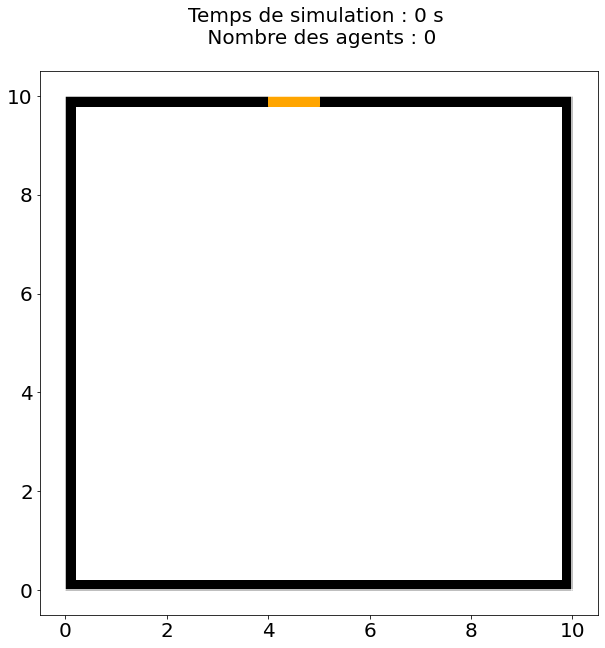
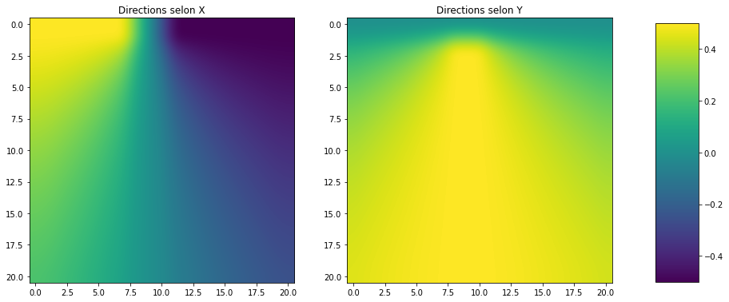
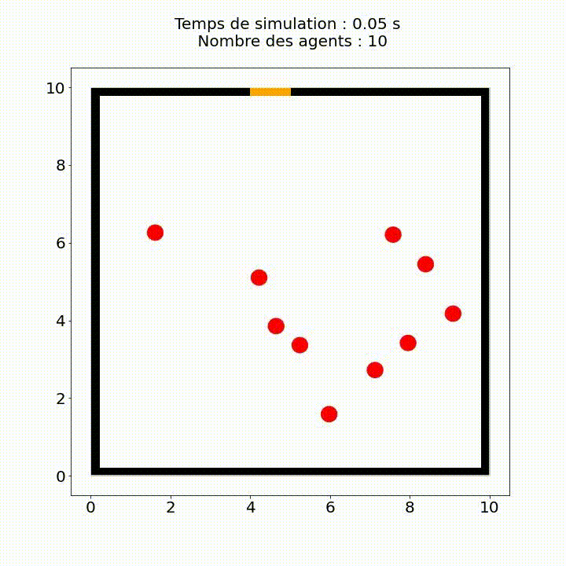

# Reciprocal n-body Collision Avoidance

## **Importer les Packages**

- [NumPy](https://numpy.org/) : NumPy est une bibliothèque Python populaire pour le calcul scientifique qui fournit des structures de données pour la représentation de tableaux multidimensionnels et des fonctions pour manipuler ces tableaux.

- [Matplotlib](https://matplotlib.org/) : Matplotlib est une bibliothèque en Python utilisée pour tracer des graphiques et des visualisations.

- [heapq](https://docs.python.org/3/library/heapq.html) : heapq est un module Python qui implémente les algorithmes d'heaps ou de tas pour des structures de données.

- [math](https://docs.python.org/3/library/math.html) : Le module math en Python fournit des fonctions mathématiques courantes, telles que les fonctions trigonométriques, exponentielles, logarithmiques, etc.

- [CVXOPT](https://cvxopt.org/) : CVXOPT est une bibliothèque open source Python pour l'optimisation convexe. Elle est utilisée pour résoudre des problèmes d'optimisation convexe tels que la programmation linéaire, la programmation quadratique, la programmation semi-définie, la programmation convexe et autres. Elle fournit des solveurs rapides et précis pour les problèmes d'optimisation convexe, y compris des interfaces pour les solvers externes.

- [random](https://www.geeksforgeeks.org/python-random-module/) : The random module in Python provides a suite of functions for generating random numbers.

- [time](https://docs.python.org/3/library/time.html) : Le module time est un module Python qui fournit diverses fonctions permettant de manipuler le temps.

- [cv2](https://docs.opencv.org/4.x/d6/d00/tutorial_py_root.html) : cv2 is a library for computer vision and image processing. It is a Python wrapper for OpenCV (Open Source Computer Vision), which is a C++ library that includes numerous computer vision algorithms.

- [IPython](https://ipython.org/) : La bibliothèque IPython fournit un certain nombre d'outils pour faciliter le développement et l'analyse de données en Python.

- [tqdm](https://tqdm.github.io/) : tqdm is a Python package that provides a progress bar visualization for iterative tasks, making it easy to see how far along a task is and how much longer it is expected to take.

```py linenums="1" title="Packages"
import numpy
from numpy.linalg import norm
from numpy import dot,array
import matplotlib.pyplot as plt
from matplotlib.patches import Rectangle, Circle
import matplotlib.patches as patches
from pylab import show,imshow
import heapq
from math import *
import cvxopt
from cvxopt import matrix,solvers
import random
import time
import os
import matplotlib.animation as animation
import cv2
from IPython import display
from tqdm import tqdm
```


## **Initialiser la géométrie**

### **draw**

On commence par définir la fonction `draw` qui prend plusieurs arguments en entrée et qui trace une scène avec des agents et des obstacles.

Les arguments en entrée sont:

**``Ex`` :** une liste des sorties de la scène

**``Obs`` :** une liste des obstacles rectangulaires

**``Obs_cir`` :** une liste des obstacles circulaires

**``scene`` :** une paire (L, l) qui représente les dimensions de la scène

**``agents`` :** une liste d'agents, où chaque agent est représenté par sa position, sa taille et sa couleur

**``t`` :** temps de simulation

**``savepath`` :** le chemin pour enregistrer la figure générée

**``play`` :** un booléen qui spécifie si l'animation doit être affichée ou non

La fonction commence par créer une figure et un axe avec une taille déterminée par la dimension de la scène. Ensuite, elle dessine les obstacles, les sorties et les agents sur la figure. Les obstacles rectangulaires sont représentés par des rectangles noirs, les obstacles circulaires par des cercles noirs, les sorties par des rectangles orange et les agents par des cercles de couleur.

Enfin, la fonction sauvegarde la figure à l'emplacement spécifié par "savepath". Si "play" est faux, la figure est fermée.

```py linenums="19" title="draw"
def draw(Ex, Obs, Obs_cir, scene, agents, t, savepath, play = False):
    
    L , l = scene
    ratio = l/L
    c = 10
    
    fig, ax = plt.subplots(figsize=(c/ratio,c))

    title = ax.text(0.5, 1.05, "Temps de simulation : %s s \n Nombre des agents : %s" %(t,len(agents)), 
                    transform=ax.transAxes, ha="center", size=20)

    #Draw the environment
    plt.plot([0, L], [0, 0], 'white')
    plt.plot([L, L], [0, l], 'white')
    plt.plot([L, 0], [l,l], 'white')
    plt.plot([0,0], [l,0], 'white')

    
    #Draw Obstacle
    for obs in Obs:
        rect = Rectangle(obs.position, obs.width, obs.height)
        rect.set_color('black')
        ax.add_patch(rect)

    #Draw Obstacle Cir
    for obs in Obs_cir:
        circle = Circle(obs.position, obs.rayon)
        circle.set_color('black')
        ax.add_patch(circle)
    
    #Draw exits
    for e in Ex:
        rect = Rectangle(e.position, e.width, e.height)
        rect.set_color('orange')
        ax.add_patch(rect)

    #Draw agents
    for agent in agents:
        x,y = agent.position
        circle = Circle((x,y), agent.size)
        circle.set_color(agent.color)
        ax.add_patch(circle)

    plt.xticks(fontsize=20)
    plt.yticks(fontsize=20)
    
    fig.savefig(savepath)

    if not play:
        plt.close()
```

-------------------------

### **record_video**

La fonction appelée `record_video` prend un argument optionnel speed (dont la valeur par défaut est 25). Le but de cette fonction est de créer une vidéo à partir d'une séquence d'images sauvegardées dans un répertoire, et de sauvegarder le fichier vidéo résultant dans le répertoire de travail actuel. Les arguments passés à cette fonction sont les suivants :

**``speed`` :** une valeur entière représentant le nombre d'images par seconde de la vidéo résultante (c'est-à-dire le taux de rafraîchissement de la vidéo).

La fonction commence par imprimer un message indiquant qu'elle commence l'enregistrement de la vidéo. Ensuite, elle lit la première image de la séquence d'images pour déterminer les dimensions de la vidéo.

Elle crée ensuite un objet VideoWriter en utilisant la méthode **cv2.VideoWriter** d'OpenCV, en spécifiant le nom du fichier de sortie, le codec vidéo (dans ce cas **XVID**), le taux de rafraîchissement et les dimensions de la vidéo (basées sur les dimensions de la première image).

Ensuite, elle boucle sur les images restantes de la séquence et ajoute chacune à la vidéo à l'aide de la méthode **video.write()**. Les images sont lues en utilisant la méthode **cv2.imread()** d'OpenCV, qui lit une image à partir d'un chemin de fichier spécifié.

Enfin, la fonction nettoie toutes les fenêtres qui ont pu être créées pendant le processus et libère l'objet vidéo. Elle affiche un message indiquant que la vidéo a été sauvegardée.

```py linenums="69" title="record_video"
def record_video(speed = 25):
    print('Recording video ...')
    frame = cv2.imread('DossierImages/simulation' + str(10) + '.jpg')
    height, width, layers = frame.shape

    fourcc = cv2.VideoWriter_fourcc(*'XVID')
    video = cv2.VideoWriter('video.avi', fourcc, speed, (width,height))

    for k in range(N_iter):
        video.write(cv2.imread('DossierImages/simulation' + str(k+1) + '.jpg'))

    cv2.destroyAllWindows()
    video.release()
    print('Video saved.')
```

-----------------------

### **generate_indiv(N)**

La fonction `generate_indiv(N)` crée une liste de N agents en vérifiant qu'ils ne se chevauchent pas et ne traversent pas les obstacles. Voici les étapes principales :

- [x] La fonction définit la taille de la scène, ainsi que des variables pour la distance minimale entre les agents et pour le rayon de chaque agent.

- [x] La fonction crée une liste vide L qui contiendra les agents, puis elle commence une boucle qui s'arrêtera quand il y aura N agents dans la liste L.

- [x] À chaque itération de la boucle, la fonction génère une position aléatoire pour un nouvel agent en utilisant des fonctions aléatoires et l'ajoute à une liste temporaire q, qui contient les positions de tous les agents déjà créés, ainsi que les rayons de ces agents, qui sont stockés dans la liste R.

- [x] Ensuite, la fonction vérifie s'il y a une collision entre le nouvel agent et les agents déjà créés. Si c'est le cas, la variable choc est définie sur True, ce qui signifie qu'il y a eu une collision et que le nouvel agent ne sera pas ajouté à la liste L.

- [x] Ensuite, la fonction vérifie si le nouvel agent entre en collision avec un obstacle. Si c'est le cas, la variable choc est définie sur True.

- [x] Si le nouvel agent ne provoque pas de collision, il est ajouté à la liste L.

- [x] Lorsque N agents ont été créés et ajoutés à la liste L, la fonction retourne cette liste.

```py linenums="83" title="generate_indiv"
def generate_indiv(N):

    def rand_float_range(start, end):
        return random.random() * (end - start) + start

    a , b = size_scene
    dst = 0.2
    r = 0.2
    L = list()

    while len(L) < N:

        choc = False

        q = [agent.position for agent in L]
        R = [agent.size for agent in L]
    
        x = rand_float_range(int(0),int(a))
        y = rand_float_range(int(0),int(b))
    
        q.append([x,y])
        R.append(r)


        for j in range(len(q)-1):
            if dist(q[-1], q[j]) - (R[-1]+R[j]) <= dst:
                choc = True
                break
        
        #chocs obstacle
        for obstacle in obstacles_cir:
            [a0, b0], rayon = obstacle.position, obstacle.rayon
            if (x-a0)**2 + (y-b0)**2 < (rayon+3)**2 : choc = True
            
        for obstacle in obstacles:
            [a0, b0], w, l = obstacle.position, obstacle.width, obstacle.height
            a1, b1 = a0 + w , b0 + l

            if (a0<=x<=a1 and b0-r-0.5<=y<=b1+r+0.5) or (b0<=y<=b1 and a0-r-0.5<=x<=a1+r+0.5): choc = True
            elif distance_vecteur_obs([x,y] , r, obstacle)[0] < 0.5: choc = True

        if not choc:
            agent = myAgent((x,y))
            agent.size = r
            L.append(agent)

    return L
```

-----------------------

### **maxiMini & plot_directions**

La première fonction, nommée `maxiMini(FX,FY)`, prend en entrée deux listes **FX** et **FY**, contenant des valeurs de directions. Cette fonction parcourt les deux listes et recherche la valeur maximale et la valeur minimale des directions dans chaque liste. Elle retourne ensuite ces deux valeurs.

La deuxième fonction, nommée `plot_directions(FX,FY)`, prend également en entrée deux listes **FX** et **FY**. Cette fonction affiche deux graphiques côte à côte : un pour les directions selon X et un pour les directions selon Y. Les directions sont représentées par des couleurs sur chaque graphique, et les couleurs correspondent à des valeurs. Les valeurs minimales et maximales sont obtenues en appelant la fonction `maxiMini(FX,FY)`. Les graphiques sont affichés à l'aide de la bibliothèque Matplotlib. Enfin, cette fonction retourne les graphiques affichés.

En résumé, ces deux fonctions permettent de visualiser les directions de mouvement à partir de listes de directions selon X et Y.

```py linenums="130" title="maxiMini & plot_directions"
def maxiMini(FX,FY):
  maxi = 0
  Mini = 0
  for i in range(n):
    for j in range(len(FX[0])):
      fx , fy = FX[i][j] , FY[i][j]
      if fx != float('inf') and fx != -float('inf') and fy != float('inf') and fy != -float('inf') and not isnan(fx) and not isnan(fy):
        if fx>maxi :
          maxi = fx
        if fy>maxi :
          maxi = fy
        if fx<Mini : 
          Mini = fx
        if fy<Mini :
          Mini = fy

  return maxi , Mini

def plot_directions(FX,FY):
  fig, axes = plt.subplots(nrows=1, ncols=2, figsize=(15,15))
  Z = [FX, FY]
  text = ['Directions selon X', 'Directions selon Y']
  maxi , Mini = maxiMini(FX,FY)

  for ax, i in zip(axes.flat, range(2)):
      im = ax.imshow(Z[i], interpolation="bicubic", origin="upper", vmin=Mini, vmax=maxi)
      ax.title.set_text(text[i])

  fig.subplots_adjust(right=0.8)
  cbar_ax = fig.add_axes([0.85, 0.35, 0.05, 0.3])
  fig.colorbar(im, cax=cbar_ax)

  plt.show()
```

-------------------------------------

### **Exit**

Ce code définit une classe `Exit` qui représente une sortie. La classe possède un constructeur **(__init__)** qui prend en argument **une position**, **une largeur** et **une hauteur** de la sortie. La position est un tuple de deux éléments représentant les coordonnées (x, y) du coin supérieur gauche de la sortie.

Le constructeur initialise les attributs position, width et height de la classe avec les valeurs passées en argument.

```py linenums="163" title="Exit"
class Exit:
  
    def __init__(self,position,width,height):

        self.position = position
        self.width = width
        self.height = height
```

------------------

### **Obstacle**

La classe `Obstacle` a pour but de représenter un obstacle dans une simulation. Elle possède trois attributs : **position**, **width** et **height**, qui correspondent respectivement à la position de l'obstacle et à sa largeur et hauteur.

La méthode **__repr__** de la classe est une méthode spéciale qui renvoie une chaîne de caractères représentant l'objet. Dans ce cas précis, elle renvoie une chaîne de caractères contenant la position de l'obstacle ainsi que les coordonnées de ses coins (en supposant que la position correspond au coin en bas à gauche).

```py linenums="170" title="Obstacle"
class Obstacle():

    def __init__(self, position,width,height):

        self.position=position
        self.width=width
        self.height=height
        
    def __repr__(self):
        return 'Obstacle'+'\n'+'DL:'+str(self.position)+'DR:'+str((self.position[0]+self.width,self.position[1]))+'UR:'+str((self.position[0]+self.width,self.position[1]+self.height))+'UL:'+str((self.position[0]+self.width,self.position[1]))
```

-----------------------------------

### **Obstacle_Cir**

Ce code définit une classe `Obstacle_Cir` qui représente un obstacle circulaire.

La classe a un constructeur **__init__** qui prend deux paramètres, **position** et **rayon**, qui sont utilisés pour initialiser les attributs de l'objet. L'attribut position est un tuple qui représente la position du centre de l'obstacle sur l'espace de simulation et l'attribut rayon est un nombre flottant qui représente le rayon de l'obstacle.

```py linenums="180" title="Obstacle_Cir"
class Obstacle_Cir():

    def __init__(self, position,rayon):
        self.position=position
        self.rayon=rayon
```

------------------------------------

## **Fast Marching**

!!! Note "PriorityQueue"

    Cette classe est une implémentation d'une file de priorité (ou heap) en utilisant la bibliothèque heapq.

    ***__init__(self) :*** Constructeur de la classe qui initialise la file de priorité et un index pour suivre l'élément courant.

    ***pop(self) :*** Cette méthode supprime et renvoie l'élément le plus petit de la file de priorité.

    ***remove(self, nodeId) :*** Cette méthode prend un noeud (identifié par nodeId) en entrée et supprime cet élément de la file de priorité.

    ***__iter__(self) :*** Cette méthode renvoie l'itérateur sur l'instance de la file de priorité.

    ***__str__(self) :*** Cette méthode renvoie une représentation sous forme de chaîne de la file de priorité.

    ***append(self, node) :*** Cette méthode ajoute un élément dans la file de priorité.

    ***__contains__(self, key) :*** Cette méthode renvoie True si la clé est présente dans la file de priorité, False sinon.

    ***__eq__(self, other) :*** Cette méthode vérifie si deux files de priorité sont égales.

    ***__getitem__(self, nodeId) :*** Cette méthode renvoie l'élément correspondant à l'ID du nœud donné.

    ***clear(self) :*** Cette méthode supprime tous les éléments de la file de priorité.

    ***__len__(self) :*** Cette méthode renvoie la longueur de la file de priorité.

    ***__next__ = next :*** Cette méthode est utilisée pour rendre la file de priorité iterable.

```py
class PriorityQueue():


    def __init__(self):
        self.queue = []
        self.current = 0

    def pop(self):
        return heapq.heappop(self.queue)

    def remove(self, nodeId):
        for i in range(len(self.queue)):
            if self.queue[i][1]==nodeId:
                self.queue.pop(i)
                break;

    def __iter__(self):
        return self

    def __str__(self):
        return 'PQ:[%s]'%(', '.join([str(i) for i in self.queue]))

    def append(self, node):
        heapq.heappush(self.queue,node)

    def __contains__(self, key):
        self.current = 0
        return key in [n for _,n in self.queue]

    def __eq__(self, other):
        self.curent = 0
        return self == other

    def __getitem__(self, nodeId):
        for element in self.queue:
            if element[1]==nodeId:
                return element
        return None

    def clear(self):
        self.queue = []

    def __len__(self):
        return len(self.queue)

    __next__ = next
```

-------------------------------------

!!! Note "GridGraph"

    Ce code définit une classe `GridGraph` qui représente une grille. Cette grille est utilisée pour simuler un environnement dans lequel une ou plusieurs entités se déplacent, en utilisant un algorithme de calcul de chemin pour déterminer le chemin optimal entre deux points.

    La classe est initialisée avec deux paramètres, ***size_scene*** qui est un tuple représentant la taille de la scène (la grille) en unités arbitraires, et ***precision*** qui détermine le nombre de subdivisions dans la grille. La précision est utilisée pour définir la taille de chaque case dans la grille.

    La grille est modélisée par deux matrices, ***indicator_map*** et ***distances***. indicator_map est initialisée avec des valeurs de 1 pour chaque case de la grille, et sera modifiée plus tard pour inclure des obstacles et des sorties. distances est initialisée avec des valeurs inf pour chaque case de la grille.

    La méthode ***get_neighbours*** est utilisée pour renvoyer les voisins d'un nœud donné, représenté par un tuple d'entiers (x, y) indiquant les coordonnées du nœud sur la grille.

    La méthode ***to_node*** est utilisée pour convertir des coordonnées réelles en coordonnées de nœuds sur la grille.

    La méthode ***prepare_graph_for_fast_marching*** est utilisée pour modifier indicator_map en y ajoutant des obstacles et des sorties, afin de préparer la grille pour l'algorithme de calcul de chemin. Les obstacles sont définis comme des rectangles ou des cercles, représentés par des objets ***Obstacle*** ou ***ObstacleCir***, et les sorties sont représentées par des objets ***Exit***.

```py
class GridGraph:

    global OBSTACLE
    global EXIT
    OBSTACLE = 0
    EXIT = 2

    def __init__(self,size_scene,precision):
        self.precision = precision
        self.horizontal_size = int(size_scene[0]*precision)+1
        self.vertical_size = int(size_scene[1]*precision)+1
        self.indicator_map = numpy.ones((self.vertical_size,self.horizontal_size))
        self.distances = numpy.ones((self.vertical_size,self.horizontal_size))*float('inf')

    def get_neighbours(self,node):
        result = {};
        if node[1]<self.horizontal_size-1:
            result['x+1']=(node[0],node[1]+1);
        if node[1]>0:
            result['x-1']=(node[0],node[1]-1);
        if node[0]<self.vertical_size-1:
            result['y+1']=(node[0]+1,node[1]);
        if node[0]>0:
            result['y-1']=(node[0]-1,node[1]);
        return result;

    def to_node(self,coordinates):
        return (int(coordinates[1]*self.precision),int(coordinates[0]*self.precision))

    def prepare_graph_for_fast_marching(self,obstacles, obstacles_cir, exits):
        for obstacle in obstacles:
            dl = (obstacle.position[0],obstacle.position[1])
            ur = (obstacle.position[0]+obstacle.width,obstacle.position[1]+obstacle.height)

            for x in range(self.to_node(dl)[0]+1,self.to_node(ur)[0]):
                for y in range(self.to_node(dl)[1]+1,self.to_node(ur)[1]):
                    if x>=0 and x<self.indicator_map.shape[0] and y>=0 and y<self.indicator_map.shape[1]:
                        self.indicator_map[x,y]=OBSTACLE

        for obstacle_cir in obstacles_cir:
            dl = (obstacle_cir.position[0] - obstacle_cir.rayon , obstacle_cir.position[1] - obstacle_cir.rayon)
            ur = (obstacle_cir.position[0] + obstacle_cir.rayon , obstacle_cir.position[1] + obstacle_cir.rayon)

            for x in range(self.to_node(dl)[0]+1,self.to_node(ur)[0]):
                for y in range(self.to_node(dl)[1]+1,self.to_node(ur)[1]):
                    if x>=0 and x<self.indicator_map.shape[0] and y>=0 and y<self.indicator_map.shape[1]:
                        if (x/self.precision - obstacle_cir.position[1])**2 + (y/self.precision - obstacle_cir.position[0])**2 <= obstacle_cir.rayon**2:
                            self.indicator_map[x,y]=OBSTACLE

        for exit_ in exits:
            dl = (exit_.position[0],exit_.position[1])
            ur = (exit_.position[0]+exit_.width,exit_.position[1]+exit_.height)
            for x in range(self.to_node(dl)[0],self.to_node(ur)[0]+1):
                for y in range(self.to_node(dl)[1],self.to_node(ur)[1]+1):
                    if x>=0 and x<self.indicator_map.shape[0] and y>=0 and y<self.indicator_map.shape[1]:
                        self.indicator_map[x,y]=EXIT
```

-------------------------------------------

!!! Note "fast_marching_method"

    Le code prend en entrée un graphe et un point de départ et retourne une carte de distance de tous les nœuds du graphe au point de départ.

    Le code commence par définir une fonction ***calculus_distance*** qui prend en entrée un nœud, un graphe et des poids et renvoie la distance de ce nœud au point de départ en utilisant la méthode de marche rapide. Cette méthode calcule la distance en utilisant la distance aux nœuds voisins pondérée par des poids qui dépendent de la géométrie du problème.

    Ensuite, le code initialise une file de priorité ***frontier***, qui contiendra les nœuds à explorer, et une liste ***explored*** qui contiendra les nœuds déjà explorés. Les poids initiaux des nœuds sont stockés dans ***weights***. Les points d'arrivée sont trouvés dans la carte ***indicator_map*** et ajoutés à la file de priorité avec une distance initiale de 0. Les poids des points d'arrivée sont également initialisés à 0.

    La boucle principale commence avec l'extraction d'un nœud de la file de priorité frontier. La distance à ce nœud est stockée dans weights. Les voisins du nœud sont explorés, et si un voisin n'a pas déjà été exploré et appartient à la grille (indiqué par la carte indicator_map), sa distance au point de départ est calculée en utilisant la méthode calculus_distance. Si le voisin n'est pas déjà dans la file de priorité, il est ajouté avec sa nouvelle distance, sinon, si sa distance calculée est inférieure à sa distance actuelle, sa distance et sa priorité dans la file de priorité sont mises à jour. Les nœuds explorés sont ajoutés à la liste explored.

    Une fois la file de priorité vidée, la carte de distance est stockée dans la variable distances de l'objet graphe et renvoyée.

```py
def fast_marching_method(graph,start):
    
    def calculus_distance(node,graph,weights):
        neighbours = graph.get_neighbours(node);
        if 'y-1' in neighbours :
            if 'y+1' in neighbours:
                x1 = min(weights[neighbours['y-1']],weights[neighbours['y+1']]);
            else :
                x1 = weights[neighbours['y-1']];
        else :
            if 'y+1' in neighbours:
                x1 = weights[neighbours['y+1']];
        if 'x-1' in neighbours:
            if 'x+1' in neighbours:
                x2 = min(weights[neighbours['x-1']],weights[neighbours['x+1']]);
            else :
                x2 = weights[neighbours['x-1']];
        else :
            if 'x+1' in neighbours:
                x2 = weights[neighbours['x+1']];
        
        if 2*h**2-(x1-x2)**2>=0:
            return (x1+x2+(2*h**2-(x1-x2)**2)**0.5)/2
        else:
            return min(x1,x2)+h
        
    
    frontier = PriorityQueue();
    weights = graph.distances;
    
    explored = []
    
    goals = numpy.where(graph.indicator_map==2)
    goals_x = goals[0]
    goals_y = goals[1]
    for i in range(goals_x.size):
        frontier.append([0,(goals_x[i],goals_y[i])])
        weights[(goals_x[i],goals_y[i])] = 0
    
       
    while frontier:
        node = frontier.pop();
        explored.append(node[1])
        #if node[1]==start:
        #   return weights
        neighbours = graph.get_neighbours(node[1]);
        for neighbour in neighbours.values():
            if neighbour not in explored and graph.indicator_map[neighbour]:
                if not neighbour in frontier:
                    frontier.append([calculus_distance(neighbour,graph,weights),neighbour])
                    weights[neighbour]=calculus_distance(neighbour,graph,weights)
                elif weights[neighbour] > calculus_distance(neighbour,graph,weights):
                    frontier[neighbour][0]=calculus_distance(neighbour,graph,weights)
                    weights[neighbour]=calculus_distance(neighbour,graph,weights)
    graph.distances = weights
```

--------------------------

!!! Note "adjust_FM"

    Ce code permet d'ajuster les fronts d'onde générés par la méthode de Fast Marching.

    Le code commence par initialiser deux listes vides, Lx_gauche et Lx_droite. Ces listes vont contenir les coordonnées des points du front d'onde qui sont à gauche ou à droite d'un point infini ou indéfini.

    Ensuite, le code parcourt les fronts d'onde et ajoute les coordonnées des points à la liste Lx_gauche ou Lx_droite si ces points sont à gauche ou à droite d'un point infini ou indéfini. Il en fait de même pour les coordonnées des points du front d'onde qui sont en haut ou en bas d'un point infini ou indéfini, qu'il ajoute aux listes Ly_haut et Ly_bas.

    Enfin, le code remplace les valeurs des points des fronts d'onde contenus dans les listes Lx_gauche, Lx_droite, Ly_haut et Ly_bas par les valeurs de leurs voisins les plus proches, en parcourant les listes et en accédant aux valeurs des tableaux FX et FY correspondant aux fronts d'onde en question.

```py
def adjust_FM():

    Lx_gauche = []
    Lx_droite = []

    for i in range(1,n):
      for j in range(1,len(FX[0])-1):

        u , v = FX[i][j] , FX[i][j+1]

        if u == float('inf') or u == -float('inf'):
          if v != float('inf') and v != -float('inf') and not isnan(v):
            Lx_gauche.append((i,j))

        if v == float('inf') or v == -float('inf'):
          if u != float('inf') and u != -float('inf') and not isnan(u):
            Lx_droite.append((i,j+1))

    for cellule in Lx_gauche:
      i, j = cellule
      FX[i][j] = FX[i][j+1]

    for cellule in Lx_droite:
      i, j = cellule
      FX[i][j] = FX[i][j-1]

    Ly_haut = []
    Ly_bas = []

    for i in range(1,n-1):
      for j in range(1,len(FY[0])):

        u , v = FY[i][j] , FY[i+1][j]

        if u == float('inf') or u == -float('inf'):
          if v != float('inf') and v != -float('inf') and not isnan(v):
            Ly_haut.append((i,j))

        if v == float('inf') or v == -float('inf'):
          if u != float('inf') and u != -float('inf') and not isnan(u):
            Ly_bas.append((i+1,j))


    for cellule in Ly_haut:
      i, j = cellule
      FY[i][j] = FY[i+1][j]

    for cellule in Ly_bas:
      i, j = cellule
      FY[i][j] = FY[i-1][j]
```

------------------------------

## **MyAgent**

!!! Note "myAgent"

    Ce code définit la classe `myAgent`, qui représente un agent dans notre environnement de simulation. Chaque instance de cette classe contient les attributs suivants :

    ***position:*** un vecteur 2D représentant la position de l'agent dans l'environnement.

    ***speed:*** un vecteur 2D représentant la vitesse actuelle de l'agent.

    ***D_S:*** un vecteur 2D représentant la direction désirée de l'agent (c'est-à-dire la direction vers laquelle il souhaite se déplacer).

    ***size:*** la taille de l'agent.

    ***has_reached_exit:*** un booléen qui indique si l'agent a atteint la sortie ou non.

    ***near_to_exit:*** un booléen qui indique si l'agent est proche de la sortie ou non.

    ***masse:*** la masse de l'agent.

    ***color:*** la couleur de l'agent.

    La classe myAgent contient également plusieurs méthodes :

    ***desired_direction:*** Cette méthode calcule la direction désirée de l'agent en fonction de la position actuelle de l'agent dans l'environnement et de la carte de flux (contenue dans les matrices FX et FY).

    ***update_D_S:*** Cette méthode met à jour le vecteur D_S en appelant la méthode desired_direction.

    ***update_Speed:*** Cette méthode met à jour la vitesse de l'agent en fonction d'un vecteur de vitesse donné en argument.

    ***reach_exit:*** Cette méthode vérifie si l'agent a atteint l'une des sorties de l'environnement et met à jour l'attribut has_reached_exit en conséquence.

    ***update_Position:*** Cette méthode met à jour la position de l'agent en fonction d'un vecteur de position donné en argument et appelle la méthode reach_exit pour mettre à jour l'attribut has_reached_exit.

```py
class myAgent():
    
    def __init__(self, position):
        self.position = numpy.array(position)
        self.speed = (0,0)
        self.D_S = (0,0)
        self.size = 0.2
        self.has_reached_exit = False
        self.near_to_exit = False
        self.masse = 80
        self.color = 'red'

    def desired_direction(self):
        x, y = self.position
        a, b = size_scene
        n , m = int(x/h) , int((b-y)/h)
        if n < 0 : n = 0
        if m < 0 : m = 0
        if n > len(FX[0])-1 : n = len(FX[0])-1
        if m > len(FX)-1 : m = len(FX)-1
        v = numpy.array((FX[m][n], FY[m][n]))
        if norm(v)==0: return numpy.array((0,0))
        return v / norm(v)

    def update_D_S(self):
        self.D_S = self.desired_direction()

    def update_Speed(self, v):
        self.speed = (v[0],v[1])

    def reach_exit(self):
        for ex in exits:
            d , _ = distance_vecteur_obs(self.position , self.size, ex)
            if d <= 0.2:
                self.has_reached_exit = True
                break

    def update_Position(self, q):
        self.position = q
        self.reach_exit()
```

----------------------------------

## **Fonctions**

!!! Note "f_motrice"

    La fonction `f_motrice(agent)` calcule la force motrice qui sera appliquée à l'agent.

    Elle prend en entrée l'objet ***agent*** qui doit posséder au moins un attribut ***D_S*** (vecteur unitaire représentant la direction désirée par l'agent) et speed (vecteur vitesse de l'agent).

    La force motrice est calculée comme suit :

    - Le coefficient de relaxation ***tau*** est défini à 0.5.

    - La force motrice est donnée par l'expression : (2 x direction désirée - vitesse courante) / tau

    - Le résultat est un vecteur qui représente la force motrice à appliquer à l'agent.

    La force motrice est la force qui pousse l'agent à suivre la direction désirée, en prenant en compte sa vitesse courante pour éviter les changements brutaux de direction. Elle permet de modéliser le comportement des agents qui avancent dans une direction donnée tout en essayant de minimiser les changements de direction brusques.

```py
#force motrice
def f_motrice(agent):
    tau = 0.5
    return (numpy.array(agent.D_S)*2 - numpy.array(agent.speed))/tau
```

--------------------------------------

!!! Note "dist & distance_vecteur_obj & distance_vecteur_obs_cir & distance_vecteur_obs"

    Ces fonctions sont toutes des fonctions de calcul de distance entre deux points ou un point et un obstacle.

    - La fonction `dist(p1, p2)` prend deux points p1 et p2 et retourne la norme de leur différence. Cette norme est calculée en utilisant la fonction numpy.array() pour créer des tableaux numpy à partir des points, puis en calculant la différence entre ces tableaux à l'aide de l'opérateur - et en utilisant la fonction norm() pour calculer la norme.

    - La fonction `distance_vecteur_obj(q1, q2, r1, r2)` prend deux points q1 et q2, ainsi que deux rayons r1 et r2 et calcule la distance entre ces deux objets. La distance est calculée comme la distance entre q1 et q2 moins la somme des rayons r1 et r2. La fonction renvoie également le vecteur normalisé allant de q2 à q1.

    - La fonction `distance_vecteur_obs_cir(q, r, obstacle)` prend un point q, un rayon r et un objet circulaire obstacle (représenté par sa position et son rayon) et calcule la distance entre le point et l'obstacle. La distance est calculée comme la distance entre le point et le centre de l'obstacle, moins la somme des rayons. La fonction renvoie également le vecteur normalisé allant du centre de l'obstacle à q.

    - La fonction `distance_vecteur_obs(q, r, obstacle)` prend un point q, un rayon r et un obstacle rectangulaire obstacle (représenté par sa position, sa largeur et sa hauteur) et calcule la distance entre le point et l'obstacle. La distance est calculée comme la distance entre q et le point de l'obstacle le plus proche de q. Ce point est calculé en projetant q sur le rectangle et en sélectionnant le point projeté qui est le plus proche de q. La fonction renvoie également le vecteur normalisé allant du point le plus proche de q sur l'obstacle à q.

```py
def dist(p1,p2):
    return norm(numpy.array(p1)-numpy.array(p2))

def distance_vecteur_obj(q1, q2, r1, r2):
    d = dist(q1, q2)

    n = -(numpy.array(q2) - numpy.array(q1))/d

    d = d - (r1 + r2)

    return d , n

def distance_vecteur_obs_cir(q , r, obstacle):
    [a0, b0], rayon = obstacle.position, obstacle.rayon
    x , y = q
    
    d = ((x-a0)**2 + (y-b0)**2)**0.5 
    n = -(numpy.array(obstacle.position) - numpy.array(q))/d
    d = d - (rayon + r)

    return d , n

def distance_vecteur_obs(q , r, obstacle):
    [a0, b0], L, l = obstacle.position, obstacle.width, obstacle.height
    a1, b1 = a0 + L , b0 + l
    x , y = q
    point = []

    if x<=a0:
      if y>=b1:
        point = [a0, b1]

      elif b0<y<b1:
        point = [a0, y]

      else:
        point = [a0, b0]

    elif a0<x<a1:
      if y>=b1:
        point = [x, b1]

      elif b0<y<b1:
        point = [x, b1]

      else:
        point = [x, b0]

    else:
      if y>=b1:
        point = [a1, b1]

      elif b0<y<b1:
        point = [a1, y]

      else:
        point = [a1, b0]
        
    d = dist(point , q)
    n = (numpy.array(q) - numpy.array(point))/d

    return d - r , n
```

----------------------------------

!!! Note "matrice_normals"

    Cette fonction `matrice_normals(q, R)` calcule les vecteurs normaux pour chaque collision possible entre les agents et les obstacles dans un environnement donné.

    La fonction prend en entrée deux listes : q qui est la liste des positions des agents et R qui est la liste des rayons de chaque agent.

    La fonction retourne une matrice numpy, Normals, qui contient les vecteurs normaux de chaque collision, où chaque ligne représente un vecteur normal pour un choc possible et chaque colonne représente un agent (donc 2*m colonnes pour m agents). La fonction retourne également une liste, agents_en_chocs, qui contient les indices des agents impliqués dans au moins une collision.

    La fonction parcourt tous les agents et vérifie s'il y a une collision avec un autre agent ou un obstacle. Si une collision est détectée, la fonction calcule le vecteur normal correspondant à cette collision à l'aide de ***distance_vecteur_obj()*** pour une collision entre deux agents, distance_vecteur_obs() pour une collision entre un agent et un obstacle rectangulaire et ***distance_vecteur_obs_cir()*** pour une collision entre un agent et un obstacle circulaire.

    Les vecteurs normaux sont stockés dans la matrice Normals et les indices des agents impliqués dans des collisions sont stockés dans la liste agents_en_chocs.

    En fin de parcours, la fonction renvoie la matrice Normals et la liste agents_en_chocs.

```py
def matrice_normals(q, R):

    Normals = []
    agents_en_chocs = []
    m = len(q)

    #chocs agents
    for i in range(m):
        
        N = numpy.zeros(2*m)

        for j in range(m):
          if j != i:
            d , n = distance_vecteur_obj(q[i], q[j], R[i], R[j])
            if d <= 0.2:
              N[2*i], N[2*i+1], N[2*j], N[2*j+1] = n[0], n[1], -n[0], -n[1]

        if not all(v == 0 for v in N):
          Normals.append(N)
          agents_en_chocs.append(i)

    #chocs obstacle
    for obstacle in obstacles:
        
        N = numpy.zeros(2*m)

        for i in range(m):
          d , n = distance_vecteur_obs(q[i] , R[i], obstacle)
          if d <= 0.2:
            N[2*i], N[2*i+1] = n[0], n[1]
            if N[2*i] != 0 or N[2*i+1] != 0:
              agents_en_chocs.append(i)

        if not all(v == 0 for v in N):
          Normals.append(N)

    #chocs obstacle circulaire
    for obstacle in obstacles_cir:
        
        N = numpy.zeros(2*m)

        for i in range(m):
          d , n = distance_vecteur_obs_cir(q[i] , R[i], obstacle)
          if d <= .2:
            N[2*i], N[2*i+1] = n[0], n[1]
            if N[2*i] != 0 or N[2*i+1] != 0:
              agents_en_chocs.append(i)
    
        if not all(v == 0 for v in N):
          Normals.append(N)

    return numpy.array(Normals) , agents_en_chocs
```

----------------------------

!!! Note "detection_de_chocs"

    La fonction `detection_de_chocs(Q, R)` qui prend en entrée deux listes Q et R contenant respectivement les positions et les rayons de tous les agents et qui renvoie True si deux agents ou un agent et un obstacle se trouvent à une distance inférieure à une marge de collision marge, et False sinon.

    La fonction parcourt d'abord tous les obstacles rectangulaires et circulaires stockés dans les variables obstacles et obstacles_cir, respectivement, pour vérifier s'il y a une collision entre l'agent et l'un de ces obstacles en comparant les coordonnées de l'agent à celles des coins de l'obstacle et à la distance de l'agent au centre de l'obstacle. Ensuite, la fonction compare la distance entre l'agent courant et tous les autres agents pour vérifier s'il y a une collision entre eux.

    Si une collision est détectée, la fonction retourne True, sinon elle retourne False.

```py
def detection_de_chocs(Q, R):

  m = len(agents)

  for i in range(m):
    [x , y], r = Q[i], R[i]
    marge = .2

    #chocs obstacle
    for obstacle in obstacles:
        [a0, b0], L, l = obstacle.position, obstacle.width, obstacle.height
        a1, b1 = a0 + L , b0 + l
    
        if a0<=x<=a1 and b0-r-marge<=y<=b1+r+marge: return True
        if b0<=y<=b1 and a0-r-marge<=x<=a1+r+marge: return True

    for obst in obstacles_cir:
        [a0, b0], rayon = obst.position, obst.rayon
        d = ((x - a0)**2 + (y - b0)**2)**0.5
        if d - (rayon+r) < 2 : return True

    #chocs agents
    for j in range(m):
      if j != i:
        if dist(Q[i], Q[j]) - (R[i]+R[j]) <= marge: return True
  
  return False
```

---------------------------------------

!!! Note "predict_position2"

    La fonction `predict_position2(V)` permet de prédire la position des agents à l'instant suivant en fonction de leur vitesse actuelle et leur vitesse future, ainsi que de leur position actuelle. Elle prend en entrée une liste V de la vitesse de chaque agent (vecteur de dimension 2 pour chaque agent) à l'instant actuel.

    Le premier élément de la fonction convertit la liste V en un tableau V_future de dimension p x 2 où p est le nombre d'agents dans la simulation. Chaque ligne de V_future contient la vitesse future d'un agent sous la forme d'un vecteur de dimension 2.

    Le deuxième élément de la fonction crée un tableau V_passe de dimension m x 2, où m est le nombre total d'agents dans la simulation. Chaque ligne de V_passe contient la vitesse actuelle de chaque agent sous la forme d'un vecteur de dimension 2.

```py
def predict_position2(V):
  p = int(len(V)/2)
  V_future =  numpy.array([ numpy.array([V[2*j], V[2*j+1]]) for j in range(p) ])
  V_passe =   numpy.array([ numpy.array(agent.speed) for agent in agents ])
  
  return [numpy.array(agent.position) + dt*(V_future[agents.index(agent)] + V_passe[agents.index(agent)])/2 for agent in agents]
```

------------------------------------------

!!! Note "correction_vitesses"

    Cette fonction prend en entrée la vitesse actuelle de chaque agent, la force extérieure appliquée à chaque agent et le coefficient de restitution entre les agents. Elle calcule ensuite la nouvelle vitesse pour chaque agent en fonction des chocs détectés en appelant la fonction ***matrice_normals*** qui retourne la matrice des normales pour chaque agent en collision avec un autre agent ou un obstacle.

    Dans la première partie de la fonction, la fonction predict_position2 est appelée pour prédire la position future des agents. Ensuite, la fonction ***detection_de_chocs*** est appelée pour vérifier s'il y a collision entre les agents et les obstacles.

    Si une collision est détectée, la fonction calcule la matrice de masse M pour chaque agent et la matrice de normales C_N pour chaque collision. Ensuite, elle calcule la matrice U en multipliant la transposée de C_N avec C_N. Cette matrice est utilisée pour calculer la matrice de contrainte P.

```py
def correction_vitesses(V, Pext, K_n):
    V, Pext = numpy.array(V), numpy.array(Pext)
    p = len(agents)
    agents_en_chocs = []

    q = predict_position2(V)
    R = [agent.size for agent in agents]

    if detection_de_chocs(q, R):
        # Matrice Masse
        M = numpy.zeros((2*p, 2*p))
        for i in range(p):
            M[2*i][2*i] = agents[i].masse
            M[2*i+1][2*i+1] = agents[i].masse
    
        # Matrice Normales
        C_N , agents_en_chocs = matrice_normals(q, R)
    
        U = dot(C_N.transpose(), C_N)
        
        P = matrix(numpy.array(M) + 0.5 * K_n * U , tc='d')
        q = matrix(numpy.array(dot(M - 0.5 * K_n * U , V) + dt * Pext), tc='d')
        G = matrix(numpy.array(C_N), tc='d')
        h = matrix(numpy.array(numpy.zeros(len(C_N))), tc='d')
        
        solvers.options['show_progress'] = False
        
        return list(solvers.qp(P,-q,-G,h)['x']) , agents_en_chocs

    else:
        return V , agents_en_chocs
```

------------------------------------

!!! Note "matrice_DistancesEtNormaux & matrice_DistancesEtNormaux_danger"

    Ces deux fonctions génèrent une matrice de distances et une matrice de normales entre les agents (ou les dangers) du scénario.

    La fonction `matrice_DistancesEtNormaux(agents)` prend en entrée une liste d'objets agents et renvoie une matrice de distance matrice_distance et une matrice de normales matrice_normaux. Les matrices sont carrées et de taille égale au nombre d'agents dans la liste agents. La matrice de distance matrice_distance contient les distances entre chaque paire d'agents, et la matrice de normales matrice_normaux contient les normales correspondantes.

    La fonction `matrice_DistancesEtNormaux_danger(agents)` prend en entrée une liste d'objets agents et renvoie une matrice de distance matrice_distance et une matrice de normales matrice_normaux entre chaque agent de la liste et le danger Dangers[0]. La matrice de distance matrice_distance contient les distances entre chaque agent et le danger, et la matrice de normales matrice_normaux contient les normales correspondantes.

```py
def matrice_DistancesEtNormaux(agents):
    N_ind = len(agents)
    matrice_distance = numpy.zeros((N_ind, N_ind))
    matrice_normaux = numpy.zeros((N_ind, N_ind,2))
    for i in range(N_ind):
        for j in range(N_ind):
            if i > j:
                d, n = distance_vecteur_obj(agents[i].position, agents[j].position, agents[i].size, agents[j].size)
                matrice_distance[i][j] = d
                matrice_distance[j][i] = d
                matrice_normaux[i][j] = n
                matrice_normaux[j][i] = -n
    return matrice_distance , matrice_normaux

def matrice_DistancesEtNormaux_danger(agents):
    N_ind = len(agents)
    matrice_distance = numpy.zeros(N_ind)
    matrice_normaux = numpy.zeros((N_ind, 2))
    for i in range(N_ind):
        d = dist(Dangers[0], agents[i].position)
        n = norm(numpy.array(Dangers[0]) - numpy.array(agents[i].position))
        matrice_distance[i] = d
        matrice_normaux[i] = n
    return matrice_distance , matrice_normaux
```

-------------------------------

## **Configuration**

```py
a , b , eps = 10 , 10 , 0.2
size_scene = (a,b)

obstacles = [Obstacle((0,0),a,eps), Obstacle((0,eps),eps,b-eps), Obstacle((eps,b-eps),a-eps,eps), Obstacle((a-eps, eps),eps, b-2*eps)]

exits = [Exit((4,a-eps), 1, eps)]

obstacles_cir = []

draw(exits, obstacles, obstacles_cir, size_scene, [], 0, 'gemoetrie.png', play=True)
```

??? Output

    

## **Champs de directions**

```py
h = .5 #pas de discritisation du FAst Marching

graph = GridGraph(size_scene,1/h)

graph.prepare_graph_for_fast_marching(obstacles, obstacles_cir, exits)

fast_marching_method(graph, (0,0))
```

```py
d = graph.distances
d_tr = []
n = len(d)

for i in range(n):
    d_tr.append(d[n-i-1])

FY, FX = numpy.gradient(numpy.array(d_tr))

FX = -FX

adjust_FM()
```
??? Output

    

## **Simulation**

```py
N_pop = 10
temps_de_sim = 1*60 #secondes
dt = 5e-2
N_iter = int(temps_de_sim / dt)

agents = generate_indiv(N_pop)

draw(exits, obstacles, obstacles_cir, size_scene, agents, 0, 'config_init.png', play=True)
```

??? Output

    

```py
K_n = 0

R = [agent.size for agent in agents]

!mkdir DossierImages
for image in os.listdir('DossierImages'):
    os.remove('DossierImages/' + image)

for n in tqdm(range(N_iter)):

    if len(agents)==0:break

    V_avant_correction = []
    P = []
    matrice_distance , matrice_normaux = matrice_DistancesEtNormaux(agents)

    for agent in agents:

        agent.update_D_S()
        p_ext = f_motrice(agent)
        vi = agent.speed + dt*p_ext/agent.masse
        V_avant_correction.extend(vi)
        P.extend(p_ext)
    
    V_new , agents_en_chocs = correction_vitesses(V_avant_correction, P, K_n)
    q = predict_position2(V_new)

    for agent in agents:
        k = agents.index(agent)
        agent.update_Speed([V_new[2*k] , V_new[2*k+1]])
        agent.update_Position(q[k])
        
    for agent in agents:
        if agent.has_reached_exit: agents.remove(agent)

    path = 'DossierImages/simulation' + str(n) + '.jpg'
    draw(exits, obstacles, obstacles_cir, size_scene, agents,round(n*dt, 2), savepath=path, play = False)
    
print('Simulation finished.')
record_video(speed = 25)
```

??? Output

    
