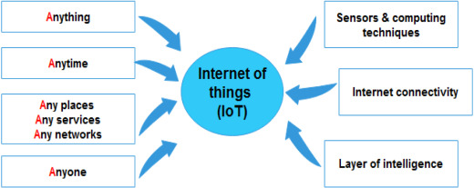

# **Big-Data For IOT**

!!! Info "Membres du groupe"
    - [Hermann Agossou](https://github.com/hermann-web/)
    - [Abdellatif BELMADY](https://github.com/Abdellatif-belmady/)
    - [Fatine BOUSSATTINE](https://github.com/FatineDev/)
    - [Hamza HAJJINI](https://github.com/HAJJINIHamza/)
    - [Salma KHMASSI](https://github.com/KHSalma04/)
    - [Mohamed Lamine BAMBA](https://github.com/limto18/)
    - [Hamza Dribine](https://github.com/hamza-dri/)

## **Introduction**

Ce projet a pour but de présenter les concepts clés du ``Big Data`` et de ``l'IoT``, ainsi que leur importance dans le monde actuel. Il a également exploré les différentes approches et outils utilisés pour gérer ces données massives, les enjeux et les défis liés à leur utilisation, les applications de l'IA dans le Big Data et l'IoT, et les perspectives futures de ces technologies.

## **Définition du Big Data et de l'IoT**

!!! Info
    Présentation de ces deux concepts clés et de leur importance dans le monde actuel.

**``L'internet des objets (IoT)``** a gagné en utilisation et en popularité au cours de la dernière décennie, indiquant de nouvelles orientations productives et passionnantes pour toute une génération de dispositifs d'information. Les concepts fondamentaux de l'IoT ont été inventés par Kevin Ashton en 1999, lorsqu'il a introduit la communication entre appareils à une échelle plus large que celle qui était possible auparavant. Atzori et al. ont depuis déclaré que "l'IoT est le résultat de la convergence de trois visions : **orientée vers les objets**, **orientée vers l'internet** et **orientée vers la sémantique**". En termes de sémantique spécifiquement, l'IoT est un "réseau mondial d'objets interconnectés". L'IoT peut être défini comme "une infrastructure de réseau mondial dynamique, en tant que telle, elle peut identifier, contrôler et surveiller chaque objet sur terre via l'internet selon un protocole d'accord spécifique, et par l'interconnexion de choses physiques et virtuelles basée sur l'interopérabilité des technologies de l'information et de la communication". L'objectif principal de l'IoT est d'aider à partager des informations en temps réel par le biais d'acteurs autonomes en réseau. La figure 1 explique le concept de l'IoT. Un capteur doté de capacités de calcul intelligentes est placé à un endroit où se trouve une connexion Internet. Ce capteur sera capable de communiquer avec n'importe quoi, à tout moment et de n'importe quel endroit du réseau. Les systèmes de collecte de données localisent et transfèrent les données par le biais d'un grand nombre de ces dispositifs de communication au sein de l'infrastructure IoT, ce qui facilite le processus de collecte des données. Plusieurs solutions de communication, telles que WIFI, ZigBee, Bluetooth et GSM, permettent l'interconnexion de dispositifs utilisant divers réseaux d'accès, notamment l'identification par radiofréquence (RFID), les dispositifs dotés de capteurs sans fil et tout objet intelligent connecté à l'internet par IP physique.

De nos jours, d'énormes volumes de données sont générés par l'IoT. Ces données, souvent appelées **``big data``**, font référence à **une grande échelle de données qui exige de nouvelles architectures et technologies pour la gestion des données (capture et traitement) afin de permettre l'extraction de valeur pour une meilleure compréhension et prise de décision**. Le big data se caractérise par diverses propriétés de haut volume, de haute vélocité, de haute variété et de haute véracité. D'ici 2020, l'IoT devrait connecter 50 milliards de dispositifs ou plus, en raison de l'afflux considérable de nouveaux objets intelligents et de l'augmentation exponentielle de la demande de leurs services.

Fig. 1. Internet of things concept.

Récemment, ``l'IoT`` a été appliqué dans les environnements intelligents, qui permettent aux utilisateurs de mieux comprendre et contrôler leur environnement grâce à une gamme de dispositifs interconnectés. Dans les applications d'environnement intelligent, l'IoT est employé pour construire un réseau de surveillance écologique complet, à plusieurs niveaux et entièrement couvert, qui peut être réalisé en utilisant l'intégration de capteurs à tous les niveaux en tirant parti de l'IoT avec des informations spatiales et temporelles, et en construisant une plate-forme massive avec un centre de données et un support de service unifié. La technologie IoT et son intégration avec le big data ont été largement appliquées dans divers domaines tels que les villes intelligentes, les soins de santé intelligents, les systèmes d'alerte intelligents et la gestion des catastrophes. Par conséquent, la construction et l'application de l'IoT et du big data dans les domaines environnementaux sont devenues une mesure cruciale, notamment pour le développement, la promotion et la gestion d'un nouvel environnement stratégique dans l'industrie.

## **Exemples concrets d'utilisation du Big Data et de l'IoT**

### **Les voitures intelligentes**

Les voitures intelligentes utilisent l’IoT pour échanger des informations liées au fonctionnement et l’environnement de la voitures, tel que l’emplacement, la vitesse, la dynamique…. Grace à l’IoT, on peut déterminer l’itinéraire le plus optimale, aussi, on peut localiser une place libre dans un parking. De plus, Il peut aider dans la réparation et l’entretien des véhicules, en fait, il informe l’utilisateur de la date de maintenance prévue, et il aide dans la réparation avec une direction adéquate. Ainsi, il permet aux voitures de faire des taches lourdes comme éviter les collisions et arrêter le trafic inutile.

Ces voitures intelligentes sont équipées de caméras et de capteurs qui peuvent collecter des données sur l'environnement de la voiture. Cela peut inclure des éléments tels que les schémas de circulation, les conditions météorologiques et même l'emplacement et la vitesse des autres véhicules dans la région. Ce qui conduit à la collecte d’un volume important de données. 

### **Les villes intelligentes**

Les villes intelligentes utilisent l’IoT sur plusieurs aspects tel que : les transports automatiques, les systèmes intelligents de gestion de l’énergie et de distribution de l’eau, la sécurité urbaine et la surveillance de l’environnement.
Ces villes utilisent l’IoT et le Big Data pour collecter et analyser des données provenant de diverses sources, telles que des capteurs et des caméras installer partout dans la ville, afin de résoudre les problèmes rencontrés par les citoyens, nous citons comme exemples :  

•	Les systèmes intelligents de gestion du trafic qui utilisent les données des capteurs de trafic pour optimiser la circulation et réduire les embouteillages.

•	Les systèmes d'éclairage intelligents qui utilisent des données provenant de capteurs pour ajuster la luminosité et la synchronisation des lampadaires.

•	Les systèmes intelligents de gestion des déchets qui utilisent les données de capteurs de niveau de déchets pour optimiser les itinéraires de collecte des ordures.

•	Les systèmes de stationnement intelligents qui utilisent les données fournies par des capteurs pour guider les conducteurs vers les places de stationnement disponibles et réduire les embouteillages.

•	Les systèmes de surveillance de la qualité de l'air et de l'eau qui utilisent des capteurs IoT pour détecter et alerter les responsables de la ville des dangers potentiels. 

Certains rapports estiment que les villes intelligentes peuvent générer jusqu'à térabytes de données par jour, ce volume de données est en constante augmentation en raison de la croissance de l'Internet des objets (IoT) et de la 5G.

### **La domotique**

Les systèmes domotiques ou les maisons intelligentes contient des appareilles qui fonctionnent à base de l’IoT, comme les climatiseurs, les lumières et les ventilateurs. Cela donne la possibilité à l’utilisateur de contrôler sa maison à une distance étendue, en fait, il peut contrôler la température, l’éclairage, la gestion de l’énergie, l’expansion, le système de sécurité, et l’accès à distance.

La domotique utilise des capteurs, des actionneurs, des réseaux de communication et des systèmes de contrôle pour automatiser les tâches ménagères et améliorer le confort et la sécurité des résidents.
La domotique utilise les technologies du Big Data, et des algorithmes d’analyse des données pour prévoir les besoins futurs et anticiper les problèmes. Par exemple, en utilisant des données sur les tendances de consommation d'énergie, les systèmes de domotique peuvent ajuster automatiquement les paramètres de chauffage et de climatisation pour réduire la consommation d'énergie.

En conclusion, la domotique et le BIG Data sont étroitement liés car ces derniers permettent de collecter, stocker et utiliser des données pour améliorer les performances des systèmes de domotique en termes de confort, sécurité et économie d'énergie.

### **Les appareils portables**

De nos jours, l’IoT a été intégré dans la plupart des appareils portable, ces dernières contient des caméras, des capteurs de son, les réseaux et la connexion à internet, qui utilisent pour collecter certaines informations sur l’utilisateurs, notamment : 

•	``Les données de localisation`` : les smartphones utilisent des technologies comme GPS, Wi-Fi et les réseaux cellulaires pour déterminer la position de l'utilisateur.

•	``Les données de navigation`` : les smartphones enregistrent les sites web et les applications que l'utilisateur a visités.

•	``Les données de contacts`` : les smartphones stockent les informations de contact de l'utilisateur, comme les numéros de téléphone et les adresses e-mail.

•	``Les données de messages`` : les smartphones peuvent stocker les messages texte et les conversations de messagerie instantanée de l'utilisateur.

•	``Les données de médias`` : les smartphones peuvent stocker les photos, les vidéos et les fichiers audio pris ou enregistrés par l'utilisateur.

Les rapports informent que aujourd’hui les serveurs de Facebook doivent analyser tous les demi-heure l’équivalent de 105 To de données (Botton ‘’j’aime’’, photos, requête … ).

## **Approches et outils pour gérer le Big Data et l'IoT**

!!! Info

    Présentation des différents approches et outils utilisés pour gérer et analyser le Big Data et l'IoT, tels que les plateformes de gestion de données, les outils d'analyse de données en temps réel, etc.

Le Big Data et l'IoT (Internet des objets) sont deux domaines qui ont connu une croissance explosive ces dernières années et qui continuent de se développer rapidement. Le Big Data fait référence à l'ensemble des données générées par les entreprises, les organisations et les individus, tandis que l'IoT désigne l'ensemble des objets connectés à Internet qui sont capables de collecter et de transmettre des données. La gestion de ces deux domaines peut être complexe, mais il existe plusieurs approches et outils qui peuvent aider les entreprises à y parvenir.

Une approche courante pour gérer le Big Data consiste à utiliser des technologies de gestion de données distribuées, telles que [Hadoop](https://www.talend.com/fr/resources/what-is-hadoop) ou Spark. Ces technologies permettent de traiter de grandes quantités de données de manière efficace et à bas coût en répartissant le travail sur plusieurs nœuds de calcul.

Il est également possible de gérer le Big Data en utilisant des bases de données en mémoire, comme [Redis ou Memcached](https://fr.strephonsays.com/what-is-the-difference-between-redis-and-memcached), qui permettent de traiter les données de manière plus rapide que les bases de données traditionnelles. Cependant, ces bases de données sont généralement moins adaptées aux grands volumes de données et ne conviennent pas toujours à tous les types de données.

Pour gérer l'IoT, il est courant d'utiliser des [plateformes de gestion de l'IoT](https://iotindustriel.com/iot-iiot/les-4-plateformes-iot-les-plus-populaires), telles que AWS IoT ou Azure IoT, qui permettent de collecter, de stocker et de traiter les données provenant d'objets connectés. Ces plateformes offrent également des outils pour la gestion de l'IoT, tels que la gestion des appareils, la sécurité et la conformité.

On note également l'utilisation de capteurs (par exemple, capteurs de température, de mouvement, de pression) ainsi que des protocoles de communication sans fil (par exemple, Bluetooth, Wi-Fi, LTE).Ces appareils permettent de collecter des données environnementales ou de contrôler des objets physiques à distance. Pour cela, ils utilisent des protocoles qui permettent à différents appareils de communiquer entre eux et de se connecter à Internet. Ils sont souvent utilisés pour la communication entre appareils IoT.

En conclusion, il existe de nombreux approches et outils pour gérer le Big Data et l'IoT. Le choix de la solution dépend de l'environnement de l'entreprise et de ses besoins en matière de traitement de données. Il est important de prendre le temps de bien comprendre les options disponibles et de choisir la solution qui convient le mieux à l'entreprise afin de maximiser l'efficacité et l'efficience de la gestion des données.

## **Enjeux et défis liés au Big Data et à l'IoT**

!!! Info
    Le recours au big data s'avère ainsi substantiel pour l'exploitation et le traitement des vastes quantités de données collectées par les dispositifs connectés (iot), dont les enjeux sont listés ci-dessous :

### **1. Confidentialité et sécurité**

Les données collectées par les objets connectés peuvent être utilisées pour suivre les activités des personnes, à savoir des comptes utilisateurs, de consommateurs. Pourtant, elles peuvent être utilisées à des fins malveillantes ou sans le consentement des personnes concernées. De plus, lesdits objets  peuvent être la cible de différentes formes d'attaques, comme les attaques de déni de service, les attaques de fuites de données ou les attaques de piratage, et par conséquent, la gestion de la sécurité des données massives et confidentielles demeure un défi en raison de la quantité de données à protéger et des risques potentiels pouvant affecter les données.

### **2. Variétés de données**

Les données massives collectées via les appareils connectés peuvent être de différents types (structurées, non structurées, semi-structurées) et provenir de différentes sources. Par exemple, la plupart des données collectées peuvent être sous format d'images, de fichiers audio, de documents, de fichiers texte, etc. qui ne sont pas structurées et ne se trouvent pas dans des bases de données. Il sera donc difficile d'extraire et d'analyser par la suite toutes ces données non structurées.

### **3. La vitesse de gestion des mégadonnées**

Ceci est considéré comme un enjeu crucial vu que les données massives collectées sur Internet peuvent être générées et mises à jour très rapidement. Cela peut rendre difficile le traitement en temps réel des données et l'obtention de résultats rapides. Par exemple, si les données sont utilisées pour prendre des décisions commerciales importantes, il est crucial d'avoir accès à des données à jour et de pouvoir traiter rapidement ces données pour obtenir des résultats en temps opportun.

### **4. Stockage et infrastructure des données**

Le stockage et l'infrastructure des données sont des enjeux importants pour l'usage du big data au service de l'IoT car celui-ci implique la collecte et le traitement de grandes quantités de données en temps réel, qui peuvent provenir de différents types de capteurs et de dispositifs connectés. Ces données peuvent être utilisées pour diverses fins, telles que l'optimisation de la production, l'amélioration de la maintenance préventive ou l'analyse de la performance des systèmes. Par conséquent, la gestion efficace de ces données repose sur une infrastructure de stockage et de traitement de données adéquates ( bases de données distribuées, systèmes de fichiers distribués, …).

## **Applications de l'IA dans le Big Data et l'IoT**

!!! Info

    Présentation des différentes applications de l'intelligence artificielle dans le Big Data et l'IoT, ainsi que leur impact sur l'analyse et la prise de décision.

L'intelligence artificielle (IA) est de plus en plus utilisée pour traiter les données massives générées par les objets connectés dans l'Internet des objets (IoT). La combinaison de l'IA et du Big Data permet d'optimiser les processus d'analyse et de prédiction, offrant ainsi de nouvelles possibilités pour les entreprises et les organisations.

Une des principales applications de l'IA dans le Big Data et l'IoT est l'analyse prédictive. Les modèles de prédiction basés sur l'IA peuvent être utilisés pour prévoir la maintenance des équipements, la consommation d'énergie ou encore les tendances de vente. Cela permet aux entreprises de planifier efficacement leur maintenance et de maximiser leur rendement. En outre, cela permet d'anticiper les besoins en consommation d'énergie et de planifier la production d'énergie en conséquence. Les tendances de vente peuvent également être prévues pour adapter les stratégies de marketing et de production.

La maintenance préventive est une autre application importante de l'IA dans le Big Data et l'IoT. Les capteurs intégrés dans les équipements industriels peuvent collecter des données en temps réel sur leur performance. L'IA peut ensuite être utilisée pour détecter les anomalies et les signes de détérioration, permettant ainsi une maintenance préventive pour éviter les pannes. Cela permet aux entreprises de réduire les coûts liés aux pannes inattendues et de maximiser la disponibilité de leurs équipements. Cela contribue également à la sécurité des employés en réduisant les risques d'accidents liés à des équipements défectueux.

L'IA peut également être utilisée pour optimiser les réseaux de transport et de distribution d'énergie. Les données recueillies par les objets connectés peuvent être utilisées pour planifier les itinéraires de transport les plus efficaces, ou encore pour réguler la production d'énergie éolienne et solaire. Cela permet d'optimiser les itinéraires de transport, de réduire les coûts de transport et d'améliorer la qualité des services de transport. L'IA peut également être utilisée pour réguler la production d'énergie renouvelable en fonction des besoins en énergie pour maximiser l'utilisation des ressources.

Enfin, l'IA peut être utilisée pour améliorer la qualité de vie des individus. Les objets connectés peuvent collecter des données sur les habitudes de vie des individus, permettant ainsi une meilleure compréhension de leurs besoins. L'IA peut être utilisée pour développer des solutions personnalisées en matière de santé, de logement ou encore de consommation d'énergie. Cela permet de créer des environnements de vie plus confortables et plus sains pour les individus.

## **Perspectives futures du Big Data et de l'IoT**

!!! Info

    Présentation des tendances et perspectives futures du Big Data et de l'IoT, ainsi que leur impact sur les entreprises et la société en général.

L’internet des objets est l’une des innovations qui façonneront fortement notre avenir. Grace à son fort progrès au cours du temps, il serait possible de connecter la majorité des appareils qui nous entourent et ainsi exploiter le Big Data partagé dans tous les aspects de notre vie. Voici les principales façons dont l’IOT et le Big Data impacteront les entreprises en particulier et la société en général :

### **Marketing personnalisé**

Grâce aux données générées par les appareils interconnectés, il serait possible de cibler le bon public et de lui transmettre le bon message au moment le plus idéal. Ainsi, les gens recevront toute sorte de publicité ou promotion qui correspond parfaitement à leurs comportements d’achat et à leurs intérêts, ce qui rend les chances de se rapprocher d’un client plus probables, certaines et même inimaginables.  D’ailleurs, les entreprises d’aujourd’hui essaient de tirer profit au maximum de l’ensemble des technologies émergentes afin d’augmenter les résultats et développer des campagnes marketing très efficace capables de bien gérer le budget qui leur est dédié.

### **Villes intelligentes**

L’IOT et le Big Data participeront fortement à la modernisation de nos villes via l’adoption de certaines appareils interconnectés capables de collecter un maximum de données en temps réel et l’application majeure de l’intelligence artificielle dans le but de rendre les technologies existantes plus intelligentes et adéquates. Ainsi, la ville de demain sera équipée par des contrôleurs du trafic servant à la prédiction du danger sur la route, des routes solaires contenant des panneaux photovoltaïques pour avertir les conducteurs en cas d’obstacle ou animal, des arrêts de bus intelligents qui activent et désactivent le chauffage et la climatisation de façon automatique…

### **Prise de décision améliorée**

L’accès en temps réel à un maximum d’informations tangibles permettra aux entreprises et aux détenteurs de magasin de prendre la bonne décision, d’anticiper les risques les plus menaçants et d’économiser les dépenses. Ils sauront interpréter et surveiller l’ensemble des données récoltées par les capteurs IOT pour déduire le bon volume à produire, les types de produits les plus vendus, la saisonnalité des ventes…, ce qui conduira à une efficacité accrue, à des couts opérationnels réduits et à un retour sur investissement plus élevé.

### **Chaine d’approvisionnement optimisée**

La mise en œuvre de l’IOT et du Big Data permettra de bien contrôler le flux du produit : de l’approvisionnement en matières premières jusqu’à la distribution du produit final. En connectant les processus et les personnes, il serait possible de mesurer les informations collectées, de les échanger et de les analyser par des tableaux de bord afin de prendre des décisions proactives basées sur les données et superviser la chaine d’approvisionnement dans sa totalité.

### **Organisations et systèmes de santé développés**

Les soins pour les patients peuvent être, grâce à la médecine de précision favorisée par l’IOT et le Big Data, considérablement améliorés comme leurs qualités de vie. Il serait possible de collecter un maximum de données sur leurs programmes de médicament via des capteurs ou montres intelligents sans nécessité de recourir constamment aux analyses et aux médecins. De plus, il serait possible de localiser avec un simple clic les hôpitaux et les ambulances qui sont les plus proches, de prédire avec précision les maladies et de développer de nouveaux médicaments en se basant sur l’analyse des données cliniques.

### **Agriculture connectée**

Le Big Data collecté via les tracteurs, animaux, drones et machines de récolte connectés permettra aux agriculteurs dans le futur proche d’améliorer le rendement de leurs terres et fermes. Ils seront capables d’accéder en temps réel aux informations qui lui sont assez importantes, d’anticiper les maladies des cultures pour faire les précautions nécessaires et d’optimiser l’irrigation et l’emploi des fertilisants. D’où une agriculture future écologique, économe et de haute précision.

### **Gestion de transport améliorée**

L’IOT et le Big Data jouent un rôle important pour les différents types de systèmes de transport : maritime, aérien, ferroviaire et routier. Ils permettront de garantir un transport de services et biens sécurisé, de coordonner efficacement l’expédition et d’assurer en permanence la connectivité réseau sur les routes. De plus, ils serviront à anticiper la maintenance et l’entretien des équipements, à contrôler toute pollution dégagée des moyens de transport et à réduire le recrutement des chauffeurs à cause des véhicules autonomes. Ainsi, la gestion du transport de demain serait plus simple, efficace et sécurisée.

### **Consommation énergétique optimisée**

Grâce à la collecte instantanée en temps réel des données liées à la consommation et aux pertes énergétiques, il serait possible d’identifier l’ensemble des comportements à optimiser et éviter le gaspillage des ressources. De plus, les consommateurs particuliers ou entreprises disposeront d’algorithmes leur permettant de prédire leur consommation énergétique dépendamment d’appareils ou machines utilisées, de réduire leurs dépenses et d’améliorer le confort logement. Ainsi, les comportements énergétiques futurs seraient plus sobres et répondent à la neutralité carbone et aux enjeux énergétiques les plus complexes. 

### **Métiers nouveaux**

Grâce à l’évolution remarquable de l’implémentation de l’IOT et de l’exploitation du Big Data, les métiers d’avenir seront focalisés sur tout ce qui est digitalisation et intelligence artificielle. Voici quelques exemples des métiers les plus incontournables dans le futur proche : Data Engineer, ingénieur DevOps/Cloud, architecte Big Data, Data Analyst, Data Scientist, Tech Lead Big Data…

## **Conclusion**

!!! Info

    Synthèse des principaux points abordés dans l'exposé et éventuelles réflexions sur l'avenir du Big Data et de l'IoT.

En conclusion, il est clair que le Big Data et l'IoT ont un impact significatif sur les entreprises et la société en général. Les avancées technologiques en cours permettront de collecter et de traiter des volumes encore plus importants de données, offrant ainsi de nouvelles opportunités pour optimiser les processus d'analyse et de prédiction. Cependant, il est important de noter que ces technologies posent également des défis en matière de sécurité et de confidentialité des données. Il est donc crucial de continuer à développer des approches et des outils pour gérer efficacement ces données massives tout en protégeant les intérêts des utilisateurs.

