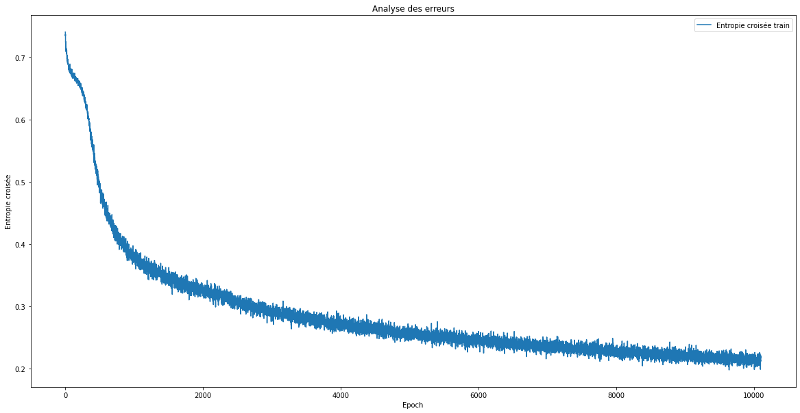

## **Introduction**

The objective of this project was to train a neural network to classify emails as "spam" or "non-spam." This was done using the Spambase dataset provided by the UCI Machine Learning Repository, which contains 57 features representing the word frequencies in 4601 emails.

For our label (Spam), "spam" was encoded as 1 for the positive class, and "non-spam" was encoded as 0 for the negative class.

<!-- <p align="center">
  <br>
  <iframe width="720" height="405" src="https://www.youtube.com/embed/LNwODJXcvt4?si=7n1UvGRLSd9p5wKs"
    title="YouTube video player" frameborder="0"
    allow="accelerometer; autoplay; clipboard-write; encrypted-media; gyroscope; picture-in-picture; web-share"
    allowfullscreen>
  </iframe>
  <br>
  <strong>Watch:</strong> How to Train a YOLOv8 model on Your Custom Dataset in <a href="https://colab.research.google.com/github/ultralytics/ultralytics/blob/main/examples/tutorial.ipynb" target="_blank">Google Colab</a>.
</p> -->

## **Data Preparation**

```py
# Import Libraries
import pandas as pd
import numpy as np
import matplotlib.pyplot as plt
import seaborn as sns

from tensorflow import keras
import tensorflow as tf
from tensorflow.keras.models import Sequential
from tensorflow.keras.layers import Dropout
from sklearn.metrics import accuracy_score
from tensorflow.keras.layers import Dense
```
```py
# Import Datasets 
spam = pd.read_csv("spam.csv")
```
```py
# Read the first 5 lines
spam.head(5)
```
## **Exploratory Data Analysis (EDA)**
```py
# Display some dataset information
spam.info()
```

According to the **``info()``** method results, it appears that all the features are of type float, which will make our subsequent analysis easier (no need for feature engineering).

```py
# Display some dataset statistics
spam.describe()
```

I have also conducted an analysis of the data distributions to get an idea of the distributions followed by the various features. Below is the obtained result, showing that most features do not follow a Gaussian distribution.

```py
# Display some dataset statistics
spam.describe()
```
??? success "Output"
    

```py
# Correlation Analysis
matriceCorr = spam.corr().round(1)
sns.heatmap(data=matriceCorr, annot = True)
```
??? success "Output"
    

## **Implementation of a Neural Network Model**

```py
# Splitting data into training, testing, and validation data

spam = spam.sample(frac=1, axis=0)

data_train_valid = spam.sample(frac=0.85, axis=0)
data_test = spam.drop(data_train_valid.index)
data_train = data_train_valid.sample(frac=0.8, axis=0)
data_valid = data_train_valid.drop(data_train.index)

x_train = data_train.drop('spam', axis=1)
y_train = data_train['spam']
print('X train dimensions :', x_train.shape)
print('Y train dimensions :', y_train.shape)

x_valid = data_valid.drop('spam', axis=1)
y_valid = data_valid['spam']
print('X valid dimensions :', x_valid.shape)
print('Y valid dimensions :', y_valid.shape)

x_test = data_test.drop('spam', axis=1)
y_test = data_test['spam']
print('X test dimensions :', x_test.shape)
print('Y test dimensions :', y_test.shape)
```
```py
# Data Normalization

min_x_train = x_train.min()
max_x_train = x_train.max()

print("Min of x_train :", min_x_train)
print("Max of x_train :", max_x_train)

x_train_norm = (x_train-min_x_train)/(max_x_train-min_x_train)
x_test_norm = (x_test-min_x_train)/(max_x_train-min_x_train)
x_val_norm = (x_valid-min_x_train)/(max_x_train-min_x_train)
```

The perceptron structure consists of **an input layer with 57 neurons corresponding** to each of the 57 features, **a hidden layer with 12 neurons**, and **an output layer with 2 neurons**: the first one can be interpreted as the probability of an email being "non-spam," and the second one as the probability of "spam." The output neuron with the highest probability determines the email classification.

The ``sigmoid function`` was chosen as the activation function for each of the three layers, binary cross-entropy as the loss function, and the ``Adam optimizer`` algorithm for its adaptive learning rate and momentum.


```py
## Implementation of DNN model

model = Sequential()
model.add(Dense(57, input_dim=np.shape(x_train)[1], activation = 'sigmoid'))
model.add(Dropout(.5))
model.add(Dense(12, activation = 'sigmoid'))
model.add(Dropout(.5))
model.add(Dense(1, activation = 'sigmoid'))

model.compile(loss = 'binary_crossentropy', optimizer = 'adam', metrics=['accuracy'])

model.summary()
```
```py
callback = tf.keras.callbacks.EarlyStopping(monitor='loss', patience=1000)

hist = model.fit(x_train_norm, y_train, epochs = 10100, batch_size = 99999, callbacks = callback)
```
```py
# Model Performance on Test Data

preds = model.predict(x_test_norm)
preds = [1 if x[0] > 0.5 else 0 for x in preds]
score_test_dnn = accuracy_score(y_test, preds)
print(score_test_dnn)
```
```py
# Model Performance on Validation Data

preds = model.predict(x_val_norm)
preds = [1 if x[0] > 0.5 else 0 for x in preds]
score_valid_dnn = accuracy_score(y_valid, preds)
print(score_valid_dnn)
```
```py
figure = plt.gcf()
figure.set_size_inches((20, 10))
plt.title('Error Analysis')
plt.xlabel('Epoch')
plt.ylabel('Cross Entropy')
plt.plot(range(1, len(hist.history['loss']) + 1), hist.history['loss'])
plt.legend(['Training Cross-Entropy'])
plt.show()
```
??? success "Output"
    
```py
figure = plt.gcf()
figure.set_size_inches((20, 10))
plt.title('Error Analysis')
plt.xlabel('Epoch')
plt.ylabel('Accuracy')
plt.plot(range(1, len(hist.history['accuracy']) + 1), hist.history['accuracy'])
plt.legend(["Training Accuracy"])
plt.show()
```
??? success "Output"
    

This neural network model achieved a score of 0.924 for the test data and a score of 0.937 for the validation data, which is very satisfactory.

## **Implementation of Logistic Regression**
```py
from sklearn.linear_model import LogisticRegression

log_reg = LogisticRegression()
log_reg.fit(x_train_norm, y_train)
```
```py
# Model Performance on Test Data

score_test_log_reg = log_reg.score(x_test_norm, y_test)
print("Test Accuracy Score", score_test_log_reg)
```
```py
# Model Performance on Validation Data

score_valid_log_reg = log_reg.score(x_val_norm, y_valid)
print("Test Accuracy Score", score_valid_log_reg)
```

I also implemented logistic regression and obtained a score of 0.876 for the test data and a score of 0.895 for the validation data.

## **Implementation of SVM (Support Vector Machine)**
```py
from sklearn import svm

svm = svm.SVC()
svm.fit(x_train_norm, y_train)
```
```py
# Model Performance on Test Data

score_test_svc = svm.score(x_test_norm, y_test)
print("Test Accuracy Score", score_test_svc)
```
```py
# Model Performance on Validation Data

score_valid_svc = svm.score(x_val_norm, y_valid)
print("Test Accuracy Score", score_valid_svc)
```

An SVC was also implemented and achieved a score of 0.931 for the test data and a score of 0.932 for the validation data.

## **Implementation of Random Forest**
```py
from sklearn.ensemble import RandomForestClassifier

rdf = RandomForestClassifier(max_depth=2, random_state=0)
rdf.fit(x_train_norm, y_train)
```
```py
# Model Performance on Test Data

score_test_rdf = rdf.score(x_test_norm, y_test)
print("Test Accuracy Score", score_test_rdf)
```
```py
# Model Performance on Validation Data

score_valid_rdf = rdf.score(x_val_norm, y_valid)
print("Test Accuracy Score", score_valid_rdf)
```

To get an idea of all machine learning models, I also implemented a Random Forest model which achieved a score of 0.884 for the test data and a score of 0.904 for the validation data.

## **Conclusion**

In conclusion, here is a table summarizing the different scores of all the models I implemented:

|Model	                      |Score (Test Dataset)	        |Score (Validation Dataset)
|-----------------------------|-----------------------------|--------------------------
|Deep Neural Network (DNN)	  |0.9246376811594202	        |0.9246376811594202
|Logistic Regression	      |0.8768115942028986	        |0.8951406649616368
|Support Vector Machine (SVC) |0.9318840579710145	        |0.9322250639386189
|Random Forest	              |0.8840579710144928	        |0.9040920716112532
